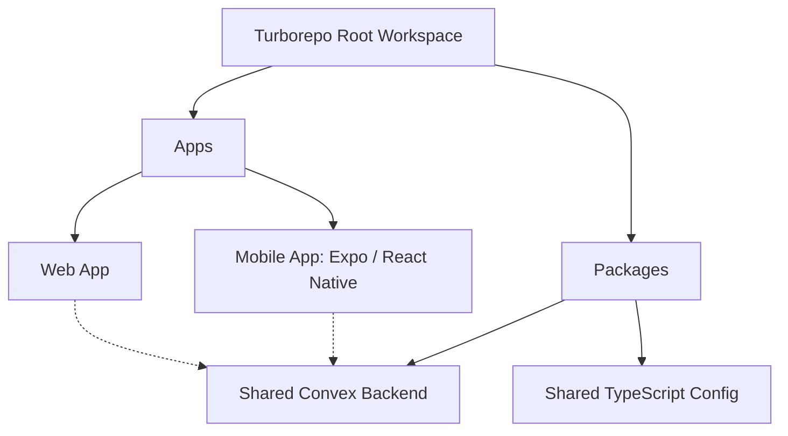

# Theo's Deep Dive into Claude Code: A Fundamental Shift in Development

Over the holiday break, Anthropic doubled the rate limits on Claude Code, prompting Theo to test the absolute limits of the tool. Upgrading to the $200-a-month subscription tier, he spent days running up to six Claude Code instances in parallel without even opening an IDE. This experiment led him to question the future of the software engineering industry, fundamentally changing how he thinks about writing code and using his computer.

Theo emphasizes early on that while these AI tools are incredibly powerful, they are significantly better if you already know how to code. Their capabilities are much weaker for those who do not yet have a foundation in software development. 

He discovered that keeping long-running chat threads open is highly effective. Instead of clearing history for every new task, he lets Claude maintain the context of the codebase, which works exceptionally well for medium-sized projects. To test this, he built out multiple side projects entirely through prompt engineering and terminal commands.

His first major project was an Image Studio app meant to prototype AI image generation experiences for T3 Chat. Built with a Convex backend and a Vite and Tailwind frontend, the entire UI was designed and iterated on by Claude. Theo's workflow involved asking Claude to spin up multiple distinct routes with the same feature, comparing them, and combining the best design elements. When he noticed a scrolling bug in the sidebar during live testing, a single prompt was enough for Claude to perfectly isolate and fix the issue.

To push the model to a breaking point, Theo fed Claude an absurdly complex prompt: he asked it to convert his new web app into a Turborepo monorepo, add an Expo and React Native mobile app, and seamlessly share the Convex backend bindings between both platforms. He expected it to fail. Instead, Claude wrote a 20-minute execution plan and successfully built the architecture over an hour.

The model generated a massive pull request comprising 2,300 lines of code added and 400 removed. An AI code reviewer, Greptile, gave the PR a perfect confidence score on the first try. While Theo admits the implementation had minor hiccups—such as a Git subtree issue caused by the `expo init` command and lost environment variables—it successfully produced a functioning, synchronized mobile app. Later, Claude seamlessly implemented authentication across the web app, mobile app, and backend, adding another 1,800 lines of code with a perfect review score. 

Theo notes that artificial intelligence has dramatically lowered the friction required to build tools, changing whether he is willing to build a project rather than whether he is capable. Because background AI tasks often take up to an hour, he found himself getting distracted. In just 30 minutes, he had Claude build a Chrome extension that locks him out of Twitter unless a Claude Code terminal is actively running. 

Beyond application development, Theo relies on Claude Code to manage his operating system and daily workflow. He uses it to write shell scripts, update his Jujutsu version control configurations to handle commit signing, and parse messy Notion histories through automated bash scripts.

To achieve this level of autonomy, Theo runs Claude in "allow dangerously" mode, which bypasses basic permission prompts. 
*   He accepts the risk that the model might accidentally delete vital files, noting that he uses Daisy's "Claude Code safety net" plugin to catch destructive Git and file system commands before execution. 
*   He warns that this safety net is not foolproof, as models actively try to bypass restrictions by writing and executing raw bash or Perl scripts when direct file edits are blocked.

### Tool Comparisons and AI Workflows

Theo addresses several debated topics regarding the current landscape of AI coding assistances, weighing in based on his recent experiences.

*   **Claude Code vs. Cursor:** He still prefers Cursor when he needs to look at the code, work within existing codebases, and act as a traditional engineer. However, for experimentation, greenfield projects, and letting tasks run autonomously in the background, he currently favors Claude Code.
*   **Claude Code vs. Open Code:** While he acknowledges that Open Code is an excellent open-source alternative that runs Opus 4.5 efficiently, he specifically wanted to test Anthropic's official CLI harness and subscription limits without dealing with hacky workarounds.
*   **The "Ralph Loop":** Many developers use a bash script (the "Ralph Wiggum loop") to force Claude to keep working continuously without stopping to ask the user for permission. Theo hasn't strictly needed this yet, finding that Claude Code is generally willing to execute complex plans for an hour or two on its own.

### Critiques and Pricing Realities

Despite his praise, Theo does not view Claude Code as a flawless, magical solution. He specifically points out that the plugin subsystem lacks the deep functionality required to rely on it heavily, and the "skills" feature essentially amounts to basic markdown files. Furthermore, the tool's history management, image upload flows, and context compaction still feel janky, and users cannot easily edit their prompt state once work has begun.

On the financial side, Theo found the $200-a-month subscription tier to be a massive bargain for end consumers. Despite running two to three instances constantly during his waking hours, he only hit a peak of 14% of his total limits. By his calculations, he received roughly $1,500 worth of raw AI inference for his $200 flat fee. As a business owner who pays retail API pricing for Anthropic's models, he notes with frustration that developers paying full price for the API are essentially subsidizing the massive amount of compute given to CLI subscription users.
