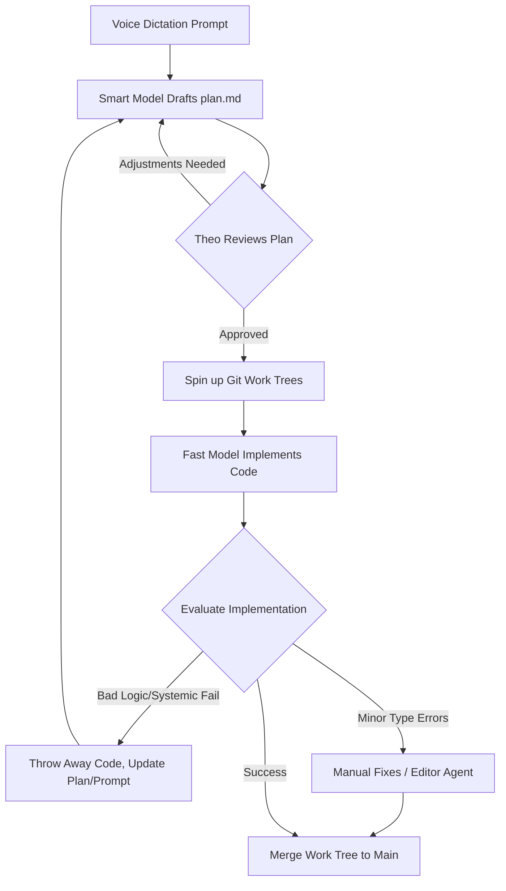

# Theo's Ultimate AI Coding Workflow: Plans, Work Trees, and Agents

Over the last two years, the way Theo uses AI to write code has fundamentally changed. Instead of relying on traditional autocomplete, he has developed a highly structured, agent-driven workflow that makes him significantly more productive and makes engineering fun again. 

Theo emphasizes right away that this workflow is not for "vibe coding"—meaning it is not a tutorial for people who do not understand software engineering. To successfully guide AI, troubleshoot its logic, and architect applications, you must already know how to code. His approach treats AI tools as powerful force multipliers for existing engineers, not as replacements for foundational coding knowledge.

## Initializing and Planning

Theo prefers to start brand new projects manually rather than letting the AI run setup commands. By using familiar tools like Vue, Next.js, or Bun to scaffold the initial environment, he ensures the fundamental foundation of the project is correct before the AI touches it. He uses Cursor as his primary editor, heavily relying on its dedicated Agent mode to write code rather than cramming chats into the traditional text editor view.

When it comes to giving the AI instructions, typing out massive architectural prompts can be tedious. Instead, Theo dictates his initial project goals using voice software, which naturally results in richer, more detailed context.

He does not ask the AI to start coding immediately. Instead, he asks a high-capability model, like Anthropic's Opus, to generate a detailed markdown plan file. This step is non-negotiable for complex work. Theo insists that developers must read this generated plan carefully. If the AI hallucinates a dependency or plans a flawed architecture, you can simply tell it to correct the plan before any actual code is written.

## Execution and Git Work Trees

Once a solid plan is established, Theo leverages Git work trees to execute the build. Work trees allow him to check out multiple branches in parallel directories on his local machine. This is incredibly useful for isolating AI agents so they can work without cluttering the main branch or current working directory.

Because work trees exist in isolation, Theo often runs multiple different AI models simultaneously against the exact same plan to see which performs best. 

*   He assigns complex logic and planning to smarter, more expensive models.
*   He assigns the actual project implementation to fast, less expensive agent models like Cursor's Composer. 
*   Surprisingly, once provided with a well-structured plan, the faster and cheaper models often produce more reliable formatting and logic than the slower, expensive models.

## The Agentic Development Loop

Theo's workflow heavily mitigates the risk of the AI generating spaghetti code by treating generated code as inherently disposable. 

If the agent goes down a completely wrong path or builds something fundamentally broken, you should not waste time arguing with the AI to fix a messy codebase. Because AI code generation is incredibly fast and cheap, Theo advises abandoning the bad branch entirely. Instead of fixing the code, you should update the original prompt or the markdown plan to explicitly address the mistake, and then generate a completely new implementation.

## Providing Harnesses and Context

As tasks get more complex, AI models will struggle if they cannot verify their own work. Theo discovered a massive leap in AI performance when he provided the agents with tools to check their execution.

*   **Create dry-run environments:** Theo builds simple test scripts or standard input commands so the agent can execute its own generated code and read the output to verify if it succeeded.
*   **Enforce type checking:** By configuring a command line script for TypeScript validation, he can instruct the AI to ensure all project code is completely type-safe before finishing its task.
*   **Avoid bloated context windows:** Theo actively dislikes automated context tools that fill the prompt with garbage documentation. He prefers explicitly passing migration guides or selectively cloning specific repository tests into the workspace to give the AI accurate code examples.
*   **Rewrite the context when it fails:** If a model continuously fails an integration, it means the developer has not provided enough guardrails. Adding a few example files of desired patterns goes much further than repeatedly asking the model to fix its bug.

## Code Review and Final Polish

Once the execution phase looks good, Theo merges the work tree and pushes it to GitHub. He is highly critical of the GitHub CLI for being unnecessarily bloated with network blocks and prompts, preferring to use Lazygit to rapidly stage and push his code. 

For the final sanity check, he uses automated AI review platforms like Greptile or CodeRabbit directly on his pull requests. Because these platforms run independently of the local editor agent, they act as a fantastic secondary set of eyes. In his demonstration, the PR reviewer tool successfully caught an immediate bug regarding how parameters were extracted from an AI SDK tool call, which he was then able to fix manually before merging.

## Conclusion

Theo points out that refining this workflow provides benefits far beyond just coding speed. When you practice writing detailed plans, building test harnesses, and providing crystal-clear reproduction steps for an AI agent, you inherently exercise your ability to communicate complex engineering requirements. This ultimately makes you a much better manager and coworker when dealing with human engineers. 

By applying smart models to planning and fast models to execution, the actual cost of this workflow remains remarkably low—easily staying within standard subscription limits. Ultimately, adopting these tools has allowed him to build spontaneous side projects in minutes rather than hours, making his daily coding tasks fresh, creative, and highly productive.
