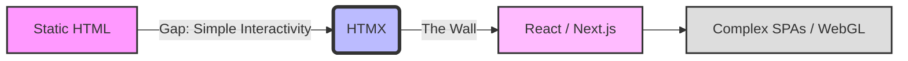

# The Future of HTMX and the Web Complexity Arms Race

Theo believes that HTMX is one of the most important and exciting projects in web development today. Despite a previous, highly sarcastic video where he stated "HTMX sucks," he clarifies that he has immense respect for the technology. He breaks down the history of web development, why modern frameworks have become overly complex, and precisely where HTMX fits into the future of the web.

### The History of Web Complexity
To understand why HTMX matters, Theo explains the history of how the web became so complex. 

Before Ajax, web interactions required full page reloads. When Google introduced Gmail using Ajax, it proved that web apps could update dynamically without refreshing, fundamentally shifting user expectations. The industry eventually moved away from sending HTML from the server to sending JSON data, forcing the client-side JavaScript to figure out how to render the user interface. 

This ushered in a "complexity arms race." Tools like Angular and React lowered the barrier to building complex user experiences. Because complex apps became easier to build, developers started building them by default, and users grew to expect fast, app-like experiences on every website. 

### The Missing Middle
Theo argues that this arms race left an massive gap in web development tooling. Modern frameworks are designed to solve high-complexity problems, but they offer terrible developer experiences for simple enhancements. 

If you have a static HTML blog and just want to add a comment section that submits without reloading the page, standard HTML cannot do it. However, adopting React just to get a dynamic comment section forces you to adopt heavy build steps, complex state management, and bundlers. 

### How HTMX Solves the Problem
HTMX fills this gap by allowing developers to build complex, dynamic interactions without leaving the server-side architecture. It began as intercooler.js (which was built on jQuery) and shares jQuery's goal of being a simple, opt-in tool that doesn't dictate your entire app structure.

*   **HTML over JavaScript:** Instead of writing JavaScript event listeners for clicks and data fetching, you write simple HTML attributes (like `hx-post` and `hx-swap`) that tell the browser exactly where to fetch new HTML and where to inject it into the current page.
*   **State stays on the server:** By generating HTML directly on the server, HTMX removes the need for the browser to manage state, completely eliminating the need for complex synchronization layers like GraphQL.
*   **Backend focus:** It allows backend developers to build highly interactive web interfaces using their preferred languages (like Go, PHP, or Rust) without having to learn modern JavaScript SPA frameworks.
*   **Pick the right tool:** Theo warns that you should not use HTMX to build highly complex, client-heavy applications like a video editor or his live-streaming Zoom clone, Ping. Conversely, you should not use React to build simple CRUD apps. 

### The Philosophy and Future of HTMX
Theo praises the development philosophy of HTMX's creator, Carson, noting that the project aims to build "100-year web services" that prioritize long-term stability over bleeding-edge features. 

*   **Stability over progress:** HTMX is intended to be feature-complete, meaning they will not break backwards compatibility or drastically change the core API just to update defaults, ensuring code written today will still work a decade from now.
*   **Template fragments:** HTMX is successfully driving a movement where traditional backend frameworks are adopting "template fragments," allowing servers to return a single, dynamic piece of HTML (like a button) rather than a whole web page.
*   **Aiming for obsolescence:** The ultimate goal of HTMX is to push these hypermedia concepts into official native HTML standards (such as allowing PUT and DELETE requests natively in HTML forms) so that the framework itself eventually becomes unnecessary.

Theo concludes that for the web ecosystem to be healthy, we cannot only have fast-moving, high-churn tools like React. We desperately need reliable, "boring" tools that stay out of the way, and he is thankful that HTMX exists to provide that stability for developers.
