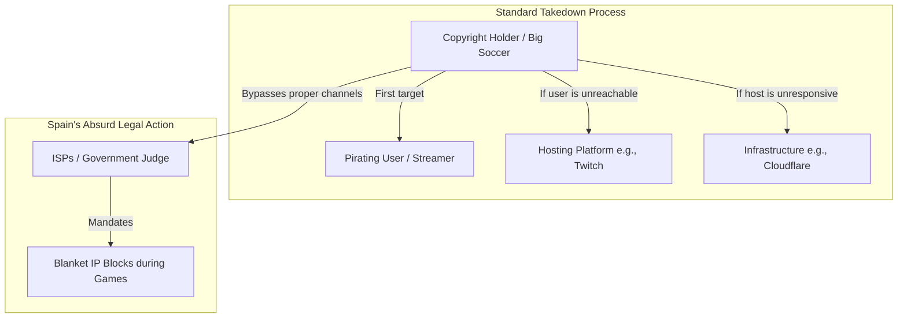

# Spain's Catastrophic IP Ban: How Soccer is Breaking the Internet

Theo breaks down a severe and unprecedented internet freedom issue currently unraveling in Spain, where government mandates are causing sweeping web outages entirely by accident. He explains how a fundamental misunderstanding of web infrastructure has allowed copyright holders to systematically break a large portion of the internet simply to protect pay-per-view soccer streams.

### The Technical Reality of IP Sharing

To understand why Spain's actions are so destructive, Theo outlines how modern web infrastructure actually functions, specifically regarding Cloudflare, Vercel, and IP addresses. 

*   IPv4 addresses are fundamentally exhausted, forcing web developers and massive infrastructure companies to aggressively reuse the same IP addresses across millions of different domains.
*   Services like Cloudflare and Vercel use shared pools of IP addresses so they can route traffic and provide critical denial-of-service (DOS) protection for a massive portion of the web without assigning a unique IP to every single site.
*   Because so many distinct websites sit behind the exact same Cloudflare IP addresses, banning a single IP automatically takes down millions of entirely unrelated websites and services.
*   While transitioning to IPv6 would technically solve this by offering nearly infinite unique addresses, most Internet Service Providers (ISPs) currently lack reliable IPv6 support, keeping the entire internet dependent on shared IPv4 setups.

### The Situation in Spain

Theo illustrates the standard operating procedure for handling internet piracy and points out exactly where Spain went wrong. Typically, if a user illegally streams copyrighted material, the rights holder should target the streaming user. If that fails, they target the hosting platform. If the host ignores them, they might target the infrastructure provider. 

Instead of following this chain, rights holders in Spain skipped straight to the bottom layer. 

Theo points out a massive conflict of interest driving this: the rights holder pushing for these bans, Telefónica, also happens to be Spain's most popular ISP. Rather than issuing standard DMCA takedowns to web hosts, they petitioned a judge to force all ISPs in the country to execute hard blocks on specific IP addresses whenever an illegal soccer stream is detected. 

Because of the IPv4 sharing reality, pulling the plug on a Cloudflare IP over a single pirated stream inherently disables vast, unrelated segments of the internet. Theo highlights that everyday citizens lose access to airline sites, government portals, and independent applications simply because a soccer game happens to be broadcasting.

Theo is particularly furious because this is no longer a case of an uninformed judge making a mistake. Cloudflare formally appealed the decision, meticulously explaining why blanket IP bans cause immense collateral damage. The judge completely dismissed Cloudflare's appeal, cementing the policy. 

### Theo's Conclusions and Recommendations

*   The internet desperately needs immediate, widespread IPv6 adoption so services no longer have to reuse IP addresses, which would inherently prevent the collateral damage of IP-level bans.
*   Governments must appoint judges and lawmakers who genuinely understand technology, rather than allowing tech-illiterate courts to be manipulated by corporate interest groups.
*   Illegal content must be handled at the hosting level via standard DMCA laws, rather than mandating infrastructure bans five layers down the network chain.
*   Spanish citizens should be actively protesting these measures to defend their digital infrastructure from being censored over minor profit losses for soccer networks.
*   Until the ruling is overturned, Spanish internet users should operate through VPNs to shield their basic network traffic from Telefónica's oversight and heavy-handed blocking.
