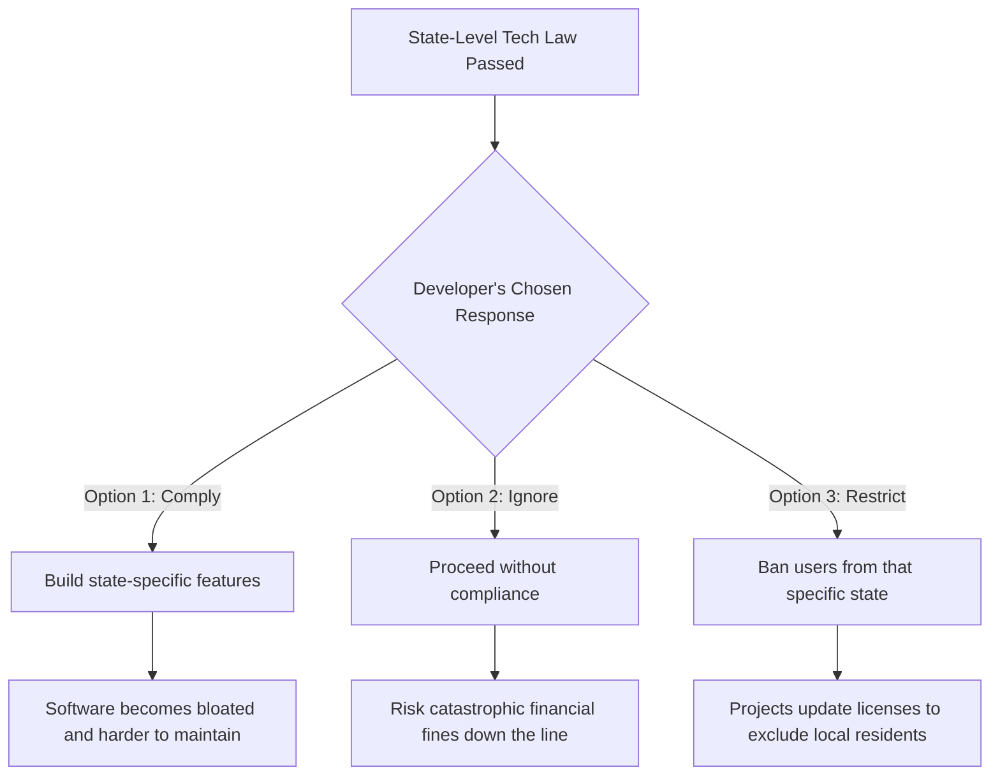

# The Danger of State-Level Age Verification Laws in Tech

Theo opens by reminiscing about the early days of computing, such as setting up Windows XP, where the process was offline, unrestricted, and easy. He contrasts this with modern tech constraints, noting how operating systems now effectively force immediate network connections and account logins. However, he warns that a much more severe hurdle is rapidly approaching: mandatory age identity verification. 

Theo explains that states like California and Colorado have passed or are proposing legislation that will mandate operating systems and app stores to verify a user's age. While these bills are historically framed as efforts to protect minors online, Theo argues they are drafted by lawmakers who fundamentally misunderstand software development and open-source ecosystems. 

### Why These Laws Harm the Tech Ecosystem

*   The legislation introduces staggering financial penalties, including fines between $2,500 and $7,500 for every minor affected by a violation, creating an immense legal liability for developers.
*   Enforcing software laws at the state level forces companies to maintain fragmented, highly complex versions of their products, similar to how apple was forced to alter physical iPhone manufacturing exclusively to meet European Union labeling requirements.
*   The mandate requires apps to recognize a user's age bracket upon installation, which directly compromises user privacy and undermines recent industry efforts to stop apps from automatically collecting personal metadata.
*   These regulations place an absurd and highly discouraging burden on open-source maintainers, forcing developers who build free tools in their spare time to navigate complex legal compliance.
*   The push toward mandatory age verification creates massive new security risks, as users will inevitably be forced to hand over highly sensitive data, like driver's licenses or facial scans, to independent maintainers and platforms that do not want the immense liability of protecting that information.

Theo notes that developers generally have three distinct reactions when faced with highly specific, localized tech laws:

As an example of the third option, Theo points out that some open-source communities, such as the Midnight BSD project, have already updated their software licenses to explicitly ban residents of California from using their operating system rather than attempting the impossible task of legally compliant age verification. 

### A Call to Action for Developers

Theo concludes the video with an urgent plea to his audience, specifically targeting software developers. He emphasizes that lawmakers frequently draft these damaging bills simply because they operate in a bubble and do not consult technical experts. 

He urges viewers to look up their state representatives and contact them directly. Theo firmly believes that a simple phone call or email from a knowledgeable developer explaining the logistical reality of how software is actually distributed can successfully make a politician reconsider poorly designed tech legislation.
