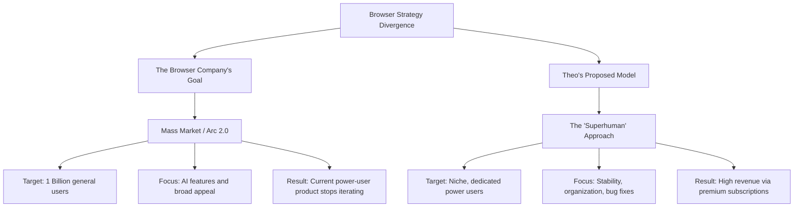

# The Uncertain Future of Arc Browser: Why Theo is Concerned

Theo has been one of the most vocal advocates for the Arc browser. While he initially disliked it, it eventually clicked for him, becoming an essential tool to the point where he actively promoted it to his audience. However, a recent announcement from The Browser Company has left him feeling misled, frustrated, and deeply concerned about the future of the browser he loves. 

The crux of the issue is that The Browser Company has decided to stop iterating on the current version of Arc. Instead, they are pivoting to build a brand new browser designed for mass appeal, aiming to reach a billion users. This pivot has manifested in neglected bugs, a decline in technical support, and a tense public exchange with the company's CEO.

### The Strategy Disagreement: Mass Market vs. Premium Niche

Theo strongly disagrees with The Browser Company's goal of chasing a billion users. He believes they have fundamentally misunderstood the value of the audience they have already captured: developers, professionals, and power users who rely on the browser for daily work.

To illustrate his point, Theo compares Arc to the email client Superhuman. Superhuman proves that a company does not need a billion free users to be highly successful and achieve a massive valuation. 

*   Superhuman charges a premium monthly fee (around $30) for a highly optimized, niche workflow that power users gladly pay for because it acts as a massive productivity multiplier.
*   Theo argues that Arc could easily follow this model, noting he would happily pay 30 dollars a month if it meant the developers would fix existing bugs and maintain the desktop experience.
*   Instead of monetizing a dedicated core of power users, Arc is trying to build an AI-heavy product for the general public (which the CEO described as building a browser his mom would use), alienating the enthusiasts who championed Arc in the first place.

### The Technical Breakdown and Leadership Conflict

Theo's frustration goes beyond business strategy and is rooted in a severe, long-standing technical issue regarding how Arc handles file downloads. 

Because Theo works heavily in video production and design, his downloads folder acts as a chronological inbox for his creative exports, resulting in thousands of files. When he accidentally clicks the "Collections" button in Arc, the browser attempts to index and render all of those files at once. This causes the entire browser to drop to single-digit frame rates or freeze completely for up to 30 seconds, effectively rendering the feature unusable.

Theo reported this issue over a year ago. He originally had a dialogue directly with Arc's engineers, who promised a fix was coming. However, when he recently followed up, he was unexpectedly forwarded to general membership support. To Theo, this was the ultimate signal that the company is no longer interested in maintaining the technical integrity of the current browser. 

This led to a tense exchange with Arc's CEO, Josh, where the two strongly clashed over the legitimacy of Theo's complaints. 

*   **The CEO's Argument:** Josh accused Theo of fear-mongering for views and slandering a team of engineers who are working incredibly hard to build a cross-platform browser. Josh argued that Theo represents an extreme edge case (affecting less than 0.1% of users) because of the sheer volume of files he stores in his downloads folder.
*   **Theo's Counterargument:** Theo notes that actually fixing the bug natively is simple, requiring basic pagination or a hard cap on the number of recently downloaded items displayed. He also points out that many creative professionals use their download folders exactly as he does. 
*   **The Financial Reality:** Theo refutes the idea that he is criticizing the company for views, clearly stating that he loses money covering Arc and promoting it, but does so anyway purely out of love for the product.

### Leaks and Final Thoughts

Adding to Theo's anxiety was his discovery of an experimental, minimal browser known as "Browse with 10." While a community moderator later clarified it was just a heavily marketed, temporary internal prototype to test new ideas, the fact that a separate browser client briefly leaked to the public further convinced Theo that the original Arc codebase is being left behind. 

Theo feels that The Browser Company operates as a one-way street, dictating what users should care about rather than listening to their most loyal advocates. He ends with a sincere apology to any viewers who switched to Arc based on his recommendation, expressing profound sadness that he ultimately feels more invested in the success of the Arc browser than the company building it.
