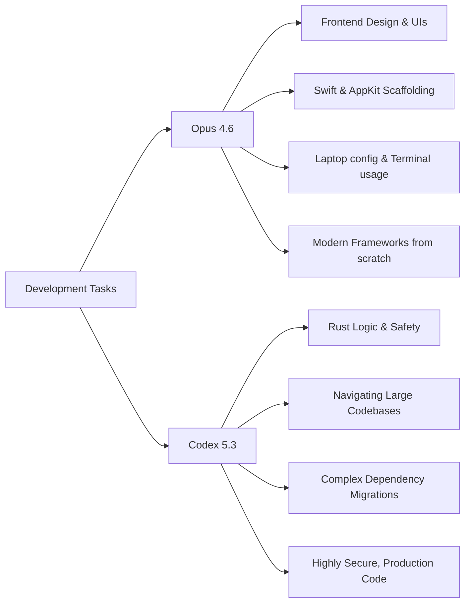

# Opus 4.6 vs. Codex 5.3: A Developer's Deep Dive

Theo has spent dozens of hours and hundreds of dollars testing the current titans of the AI coding space: Opus 4.6 and Codex 5.3. While acknowledging that we are in a broader model renaissance, he focuses deeply on figuring out which of these leading closed models performs best in daily, real-world coding environments. While he ultimately concludes that Codex is the more capable software engineer, the reality of using them is highly nuanced, with each model featuring distinct strengths, glaring blind spots, and drastically different approaches to problem-solving.

### The True Cost of Inference

While API pricing matters, Theo points out that most heavy users rely on the $200 monthly team subscriptions, making quota generosity the most important metric for cost. 

*   Opus 4.6 is significantly more expensive at the API level and burns through subscription quotas incredibly fast, to the point where an intensive code review of a single pull request locked Theo out of his four-hour usage window.
*   Codex 5.3 is vastly more generous with its API tokens under the subscription limit, allowing Theo and members of his community to run heavy, complex development tasks daily without ever nearing their usage caps.
*   A major downside of OpenAI's pricing structure is that the fast inference speeds are locked behind the $200 tier, leaving users on the $20 tier with a painfully slow experience, whereas Anthropic's $20 tier provides fast inference but exhausts its limits almost immediately.

### Different Engineering Mentalities

Theo visualizes the two models as having entirely different employee personas. He describes Opus as a hyper-caffeinated, brilliant engineer who just wants to ship code to the screen immediately, completely indifferent to what breaks along the way. Conversely, he views Codex as a beaten-up, disgruntled senior engineer terrified of causing an outage, meaning it checks everything twice before making a move.

This fundamental difference dictates how they handle complex tasks. Theo highlights their distinctly different approaches through real-world stress tests. When migrating an entire application into his T3 Chat platform, Codex attempted to solve every environmental and network blocker it encountered, which ultimately caused it to fail entirely due to sandbox restrictions. Opus, on the other hand, actively ignored the blockers and stripped away half the application's features just to get a rudimentary UI working on the screen as fast as possible. 

However, Codex's thoroughness yields miraculous results on deeply broken code. Theo tasked the models with updating an incredibly outdated, heavily intertwined React and TRPC codebase. Every time a dependency was bumped, it caused a cascading failure of other dependencies. Opus failed completely, but Codex solved it by dynamically writing and deleting local patches for individual packages to unblock itself step-by-step until the migration was largely complete.

### Domain-Specific Strengths

Depending on the language or environment, Theo finds that the models drastically outpace each other in highly specific domains. 

*   Opus is significantly better at generating beautiful UI design and mockups, making it the clear choice for frontend-heavy inception work.
*   Codex dominates in Rust, writing highly safe code, whereas Opus defaults to lazy shortcuts like dropping unsafe blocks or loose typing.
*   Opus surprisingly excels at Apple ecosystem scaffolding, correctly handling Swift and AppKit environment bugs that consistently crash Codex.
*   Codex shines brilliantly in massive codebases because it actively seeks out existing patterns written by human engineers and mimics them, keeping enterprise code consistent.
*   Opus performs better with ultra-modern frameworks like Convex and Svelte when starting from an empty directory, due to fresher training data, whereas Codex requires a reference repository to catch up to modern syntax.

### Harnesses and Steerability

The software used to interact with these models heavily impacts the experience. Theo expresses severe frustration with Anthropic's Claude Code CLI. He repeatedly encounters bugs where uploading an image silently strips his text input, and utilizing the tool's compaction feature routinely deletes his stashed, pending instructions. Furthermore, if Opus strays from its plan, it is incredibly difficult to correct it without the model completely losing its context and giving up. 

In total contrast, the Codex CLI and desktop app are highly functional and deeply steerable. If Codex makes a mistake in step two of a five-step plan, Theo can interrupt it, dictate a correction, and the model will seamlessly adapt to the feedback before faithfully finishing the rest of the plan. However, Codex's diligence can backfire. In a long-running background task via Cursor, Codex spent 20 hours writing 85,000 lines of entirely unnecessary testing code because it got trapped in a loop of trying to verify everything perfectly. Opus completed a passable version of the identical prompt in eight minutes. 

### Security and Safety Guardrails

Theo notes that Opus can be remarkably dangerous regarding application security. In his codebase, Opus introduced severe security flaws to get features working, such as making User IDs nullable on a database schema and broadly applying unrestricted typings, which Codex's safety-first mentality successfully avoided. 

On the topic of guardrails, Theo points out that Anthropic will often quietly ban users for triggering safety thresholds. OpenAI handles this differently on Codex 5.3: if they suspect a user is running malicious cybersecurity prompts, they will silently reroute the account to the older Codex 5.2 model. While Theo prefers this over an outright ban from a private lab, he strongly criticizes OpenAI for lacking transparency in their UI when an account is downgraded.

### Theo's Final Verdict

If forced to pick just one model, Theo enthusiastically chooses Codex because it solves the real, difficult problems he faces in production environments without leaving dangerous loose ends in his repositories. He leans heavily on Codex to execute actual engineering work. However, he admits that he ultimately enjoys using Opus more because it is faster, significantly more pleasant to interact with, and excellent for unblocking terminal issues on his local laptop. Because swapping between models has never been cheaper or easier, Theo highly recommends utilizing both models to cover each tool's respective blind spots.
