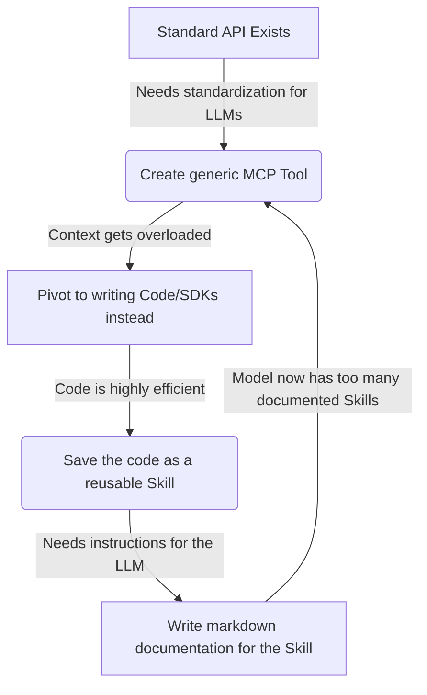

# Model Context Protocol and the Shift to Code Execution

Theo views the Model Context Protocol (MCP) as a prime example of an AI bubble. He observes that an overwhelming number of companies are building observability and tooling layers for MCP, but almost no one is building actual products that rely on it. He believes that while the initial idea had promise, the current specifications and implementations are fundamentally flawed because large language models simply are not good at using them as designed. 

### The Flaws of Direct Tool Calling

Theo highlights a new article from Anthropic—the creators of MCP—which essentially validates his long-standing criticism. The standard approach to MCP involves loading every possible tool definition directly into the model's system prompt and processing every intermediate step through the context window. Theo argues this fundamentally misunderstands how to build efficient systems.

*   Giving a model hundreds or thousands of tools does not make it smarter; it simply overloads the context window, making the model slower, more expensive, and prone to hallucinations.
*   Every time an agent makes a sequential tool call, the entire conversation history and all previous intermediate results must be sent back to the model, compounding token consumption exponentially.
*   The MCP specification lacks basic software engineering necessities, entirely missing a concept of authentication, which makes integrations highly fragmented and insecure without custom workarounds.

### The Code Execution Solution

Anthropic and other infrastructure companies are now realizing that replacing direct MCP tool calls with code execution is vastly superior. Instead of dumping complex tool definitions into the LLM's context window, the agent is tasked with writing code—specifically TypeScript—to interact with external systems. 

*   Agents can dynamically explore a file system of available SDKs and load only the specific TypeScript interfaces they need for a given task, which Anthropic admits can reduce token usage by over 98%.
*   Data filtering happens in the runtime execution environment rather than inside the model's context, allowing a script to process a 10,000-row spreadsheet in memory and strictly return the small handful of relevant rows.
*   Because code execution is deterministic, conditional logic executes reliably and instantly, completely bypassing the high latency and error risks of forcing an LLM to evaluate complex logic across massive data sets.
*   Sensitive information and personally identifiable information can be processed or tokenized directly within the code sandbox, ensuring private data never leaks to an external LLM provider.
*   Code natively provides state persistence through memory and local file writing, solving the difficult problem of maintaining state across standard stateless LLM generation loops.

### The Irony of the AI Engineering Loop

Theo finds it deeply amusing that Anthropic's solution to their own AI specification is to pivot back to standard software engineering practices. However, he pushes back hard on Anthropic's claim that executing sandboxed code is riskier or operational overhead compared to direct MCP calls. He notes that proper sandboxing tools easily outclass MCP's wildly insecure, auth-less design. He also pokes fun at Anthropic's technical execution, noting that their official examples feature slow, blocking loops instead of parallel execution. 

Most importantly, Theo highlights a comical cycle of reinvention introduced at the end of Anthropic's article. They suggest taking this efficient, newly generated code and saving it alongside markdown documentation as "skills" for the model to use later. Theo points out that this simply recreates the exact bloated toolset problem they were trying to escape, resulting in an endless loop of AI researchers reinventing the wheel.

Ultimately, Theo concludes that LLM researchers should not be designing execution protocols for software developers. The failure of direct MCP tool calling and the subsequent pivot back to traditional code execution serves as proof that fundamental software engineering principles remain highly necessary.
