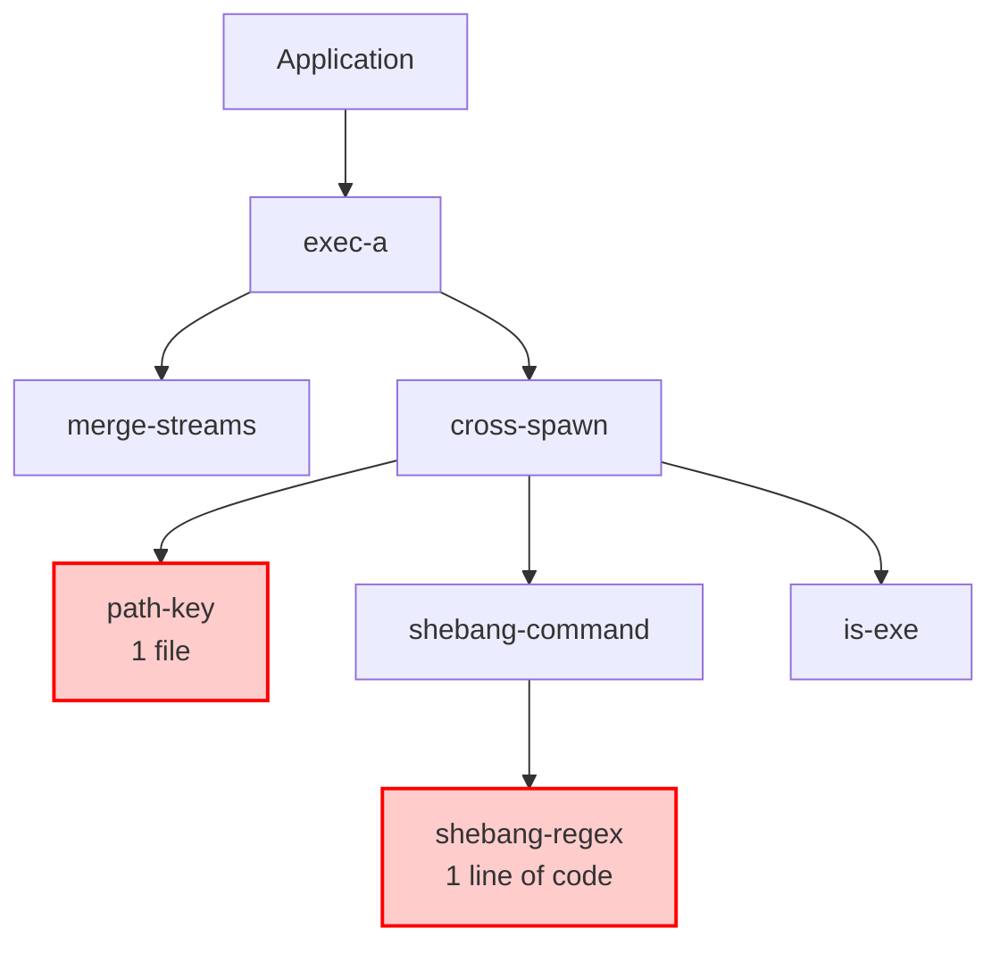

# The Three Pillars of JavaScript Bloat

Theo addresses a massive, invisible problem in modern web development: JavaScript dependency bloat. While acknowledging that JavaScript is an essential language due to universal support, he argues that the vast majority of JavaScript shipped on the web is completely unnecessary. Through a review of an article by James Garbet, Theo explores how outdated tools, lazy development, and hyper-niche legacy requirements have created a web ecosystem burdened with garbage code. He hopes that by properly identifying these issues, developers can begin cleaning up their dependency trees. 

Before diving into the codebase issues, Theo briefly notes his positive experience with Browserbase, a tool that allows AI agents to interact with the web by directly executing JavaScript rather than faking traditional browser clicks, which he finds to be significantly faster and more accurate.

### The Three Pillars of Dependency Bloat

According to the article Theo reviews, the unnecessary code cluttering modern `npm` dependency trees generally falls into three distinct categories. 

*   **Pillar One: Legacy runtime support, safety, and strict realms.** Some packages bring in massive dependency trees just to support ancient, obsolete environments like Internet Explorer or Node 0.8. Theo highlights "Hero Devs," a company that maintains legacy codebases and frequently injects massive backward-compatibility fixes into mainstream packages, famously causing SvelteKit's dependencies to randomly double and angering framework creators.
*   **Safety wrappers and primordials.** To prevent applications from breaking if a developer accidentally overwrites a core JavaScript global, some packages and engines will wrap default objects in custom namespaces, leading to redundant dependencies like `math-intrinsics` that do nothing but re-export standard math functions.
*   **Cross-realm value checking.** Developers sometimes have to pass values between isolated iframes and web pages, which breaks standard type checking because a string in an iframe is technically a different class than a string in the parent page. Utilities are written specifically to bypass this, adding complex logic to the whole ecosystem for an issue most developers will never face.
*   **Pillar Two: Atomic Architecture.** The JavaScript community developed a habit of breaking packages down to single lines of code, erroneously believing this micro-level Unix philosophy would increase reusability. Theo is shocked to find that single-line packages like `shebang-regex`, simple math conversions, or JSON files mapping out text boxes are still downloaded hundreds of millions of times a week.
*   **The failure of micro-packages.** Instead of acting as reusable building blocks, these atomic packages are usually only utilized by one or two other packages from the exact same maintainer. This inflates network request overhead, causes multiple versions of the same single-line package to be duplicated across a project, and massively increases the surface area for supply chain security attacks.
*   **Pillar Three: Ponyfills that overstayed their welcome.** Polyfills mutate the global environment to add future JavaScript features to older engines, while ponyfills safely import those features as standard modules to avoid altering the environment. Theo understands their initial utility, sharing a story of having to use ponyfills to support a single Firefox user while building an internal dashboard at Twitch. 
*   **Lingering native replacements.** The major problem with ponyfills is that maintainers simply forget to remove them once engines natively support the feature. Consequently, millions of projects are still routinely downloading complex fallback scripts for native features like `indexOf` or `globalThis` that have been natively supported in all major browsers for upwards of 10 to 15 years.

To visualize how atomic architecture clutters the ecosystem, Theo references how a single high-level application brings in layers of microscopic dependencies, many of which only contain a single line of code:

### Solutions and Tooling

Theo passionately argues that the cost of backwards compatibility is currently inverted. Rather than the entire JavaScript ecosystem paying a performance and security tax to subsidize a tiny minority of users, those few users who need to support ancient engines should maintain their own specific forks. The default path for everyday developers should consist of modern, lightweight, and natively supported code.

To fix this, maintainers and developers must start actively questioning their dependency trees. Theo recommends leveraging the ecosystem of cleanup tools starting to emerge. He specifically points to Knip for finding dead code and unused imports, as well as `npmgraph` for visualizing how deep your sub-dependencies go. 

He highlights the E18E Foundation's work as absolutely essential for the survival of the language. They provide a CLI analyze tool that scans your project and automatically migrate legacy bloat to modern, native implementations. Deeply moved by the thankless, difficult, and under-funded work the E18E team is doing to save the web ecosystem, Theo concludes the video by personally donating $5,000 to their project and urges other developers and companies to financially support ecosystem maintainers.
