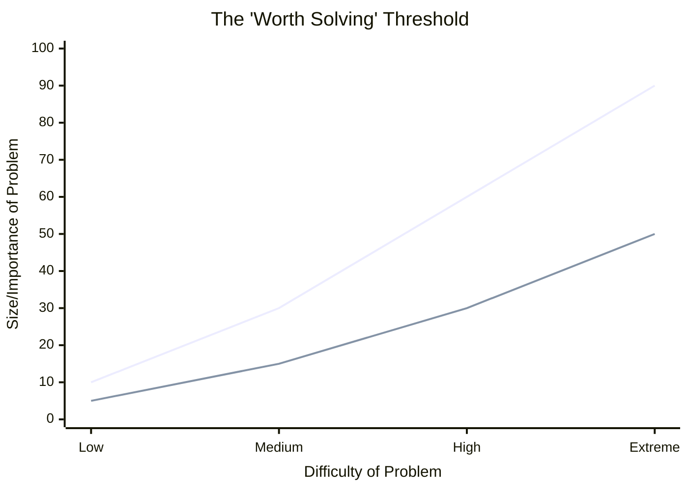

# The Era of Disposable Software: Why Code is Cheap but Software is Expensive

Over the last few decades, code was an inherently expensive resource that required armies of highly paid engineers to produce. According to Theo, we are currently experiencing a massive shift: code has become incredibly cheap and prolific, but the actual software—the valuable solutions that code provides—remains just as expensive. He compares this transition to the invention of compilers, which abstracted away the difficulty of assembly language. Today, we are stopping thinking about the underlying code entirely and focusing strictly on the software's output.

### The Shift to Personal, Disposable Software
Inspired by an article from Chris Gregory, Theo explores how the barrier to generating code has collapsed, yet the barrier to building something meaningful remains unchanged. We are leaving the golden age of Software as a Service (SaaS) and entering an era of personal, disposable software.

*   Programs that were previously ignored because the use case was too small and the coding effort too high are now absolutely worth building because generating the code is almost free.
*   Theo notes that he has written and thrown away roughly 50,000 lines of unversioned code in just a few weeks to solve highly specific, one-off problems like configuring custom Linux boxes or finding specific files.
*   AI tools are functioning like "Excel for developers," democratizing logic and utility much like spreadsheets allowed non-programmers to manage complex data decades ago.
*   Theo envisions a future where API endpoints are no longer bound to static binaries, but instead dynamically generate new, payload-specific code the moment they are hit.

To illustrate how AI tools have changed what developers build, Theo describes a mental threshold we all have regarding problem-solving. This shift is visualized below:

*In the chart above, the top line represents the traditional threshold: a problem had to be highly important to justify tackling high difficulty. The bottom line represents the new AI-assisted threshold: the difficulty of solving problems has dropped so significantly that we can now write custom code for tiny, trivial annoyances that we previously would have just ignored.*

### The CLI Debate and Engineering Tooling
While acknowledging the power of AI tools, Theo disagrees with the idea that moving to a Command Line Interface (CLI) gives developers better control. 

*   He finds modern AI CLI tools (like Claude Code and Open Code) frustrating because they hijack standard terminal buffers, breaking ingrained keyboard shortcuts like specific word-deletion mechanics.
*   Theo advocates using modern databases suited for this fast-paced era, specifically shouting out his sponsor SpaceTime, a database platform born from the gaming industry that allows developers to run TypeScript, Rust, or C# directly on the data box for ultimate real-time performance.
*   While tools like Rust were vital when code was expensive—ensuring long-term stability and eliminating memory leaks—Theo questions how much this longevity matters for standard web services now that code is designed to be rewritten or thrown away easily.

### The Delusion of Distribution and the "Airplane" Metaphor
With the barrier to entry gone, the noise level in the software industry is at an all-time high. Theo warns against believing the hype of grifters claiming massive revenue for apps built in an afternoon, arguing that these are marketing stunts, not technical innovations. Because code generation is no longer a bottleneck, distribution, taste, and audience intuition are the ultimate competitive advantages. 

To explain why making coding easier won't magically create successful founders out of the average person, Theo uses an anecdote about landing an airplane. When asked if they could land a passenger jet if the pilot passed out, a shocking number of people assume they could. Theo ties this Dunning-Kruger effect to software and content creation. 
*   People assume they would be great YouTubers or startup founders if only the initial friction—like learning video editing or learning syntax—were removed for them.
*   Theo argues that if your personal motivation wasn't strong enough to push you through the friction of learning to code, it absolutely will not be strong enough to push you through the much harder challenges of marketing, sales, and distribution.
*   He recalls a peer who thought starting a successful YouTube channel would be incredibly easy because talking to a camera is simple, yet this person admitted they didn't even watch YouTube. 
*   Success requires a deep, intuitive understanding of your medium and audience, which only comes from genuine obsession and motivation, not just access to easier tools.

### The Evolving Role of the Engineer
Theo candidly admits that his historical superpower—jumping into a delayed project, cutting scope, and shipping fast without losing quality—is no longer a unique differentiator. AI agents can essentially do that now. However, he strongly refutes the idea that engineering is dead. 

*   The value of an engineer is shifting away from the syntax of writing code and moving toward the architecture of shaping systems.
*   Engineers are needed more than ever to manage complex orchestration, figure out distributed caching architectures, and handle nuanced security layers like authorization and environment variables.
*   AI tools are terrible at architecting maintainable, scalable systems, making technical leadership and system oversight the new premium skills.
*   Theo recommends a hybrid approach to code review where developers use AI tools like Code Rabbit to catch syntax errors made by AI code generators, saving human reviewers strictly for assessing business logic and system architecture. 

Ultimately, Theo concludes that while AI bumps everyone's baseline capability, it simply exposes the fact that knowing what to build and how to get people to care about it is where the real work begins. Those who lack motivation will be replaced, but developers who maintain their engineering rigor and scale up their communication skills will thrive.
