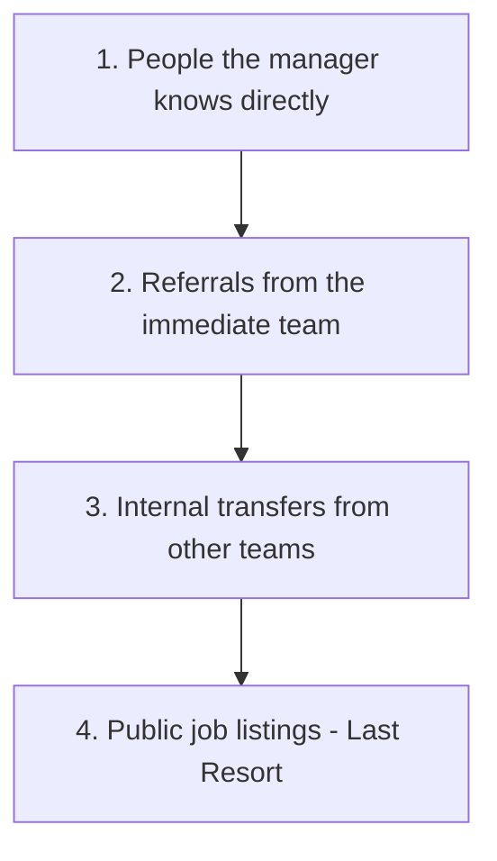

# Navigating the Brutal Tech Job Market

Theo acknowledges the incredibly tough tech job market right now, heavily drawing from his recent conversations with junior developers and college students. Although he runs his own companies and hasn't had to look for a job recently, he oversees hiring, deals with other companies' recruiting efforts, and has conducted hundreds of interviews. He notes that much of the standard job-hunting advice online is outdated, and he offers a realistic look into why getting hired has changed and how to adapt.

### Why the Market fundamentally Shifted

To understand the current crisis, Theo explains how the market used to work just a few years ago. Between 2019 and 2021, there were far more open tech jobs than available engineers. Because of this shortage, companies hired classes of junior developers as long-term investments. Managers willingly absorbed the initial hit to team productivity, betting that a few of those juniors would adapt, level up, and become stellar engineers. 

Today, two massive changes have completely upended that dynamic. First, massive layoff waves in 2023 and 2024 have flooded the job market with hundreds of thousands of experienced, senior-level engineers. When a company needs to fill a role today, they can easily hire a battle-tested veteran rather than taking a gamble on an unproven junior. 

Second, AI has fundamentally altered the value of junior work. Theo notes that tools like Claude can act as a reliable, fast junior developer for senior engineers, vastly multiplying a senior's output and shrinking the overall headcount needed for a team. More drastically, AI has entirely broken the traditional application process. Whenever a junior role is posted publicly, companies are instantly hammered by thousands of AI-generated resumes and cover letters. This wave of useless "slop" is so overwhelming that hiring managers largely abandon public application stacks altogether. 

### The Hidden Hiring Funnel

Because resumes are increasingly viewed as untrustworthy AI hallucinations, trust has become the single most valuable currency in hiring. Hiring is inherently a gamble, and managers want to reduce their risk. Theo outlines the exact mental checklist he and other managers use when filling an open role, proving why applying to public listings rarely works.

### How to Build Trust and Get Hired

Since public applications are the ultimate last resort, your goal is to infiltrate the first two tiers of a hiring manager’s checklist. You do this by building trust, making friends, and proving your competence in public spaces. 

*   **Become an active, valuable community member.** Hang out in developer communities on Discord, Blue Sky, or Twitch, and consistently share high-signal, relevant insights to build a positive association with your name. 
*   **Demonstrate a genuine passion for the craft.** Developers who only got into the industry for the paycheck and never explore tech in their spare time will not survive the current crunch; you must actually care about computers to outcompete AI. 
*   **Document and share your deep technical dives.** Theo shares an anecdote about a developer named Taylor who researched niche Next.js server actions; turning that kind of unique research into a blog post proves to hiring managers that you truly understand the technology.
*   **Nurture your peer relationships and help others.** Connecting with old classmates, coworkers, or jumping on a video call to troubleshoot a stranger's code in a Discord server often leads directly to unadvertised job referrals. 
*   **Cultivate a lasting professional reputation.** Theo notes that his relentless focus on "shipping" projects at Twitch resulted in a reputation that brought him endless opportunities, proving that positive mental associations outlast any single job role.

Theo concludes with a simple but vital plea: do not isolate yourself. The easiest way to derail your career is to fight the brutal job market entirely alone. Find your fellow nerds, help people out in public, and build the trust required to bypass the broken resume system.
