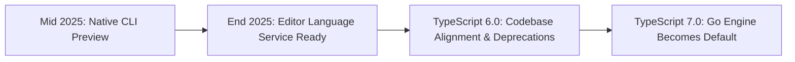

# Microsoft's Native TypeScript Type Checker in Go

Theo shares his immense excitement about Microsoft's announcement of a native port of the TypeScript type checker written in Go. Historically, rewriting a type checker for a highly dynamic language like JavaScript was considered nearly impossible due to the structural complexity of the language, but the TypeScript team has successfully managed it. This project is not just a straightforward compiler that strips types for production, but a full native implementation of the overarching type checking engine.

The performance gains of this new tooling are staggering, consistently demonstrating around a 10x improvement across large projects. Compiling the massive VS Code codebase dropped from 77 seconds to 7.5 seconds, while the Playwright codebase went from over 11 seconds down to roughly one second. Theo compiled the new tooling locally and experienced these speedups firsthand, noting that checks which previously felt like they took a full minute finished almost instantly.

*   This rewrite profoundly improves IDE and editor performance, as features like intellisense and hover-to-evaluate rely directly on executing the type checker under the hood.
*   Microsoft is intentionally moving TypeScript to use a traditional Language Server Protocol structure rather than keeping its historical, custom, deep integration specifically for VS Code.
*   Adopting the standard Language Server Protocol means that these massive performance benefits will be instantly available in other development environments like Neovim without requiring special treatment.

### The "Why Not Rust?" Debate

With any native tooling rewrite in the JavaScript ecosystem, developers immediately question why Rust was not chosen. Theo predicted over a year ago that Go would be the ideal language for this specific task, and the TypeScript team ultimately agreed after exploring C# and Rust iterations. Here are his points and the reasoning behind Microsoft's decision:

*   The TypeScript team used an automated script to port the existing TypeScript codebase into Go, capitalizing on the fact that Go's straightforward syntax maps beautifully to the existing JavaScript codebase.
*   JavaScript code is structurally highly flexible, allowing developers to add object properties dynamically on the fly, which is notoriously difficult and unergonomic to represent in Rust's strict type system.
*   A native rewrite in Rust would have required completely abandoning the current codebase for a from-scratch rewrite taking years, potentially yielding an incompatible version filled with complex and unsafe code.
*   Over half of the performance gains realized in the new engine come from parallel processing, which is a native, easy-to-use primitive in Go, contrasting heavily with JavaScript's single-threaded nature and Rust's challenging concurrency model.
*   Because files heavily reference one another, the parallel type checker intentionally does redundant work across threads but deduplicates the errors at the very end, resulting in vastly faster completion times despite using slightly more memory.
*   Relying on a Garbage Collector in Go is actually a massive advantage for a compiler, as developers can safely write simpler, greedier code without obsessing over memory lifetimetracking, and occasional garbage collection latency spikes do not negatively impact a build process.

Currently, the Go port is not completely feature-ready, specifically lacking JSX support, which prevented Theo from testing his React-heavy applications. However, Microsoft has clearly mapped out the eventual transition for the ecosystem to ensure large companies can scale their codebases effectively without fracturing the community.

Theo concludes by connecting this release to his broader theory regarding the future of development tools. He argues that the dominance of AI coding assistants fundamentally discourages the creation of entirely new frameworks or syntaxes, because AI models lack the deep training data required to write completely novel code accurately. 

Instead, he spots a highly beneficial trend where the industry is shifting toward deeply optimizing existing, well-trained paradigms without changing the developer's syntax at all. Innovations like the React Compiler, the Python UV tool, and now TypeScript Go fit perfectly into this model. Furthermore, Theo notes that a type checker capable of running in under three seconds completely changes the game for AI tooling, empowering local agents to write code, automatically verify the types, and correct their own errors in an incredibly fast, tight loop.
