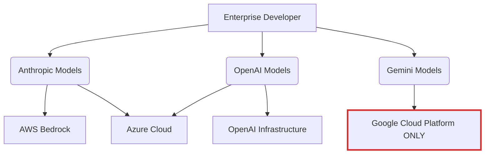

# Theo's Review of Gemini 3 Pro: A Massive, Quirky Leap Forward

Theo asserts that the release of Google's Gemini 3 Pro represents a massive capability jump, comparing its impact to the tectonic shift caused by the release of GPT-4 in early 2023. He admits he previously would not have believed Google could dethrone its competitors so quickly, but after rigorous testing, he officially considers Gemini 3 Pro the new leader in the AI space. 

### Ecosystem and Cloud Lock-In

Theo pushes back slightly on the Google CEO's boast that 70% of their cloud customers are using Google AI. He argues that this adoption is largely forced by Google's strict infrastructure lock-in, which forces developers onto their platform if they want to access the models.

### Benchmarks and Reasoning Capabilities

According to Theo, Gemini 3 Pro is dominating analytical and geometric benchmarks, proving its intelligence across a variety of complex testing environments. 

*   On the Humanity's Last Exam benchmark, the model scored an unprecedented 45.8% with tools and execution, signaling a major breakthrough on a test specifically designed by academics to stump modern LLMs.
*   It showed massive improvements on the ARC AGI 2 visual reasoning test by scoring 31.1%, proving it can solve complex visual logic puzzles that normally act as a hard wall for traditional language models.
*   During a Minecraft benchmark testing three-dimensional reasoning, Gemini successfully generated a visually recognizable video game controller, completely outclassing the disorganized geometry generated by GPT 5.1.
*   When tested on SWEBench for coding execution, Gemini 3 scored slightly below GPT 5.1 and Sonnet 4.5, though Theo notes this placement can heavily depend on the specific tool harness used to run the evaluations.

### Developer Experience and UI Generation

Through testing using the Cursor editor and parallel agents over several days, Theo found the model exceptionally fast and uniquely gifted at UI design. When asked to generate an interactive physics simulation container, Gemini successfully built an excellent, visually appealing UI that handled dynamic resizing flawlessy, outperforming the broken or misaligned layouts from Claude Sonnet and GPT 5.1.

Theo also utilized his own anti-gravity tool to let models run dry-run loops on a highly difficult AI SDK V5 update test. By allowing Gemini 3 to read its own code errors during a dry run, it solved the repository update on the first try—a feat no other previously released model had managed without heavy manual intervention.

Despite these highs, Theo points out significant trade-offs regarding the model's reliability in standard workflows.

*   The model struggles with maintaining long conversation threads and complex follow-ups, quickly losing track of context compared to its brilliant ability to execute a prompt perfectly on the very first try.
*   It frequently ignores strict developer instructions, such as directly disregarding a command to use the "bun" runtime and opting to use "npm" instead.
*   Theo encountered what he calls the "Google vibe," where the model is incredibly smart but randomly breaks in ridiculous ways, like hanging indefinitely in the command line interface or locking itself in a logical box it refuses to escape.

### Output Quality, Costs, and Hallucinations

One of the most surprising strengths of Gemini 3 Pro is its natural writing style. Theo notes it avoids the classic, robotic formatting and excessive bulleted lists seen in OpenAI and Anthropic models, providing writing that actually possesses a human tone and good pacing. It even successfully identifies that there is no official seahorse text icon, bypassing a common Mandela-effect trap that causes other models to hallucinate endlessly.

However, beneath the accurate responses, the model has a massive appetite for tokens and an unaddressed hallucination pipeline. 

*   The model suffers from severe token bloat, utilizing significantly more tokens to process standard index evaluations compared to its leaner competitors like GPT 5.1 and Claude 4.5 Sonnet.
*   The baseline pricing is high at two dollars per million input tokens and twelve dollars per million output, but Google punishes heavy usage by strictly doubling these costs the moment a user exceeds 200,000 tokens in a single context window.
*   According to the Artificial Analysis omniscience index, the model has an 88% hallucination rate, meaning that while it is highly capable of getting complex questions right, it still confidently makes things up rather than refusing to answer when it is genuinely confused.

Ultimately, Theo defines Gemini 3 Pro as a brilliant but quirky senior engineer that requires constant babysitting. Developers must verify its work and keep an eye on the terminal because it will often declare a job finished while the build is still visibly broken. Despite being expensive, token-hungry, and occasionally frustrating, its sheer intelligence and UI capabilities make Google the undisputed king of AI platforms once again.
