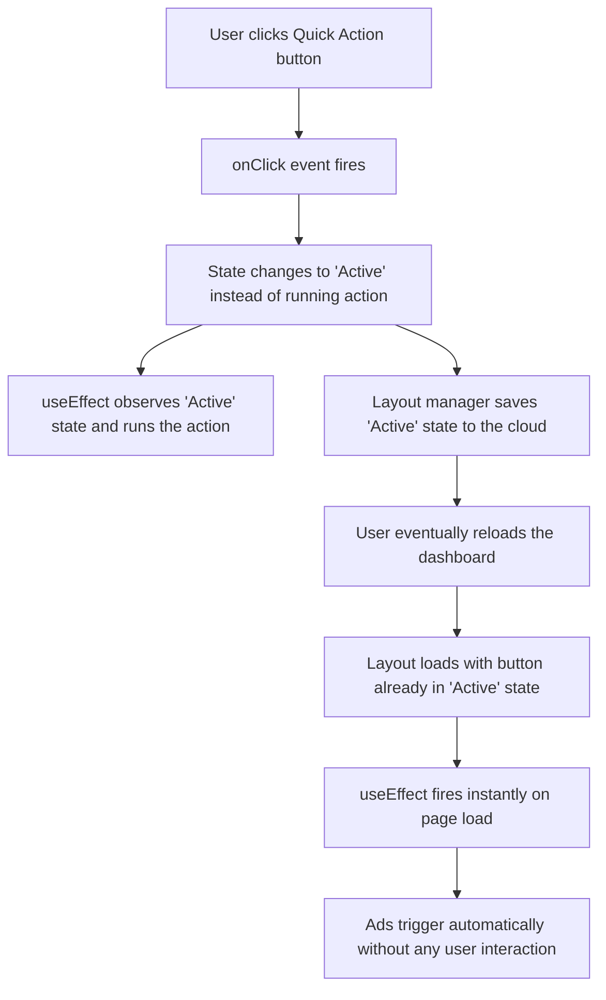

# Navigating Workplace Politics, Outgrowing Teams, and the Cost of Caring

In this reflection on his career at Twitch, Theo shares a deeply personal account of his successes and failures as he matured into a highly capable engineer. Prompted by a viewer struggling with a high workload and an inflexible boss, Theo explores the complexities of team dynamics, the danger of outpacing your peers, and the friction between building good products and protecting your career. 

### The Bus Factor and Recognizing Your Leverage

Before tackling specific workplace grievances, Theo challenges engineers to evaluate their true value to their employer by assessing their "bus factor." He argues that every professional must ask themselves what would happen to the company if they suddenly disappeared. 

*   You might realize you are entirely replaceable, which is a harsh reality that means the company can let you go at any time without consequence. 
*   Alternatively, you might realize you are truly essential, which comes with the trap of being forever burdened with maintaining the systems and teams you built.

Once Theo realized his own leverage at Twitch, his career fundamentally changed. He was capable of shipping faster and simplifying complex problems better than many of his peers, which made him an essential asset. Recognizing this gave him the confidence to demand better pay, push for specific new hires, and initiate cross-collaborative work that unblocked other teams.

### A Tale of Two Teams

Theo contrasts two wildly different team environments he experienced at Twitch to illustrate how company culture dictates an engineer's success. 

His time on the Safety Team was highly supportive and growth-oriented. Within a month, his manager noticed he was under-leveled, fought for his promotion, and encouraged him to take ownership. Because the team embraced his rapid work pace, Theo built relationships across departments, freely trading his time to help other teams in exchange for them prioritizing necessary safety features.

Seeking a new challenge, he eventually transferred to the Creator Org, a move he initially viewed as a massive mistake. The culture here was antagonistic and deeply insecure. When Theo rapidly completed tickets that the team had been delaying for months, his peers felt threatened rather than relieved. His manager monitored his calendar out of jealousy over his meetings with higher-ups, and when Theo rebuilt the Twitch mobile app during a hackathon—winning the event—his own leadership threw him under the bus with an HR warning to appease a frustrated mobile team.

### The Conflict Between Career Survival and Product Quality

A major theme in Theo's reflection is the internal conflict between doing what is right for the product versus doing what is safely optimal for your own career. He openly admits that his greatest failure was his inability to just stay quiet when bad decisions were being made. 

If you truly want to climb the corporate ladder and protect your standing, Theo notes that you sometimes have to stop doing work that does not directly benefit your role. On the Creator Org team, advocating for the users actively hurt his standing. He shares a story about a new product manager who proposed a seven-month, five-engineer project to sync dashboard layouts to the cloud. Theo knew this would ruin the experience for users accessing the dashboard on different sized monitors, and even ran data proving that only 5% of users shared the same aspect ratio across devices. Despite a two-and-a-half-hour meeting where the PM seemingly agreed with him, she later pushed the original proposal forward anyway, causing Theo to lose his temper and effectively end his upward trajectory at the company.

Theo contrasts his own stubbornness with the behavior of a coworker who was rewarded for shipping fundamentally broken, over-engineered code because it was wrapped in a highly polished PDF presentation. This coworker built a "quick action" button that inadvertently clicked itself, leading to one of the most stressful bugs Theo ever witnessed.

When this bug caused ads to run automatically during massive global broadcasts like the League of Legends World Championship, the original team denied responsibility. Theo had to check the logs to prove the action was triggering just four milliseconds after page load—an impossible human reaction time. He fixed the bug and wrote tests to prevent it from returning, but after he left the team, they deleted his tests and broke the feature again.

### Finding Your People

Despite the intense frustration he experienced, Theo expresses deep gratitude for the allies he made along the way. He concludes with several crucial pieces of advice for engineers who find themselves outgrowing their environments:

*   You must actively seek out peers who share your drive to improve, because being the best engineer on a stagnant team will only lead to misery line.
*   Motivated people often reveal themselves when given just a little bit of buy-in or positive reinforcement, so try giving your peers a slight nudge to see who steps up.
*   Once you experience the momentum of shipping fast and taking ownership, you will likely become addicted to it, making it exceptionally hard to assimilate back into unmotivated environments. 
*   If you cannot find supportive, driven allies in your current workplace, you must leave and find a new environment before your current one drains your motivation entirely.
