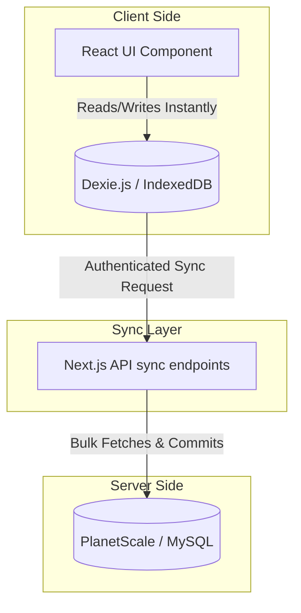

# The Chaos of Building a Local-First Database Architecture

Theo recently went through a chaotic but deeply educational experience building the data model for T3 Chat. Aiming to create a seamless, instant user experience without the loading spinners and layout shifts seen in mainstream AI chatbots, he committed to a local-first architecture. Getting this right required migrating his server-side database three times in a single 24-hour period. 

Building a robust local-first application requires managing two entirely separate database environments: a local in-browser database for immediate UI interactions, and a remote server database to act as a backup and cross-device sync engine. 

### The Problem with Server-Reliant UIs
When analyzing tools like ChatGPT or Claude, Theo notes that they rely heavily on network requests for simple navigation. Scrolling the chat history triggers loading spinners, and switching chats results in UI elements popping in randomly as different network states resolve. By storing the user's entire conversational history locally in the browser, T3 Chat updates instantly. Network data is only fetched once upon signing in, allowing users to navigate, search, and read their chat history even if they disconnect from the internet entirely.

### Evaluating Local-First Sync Tools
Before building a custom sync engine, Theo evaluated several hyped local-first solutions. He found that the industry fundamentally misunderstands the category, aggressively assuming "local-first" must also mean "real-time sync" and "multiplayer collaboration." Because T3 chat only needed to be local-first, the existing tools fell short:

*   **Zero:** This tool from the creators of Replicache looked promising due to its full-stack type safety. However, Theo dropped it because it required defining the database schema in multiple distinct places (code, SQL, and permissions), lacked a zero-downtime upgrade path, and much of the core sync engine appeared closed-source.
*   **Jazz:** Highly recommended by peers, Jazz fundamentally broke down for T3 Chat because its state model requires a global user identifier object. It offered no viable path for an unauthenticated, signed-out user experience, which was a strict requirement.
*   **TinyBase:** While it had excellent documentation and checked a lot of boxes, it relied entirely on WebSockets for syncing or required the developer to write the sync engine manually from scratch anyway.
*   **Legend State:** A remarkably fast library out of the React Native ecosystem. The creator was incredibly helpful, but they ultimately concluded together that Theo’s specific needs were better served by writing a custom sync implementation rather than wrestling with generic CRUD plugins.

### The Local Database: Dexie.js
Theo ultimately chose Dexie.js, a very mature, minimalist wrapper for IndexedDB. Natively, IndexedDB is a notoriously difficult key-value store to work with, but Dexie makes it highly flexible by allowing developers to define schemas and indexes easily. 

The biggest advantage of Dexie was its `useLiveQuery` hook. Because T3 Chat relies on streaming tokens, Theo can simply append streaming text directly to the message table in Dexie. The React components listening to that query automatically rerender upon changes. While this requires careful memoization to prevent rendering the entire application during a stream, it completely removed the need for complex, custom render loops.

A massive caveat of using local data is the necessity of "soft deletes." In a local-first architecture, you cannot actually delete data. If a user deletes a thread locally, the next time the app syncs, it will pull that thread right back down from the server. To fix this, developers must retain the record, nullify the contents, and mark its status as `deleted`, a tedious workaround required by virtually every local-first system.

### The Server Database Evolution
While the local client was running smoothly on Dexie, figuring out where to store the server-side backup was a logistical nightmare that evolved across three distinct phases.

*   **Phase 1: Redis Blobs (The Hack):** Initially, Theo took the user's entire chat history, serialized it with SuperJSON, compressed it via gzip, and stored it as a single blob in Redis under the user's ID. This worked beautifully for a short time, compressing 2,000 messages into just 200 kilobytes. However, users began pasting 100,000-word text blocks into the chat, inflating the compressed payloads to multiple megabytes. This crushed the bandwidth bill and caused the system to fail.
*   **Phase 2: Redis Key-Value Store:** Trying to be clever, Theo updated the sync engine to unbundle the blob. Every individual message and thread was given its own unique key in Redis formatted by namespace. While this fixed payload sizes, the database exploded from 50,000 keys to nearly a million in a few hours. Redis is designed for lightning-fast reads of a few items, not bulk-selecting thousands of distinct keys for a single user on page load. Performance immediately degraded.
*   **Phase 3: PlanetScale (MySQL):** Realizing a key-value store was the wrong tool for bulk data retrieval, Theo migrated everything to PlanetScale. Because PlanetScale runs on Vitess (a heavily sharded MySQL routing system built originally for YouTube), it easily handled queries pulling 20,000 rows simultaneously. The migration was completely seamless for the frontend; only the API endpoints had to change. Theo explicitly warns against relying on SQLite (Turso) for this specific scale, and notes that Postgres solutions like Supabase often buckle under connection limits when bombarded by serverless Lambda queries. 

### Final Conclusions on Local-First
Theo firmly warns developers not to build a local-first application unless it is the core differentiator of the business. 

The complexity is immense, the tooling is immature and overly conflated with multiplayer collaboration, and the architectural pitfalls are severe. For most projects, developers can achieve an exceptionally fast user experience simply by utilizing standard caching methods (like React Query's local storage persister) alongside fast server responses. If you must build local-first, expect edge cases that will force you to build your own sync engine from scratch.
