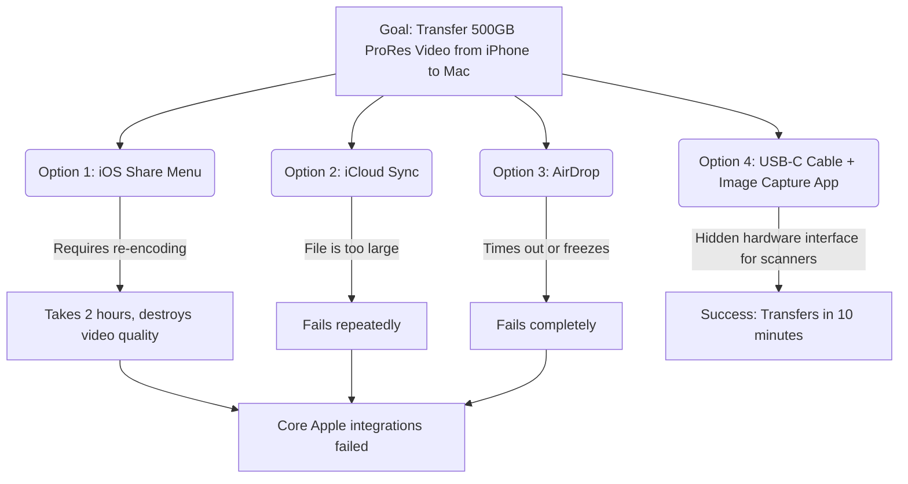

# Apple's Decline: A Power User's Breaking Point

Theo has a long, complicated history with Apple, transitioning from a childhood hater to a college-era fanboy, and now to a power user experiencing a deep, growing frustration with the ecosystem. Acknowledging the value of reliable tools—much like his team's reliance on Code Rabbit to catch minor bugs through AI so humans can focus on high-level logic—Theo expects Apple to maintain a standard of excellence. Instead, he believes the company is currently failing on three major fronts: software quality, corporate policy, and general ignorance of industry standards. 

### The Degradation of Apple Software
Theo believes the quality control in iOS and macOS is falling apart, abandoning the meticulous design standards Apple was once known for. He contrasts the seamless, unified launch of iOS 7 with today’s operating systems, which he describes as disjointed and buggy.

* Theo is incredibly frustrated by the "Liquid Glass" aesthetic in macOS 26, specifically pointing out that the corner radii on basic system apps like Finder no longer match the background windows or their physical hardware, an unforced design error.
* He blames loud, ungrateful users for ruining the iOS 18 Photos app by complaining about a highly efficient split-screen design, resulting in a new layout that forces users to perform multiple awkward taps in the hardest-to-reach zones of the phone just to see recent screenshots.
* Apple Mail's search functionality is completely broken, failing to retrieve emails by sender, subject, or unique keywords, forcing users to abandon the app entirely.
* The iOS keyboard has severely regressed, suffering from severe input lag when testing apps via Xcode and possessing an autocorrect that stubbornly ignores user edits, contrasting sharply with third-party tools like Whisper Flow that learn instantly. 
* The Apple Pay UI features a baffling design flaw where tapping your physical credit card graphic changes your billing address, while you must tap the small text underneath to actually change the payment card.
* When users sign into Gmail through the Apple Mail app, Apple silently redirects new contact saves to Google instead of iCloud, permanently losing phone numbers for users who don't understand the hidden shift. 
* Dynamic lists in macOS and iOS frequently reorder themselves milliseconds before a user clicks, resulting in accidental inputs that could be fixed with a simple half-second interaction cooldown. 
* The hit-boxes for resizing windows in macOS 26 are programmed to expect sharp corners, meaning the actual rounded corners of the UI are dead zones that do not respond to cursor clicks.

To illustrate how deeply Apple's first-party software fails professional workflows, Theo details his attempt to transfer a 500GB ProRes video file from his iPhone to his MacBook. The intended Apple ecosystem options systematically failed him, forcing a bizarre workaround.

### Entitlement and Corporate Policy
Theo argues that Apple suffers from a massive entitlement complex that severely damages its relationship with developers and degrades its own products. 

* Apple forbids its employees from having public agency or discussing their work, which drives top-tier engineering talent away to more transparent companies like Anthropic, where developers can publicly acknowledge and fix bugs.
* Apple feels entitled to a 30 percent cut of all digital transactions on its platforms, aggressively threatening companies like Patreon to adopt their payment systems or face removal. 
* Theo points out the hypocrisy of the App Store fee structure by noting that billion-dollar service companies like Bank of America consume massive Apple server resources for free, while independent creators earning small subscriptions heavily subsidize Apple’s infrastructure.
* Despite utilizing Anthropic's superior AI models internally for their own corporate workflows, Apple chose to partner with Google for Siri's consumer-facing AI simply because Anthropic was too expensive, deliberately passing a worse experience onto the user to save money.

### Ignorance and the Reality Distortion Bubble
Apple’s historic method of ignoring outside trends used to result in massive innovations, but Theo believes this isolation is now actively harming them. Because Apple executives and developers refuse to use competing software, they do not realize how far behind they have fallen. 

Theo shares an anecdote regarding a senior developer on the Xcode team. This developer admitted to watching Theo’s YouTube channel just to learn how modern developer workflows operate outside of Apple. The developer confessed that nobody within Apple understands how far behind Xcode is—largely because it is still built on NextSTEP code from the 1990s and its developers have never experienced modern, superior alternatives like VS Code. 

### Why He Is Trapped in the Ecosystem
Despite detailing exactly why Apple's software is agonizing to use, Theo explains that he cannot leave. He argues against the alternatives, stating that they fail entirely for professional creative workloads.

* While Android hardware has improved, Android apps feel like broken ports, and the operating system processes video through a pipeline that drops frames and cannot support the raw, high-bitrate video capture required for his professional work.
* Linux is highly capable for backend encoding, but it fundamentally lacks professional creative software like Final Cut or Affinity, and restrictive HDMI licensing standards prevent Linux from properly supporting 4K high-refresh-rate external capture pipelines. 
* He warns against trusting misleading media benchmarks claiming Intel has finally beaten Apple Silicon; he notes that Intel compared their top-tier, highest-core chip against Apple's baseline M5 chip, deliberately ignoring that Apple's older M4 Pro and Max chips still completely destroy Intel in multi-core performance. 

Theo concludes that he is stuck using Macs and iPhones because they are the only machines with the battery life, silicon architecture, and hardware pipelines capable of supporting a mobile professional creative. However, he warns Apple that they are entirely out of grace. If they do not fix their operating systems, AI-assisted coding will soon allow independent developers to build viable alternatives to the software that is currently keeping professionals locked in.
