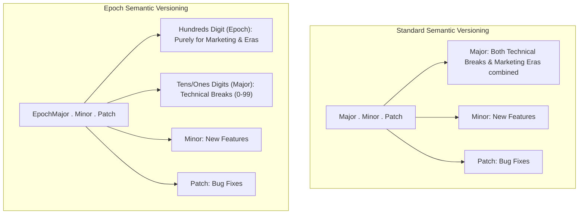

# The Flaws of Semantic Versioning and the Epoch SemVer Solution

Theo discusses the widespread use and inherent frustrations of Semantic Versioning (SemVer) in software development. While it is the industry standard for communicating code changes, he argues that the way humans interpret version numbers actively harms how software is delivered. Using his own project, UploadThing, and a new proposal from open-source developer Antfu, Theo explains why the current system is flawed and how we can effectively fix it.

Theo explains that SemVer acts as a contract between maintainers and users: a major version indicates breaking API changes, a minor version adds backward-compatible features, and a patch indicates backward-compatible bug fixes. This system technically works perfectly for package managers, which read the numbers literally to ensure safe, compatible upgrades. However, the system fails because humans perceive version numbers logarithmically. 

People view major bumps, like moving from version 1.0 to 2.0, as massive marketing events or entirely new eras of a product. Conversely, they view patches, like moving from 1.2.5 to 1.2.6, as trivial, even if those patches technically introduce significant or breaking behavior. Because of this human bias, maintainers become hesitant to bump major versions for minor breaking changes. Instead, they stockpile breaking changes until they have enough to justify a massive release. Theo points out that this actively harms users by delaying progressive delivery, making upgrades much larger and more painful than they need to be.

To avoid this problem, Theo notes that many massive, production-ready projects—like React Native and UnoCSS—stay on version 0.x.x indefinitely. This happens because SemVer includes a special rule: when the leading major version is zero, every minor version bump is treated by package managers as a breaking change. Maintainers abuse this rule to ship breaking changes as early and progressively as possible without causing the alarm that a major version jump typically triggers. Theo expresses frustration that he accidentally pushed version 1.0 of his own packages in the past, permanently locking him out of this zero-major workaround.

To fix the disconnect between technical reality and human perception, Antfu proposed "Epoch Semantic Versioning," a system that Theo enthusiastically supports.

*   In an ideal world, SemVer would use a four-number system (Epoch.Major.Minor.Patch), but because it is too late to force package managers to accept that format, the proposal merges the "Epoch" and the "Major" version into the single first number.
*   The third digit of that first number (the hundreds place) represents the Epoch, which is strictly reserved for massive marketing pushes, new eras, or complete overhauls of the software.
*   The first two digits (the tens and ones places) represent the Major version, allowing maintainers to ship up to 99 technical breaking changes under a single Epoch without triggering human panic.
*   Theo fully believes this approach is the right compromise, as it balances the strict, literal requirements of package tools with the hype-driven, illogical way humans process version numbers.
*   Theo suggests one minor modification to the proposal: multiplying the initial structure by 1,000 to make the numbers inherently massive (e.g., jumping to version 1000 instead of 100). He argues this makes it explicitly clear to users that the library is using a specialized versioning scheme, avoiding confusion with older conventions used by companies like AWS.

Theo concludes by noting that major versions were never meant to be sacred, a sentiment directly mirrored by the original creator of Semantic Versioning. He is excited about the flexibility Epoch SemVer offers maintainers to separate marketing efforts from technical release realities. While he plans to wait and observe how the rollout goes for Antfu's established packages, Theo is highly inclined to adopt this system for UploadThing and his future projects.
