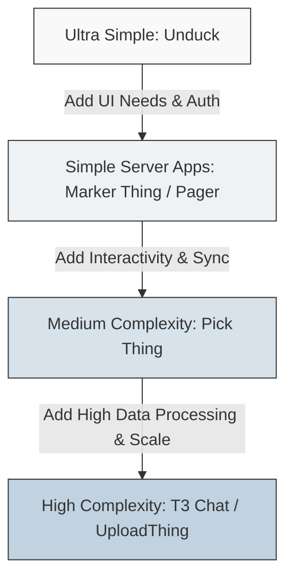

# Theo's Evolving Tech Stack and Engineering Philosophy

Theo has continuously refined his ideal tech stack since the inception of the popular "T3 Stack." Rather than advocating for a rigid, one-size-fits-all framework, he emphasizes modularity. You should pick specific, targeted tools that solve immediate problems and confidently ignore the rest. 

Through building various applications ranging from ultra-simple web tools to highly interactive, scale-heavy chat applications, Theo has crystallized a guiding philosophy for adopting technology.

### The Core Engineering Philosophy

The foundation of Theo's approach is managing complexity. He warns that complexity is the enemy of success and scale; the only thing that truly scales is simplicity. 

He approaches application architecture through three mandatory steps:
1.  Start with the simplest reasonable thing. 
2.  Add complexity only when it becomes absolutely necessary.
3.  Regularly reflect on that complexity to see if it is still required, and be incredibly willing to delete code and circumvent complex patches entirely.

Theo notes a critical rule of thumb regarding architectural shifts: moving from a simple solution to a complex one (like moving from a key-value store to a relational database) is a standard migration. However, trying to move from a complex solution back to a simple one usually requires a complete rewrite.

Here is how Theo visualizes the evolution of complexity based on his recent real-world projects:

*   **Unduck:** Zero dependencies, purely vanilla HTML and basic TypeScript. 
*   **Marker Thing / Pager App:** Utilizes React Server Components, Clerk for authentication, and basic third-party APIs with zero relational databases.
*   **Pick Thing:** Introduces full React, tRPC for client-server communication, client-side state, and basic key-value data storage.
*   **T3 Chat:** Requires complex local browser storage, bespoke routing bypasses, and heavy relational databases to manage immense chat thread data.

### Frontend, APIs, and State Management

Theo almost entirely relies on React for modern web development, noting that while simple pages do not need it, complex user interfaces inherently benefit from a dedicated library. 

*   **API Layer (tRPC vs. Server Components):** If an app is simple and minimally interactive, Theo loves Server Components for their sheer simplicity. However, the moment a project requires complex, dynamic client-server interactions, he falls back to tRPC. He argues tRPC is the only sane way to guarantee deep, frictionless type safety between the frontend and backend without generating complex schemas.
*   **State Management Navigation:** Theo uses different tools for distinct tiers of state complexity. He relies heavily on React Query to handle asynchronous data fetching cleanly. For simple, globally needed values like local storage items, he uses Jotai. When related data needs strict organization (like real-time video call statuses), he prefers Zustand. 
*   **Local High-Scale Storage:** For applications requiring the client to store massive amounts of data locally (like handling chat histories over 10MB in T3 Chat), he uses Dexie to tame the notoriously difficult IndexedDB browser API.
*   **Styling:** He strictly uses Tailwind CSS alongside Shadcn UI for fast, maintainable component designs.

### Databases and Infrastructure

Theo’s approach to data is highly protective against what he calls "split brain"—situations where the same data exists in multiple states across different services, leading to inevitable synchronization bugs. 

*   **Start with Key-Value (KV) Stores:** Theo strongly advises starting with a KV store (he highly recommends Redis via Upstash) rather than jumping straight to SQL. Most application data can be modeled as key-value pairs at the beginning, and upgrading from KV to SQL later is very manageable. 
*   **Scaling to Relational Databases:** When an application scales to a point where a KV store fails, Theo moves completely to PlanetScale. He praises PlanetScale for its massive scalability and performance under heavy loads.
*   **The Danger of Turso:** Theo explicitly warns against using Turso currently. After trying it, he observed embarrassing, large-scale outages, including a bug where users were inadvertently served other customers' databases containing sensitive information due to a caching error.
*   **Avoid Google Sheets as a Database:** Despite desires to keep things simple, Theo warns that relying on Google Sheets as a database is a nightmare due to Google's archaic, complex, and heavily restricted API layer. 
*   **Isolated Serverless Microservices:** To manage background processing without clogging his main application state, Theo uses Cloudflare Workers. For example, he built an isolated microservice on Cloudflare to process background image removal, keeping his main application utterly stateless regarding that feature.

### Auth, Analytics, and Utilities

Theo has strong opinions on application infrastructure that exists outside the direct codebase, specifically regarding how users and environments are handled.

*   **Keep Auth Out of the Database:** Theo is entirely opposed to maintaining user tables and authentication layers inside his main application database. He defaults to Clerk for standard projects due to its ease of setup. When needing more control, he uses OpenAuth (by SST) to build isolated authentication microservices via Cloudflare.
*   **Managing Stripe Payments:** Handling Stripe correctly is notoriously painful. Theo's central advice is to stop storing complex Stripe subscription data in your relational database. Instead, dump Stripe webhook data into a simple Key-Value store to strictly check if a user is subscribed or not.
*   **Product Analytics:** For any project he actually cares about measuring, Theo completely relies on PostHog. He clarifies that generic web tracking (like Google Analytics or Plausible) only tracks page views, whereas PostHog provides deep product analytics to see exactly what actions individual users are taking.
*   **Routing Hacks:** Though he builds heavily in Next.js, Theo actively patched React Router into his Next.js application for T3 Chat. He did this because Next.js blocks navigation to run server code on catch-all routes, and he needed instant, non-blocking client-side navigation. He acknowledges this is an unholy hack and looks forward to TanStack Router or Remix eventually solving this.
*   **Environment Variables:** He advocates strongly for `t3-env` (which validates environment variables with Zod at build-time) to prevent broken deployments caused by missing keys.
*   **Package Management:** Theo exclusively uses `pnpm` under a Node runtime, finding `bun` too immature to handle complex monorepo package management without causing immense frustration.
