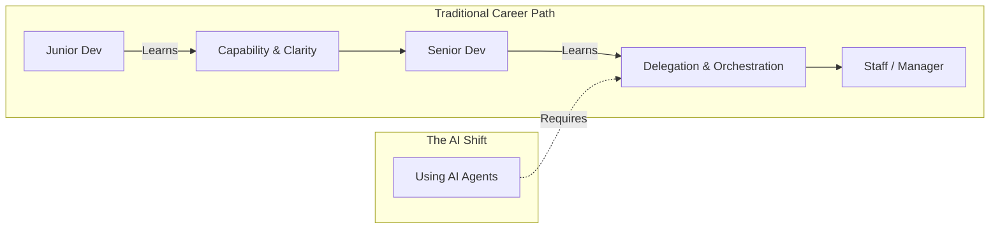

# Why Senior Developers Are Embracing AI Coders

Theo points out a surprising and heavily debated shift happening in software engineering: top-tier, veteran developers are rapidly embracing AI coding tools. While there is a common stigma that AI is only helpful for junior developers who struggle to write their own code, the industry's most respected figures are utilizing it to do real work on real systems. 

These elite developers are moving past using AI as simple autocomplete and are instead treating it as a supervised collaborator. Theo highlights a few notable examples of this shift:

*   **DHH (Creator of Rails):** Previously a skeptic who viewed AI as poor autocomplete, DHH recently stated that he has promoted AI agents to a collaborative role capable of producing production-grade contributions.
*   **Linus Torvalds (Creator of Linux):** Linus recently used AI to "vibe code" a Python audio visualizer. Because he deeply understands the domain (analog filters) but not the specific language (Python), he clearly described what he wanted and let the AI bridge the language execution gap.
*   **Antirez (Creator of Redis):** He used Claude to replace a 3,800-line C++ dependency with a clean, pure C implementation. He supervised the work closely, testing it by hand and then having a second AI model review the code.

### The Skill Gap: Why Seniors Use AI Better Than Juniors

Referencing data from Cursor, Theo explores why senior engineers and management accept significantly more AI-generated code than junior developers. He argues this comes down to how developers progress in their careers and the specific skills required at each level.

Theo breaks down a programmer's skill growth into four distinct categories:
*   **Capability:** The raw ability to write code, understand syntax, and solve problems independently.
*   **Clarity:** The communication skill needed to clearly describe what you are building, why you are building it, and what details actually matter.
*   **Delegation:** The ability to break massive pieces of work into small, independent chunks that others can resolve.
*   **Orchestration:** The ability to manage parallel work streams and assemble the resulting pieces into a cohesive system.

To move from Junior to Senior, developers mostly rely on expanding their Capability and Clarity. However, to move from Senior to Staff, developers hit a ceiling on how much code they can personally type. They must transition from doing the work themselves to explicitly delegating and orchestrating the work of others. 

Theo explains that junior developers generate a lot of AI code, but they lack the verification heuristics to know if the output is safe to accept. Conversely, senior engineers accept more AI code because they write high-signal prompts with tight specs, minimal ambiguity, and possess the experience to review the output quickly and accurately.

### Theo's Take on "Anti-AI" Developers

Theo argues that the technology industry has historically over-indexed on raw individual "capability"—measured by how much code a single developer can personally type and ship. Because AI effectively replaces personal coding capability, developers who attach their self-worth strictly to typing code often view AI with hostility.

From his perspective, developers who are fiercely anti-AI are often incredibly capable individual coders who simply lack delegation and orchestration skills. They are used to controlling every detail and view the managerial process of breaking down tasks, reviewing iterations, and correcting mistakes as a frustrating failure compared to just doing it themselves.

### We Are All Managers Now

Using AI tools effectively forces a developer to act like a manager. You have to write exceptionally clear requirements, manage tasks being executed in parallel, and reject work that falls below your quality bar. 

Theo does acknowledge one specific downside to managing AI instead of humans: AI agents cannot take long-term ownership of the code they write. If a bug appears later, an AI struggles to remember the original context of why it built the system that way, meaning the human developer must retain ultimate ownership of the system's architecture.

Ultimately, Theo concludes that developers should stop viewing AI as a threat to their personal coding ability. Instead, they should see it as a demanding exercise to level up their system thinking, clarity, and management skills. The developers who go the furthest in the future will be the ones who realize their time is better spent directing the system rather than manually typing out the details.
