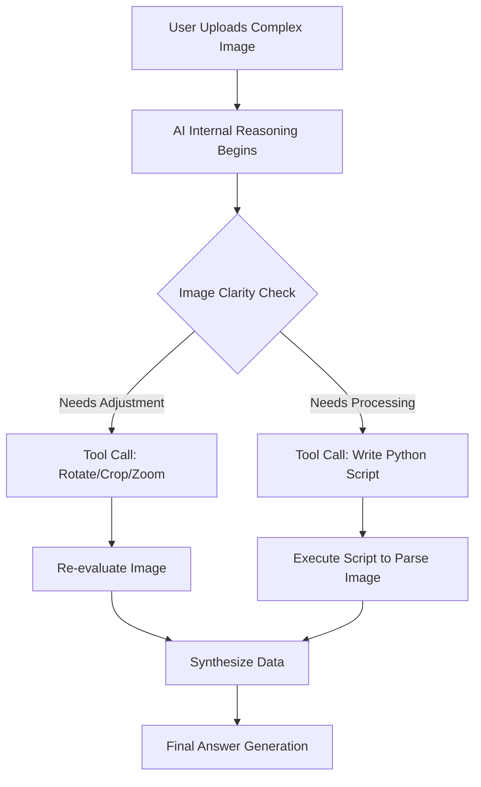

# OpenAI's Direct Attack on Anthropic: o4-Mini, Codeex, and the Developer War

Theo recorded this breakdown from his hotel room while attempting to attend the React Miami conference, disrupted once again by a major OpenAI release. While the announcement of the o3 and o4-mini models is exciting on its own, Theo argues that this release is fundamentally about something much larger. He views these updates as a calculated, aggressive attack to strip Anthropic of its only remaining major advantage: being the favored AI company among developers. 

Here is a detailed breakdown of the models, the new features, and the strategic moves Theo highlights.

## The New Models and the Price War

Theo integrated o4-mini into his own application, T3 Chat, immediately. While he notes it is frustrating that OpenAI still hides the reasoning tokens over the API, making the models feel slower than they actually are, the performance and economics of the new models are remarkable.

*   **o4-mini is a massive value:** Theo calls o4-mini his new favorite model. It is exceptionally cheap at $0.10 per million input tokens and $0.40 per million output tokens, matching the price of o3-mini while outperforming it. It is also cheaper and smarter than GPT-4.1 and GPT-4o-mini.
*   **o3 is for complex depth, but rarely necessary:** The o3 model costs $10 per million input and $40 per million output. It operates much like o1, being slower and more verbose, designed for highly complex, multi-step problems. However, Theo points out that o4-mini actually beats out o3 on some Python math benchmarks.
*   **AI still requires a piecemeal approach:** Despite these advancements, Theo still does not rely on AI to one-shot deeply complex architecture. He prefers using these models to check his work or handle smaller, broken-down components of larger coding tasks.
*   **OpenAI is winning the race to the bottom:** After previously seeming to ignore pricing, OpenAI has drastically lowered costs across the board. They are aggressively pushing down the "cost per intelligence unit," forcing a price war that Anthropic has yet to engage in.

## Multimodal Reasoning and Tool Use

One of the most groundbreaking features OpenAI showcased is the ability for these reasoning models to "think" using images. Historically, reasoning models only utilized text during their internal chain of thought. Now, they are entirely multimodal and heavily reliant on internal tool calling.

During the hidden reasoning phase, the AI can natively utilize image manipulation tools. If a user uploads a poorly angled photo of text or a math problem, the AI can internally zoom, crop, denoise, and rotate the image before attempting to solve it. Theo notes this mimics how a human might drop a bad photo into Photoshop to make it legible before reading it.

Furthermore, the model pairs this visual reasoning with its coding environment to solve puzzles. 

In one impressive example highlighted by Theo, the AI was given a transparent image of a maze. The model reasoned about the image, wrote a Python script to parse the visual data, executed the code to solve the maze, and had the Python script output a finalized image showing the solved path. Theo points out that this represents a massive leap in how deeply integrated OpenAI's agentic tools have become.

## The Strategic Moves Against Anthropic

Theo dedicates a significant portion of the video to OpenAI's broader business strategy. He believes developers prefer Anthropic's Claude primarily due to its superior coding output and excellent tool-calling capabilities. OpenAI is actively targeting this sentiment with a multi-pronged strategy.

*   **Launching a true open-source CLI coding agent:** OpenAI released Codeex, a lightweight coding agent that runs in the terminal. Crucially, unlike Anthropic's Claude Code—which is heavily restricted by an commercial license and hides its source code—Codeex is fully open-source under an Apache license. Theo notes it is built using TypeScript and Ink.js, allowing the community to extend and improve it.
*   **Attempting to buy the IDE market:** Anthropic currently works closely with Cursor to dominate the AI IDE space. To counter this, OpenAI is reportedly in talks to acquire Windsurf, Cursor's most prominent competitor, for roughly $3 billion.
*   **Teasing an open-weights reasoning model:** OpenAI has announced plans to release an open reasoning model in the near future, which Theo suspects will perform similarly to o3-mini. Anthropic, by contrast, has never released an open-source model.
*   **Focusing entirely on tool calls:** OpenAI has recognized that Anthropic's native tool calling is highly praised. By centering their last three model releases around giving the AI native access to search, code execution, and image manipulation, OpenAI is systematically erasing Anthropic's functional advantage.

## Conclusion

Theo believes that OpenAI's aggressive sequence of highly capable, ultra-cheap models alongside genuine open-source tooling is succeeding in winning back developer goodwill. Because OpenAI built the initial API standard that the rest of the industry copied, and because they are now actively lowering costs, Theo currently feels that OpenAI is acting more in the interest of developers than Anthropic is. 

He concludes by expressing hope that these aggressive maneuvers by OpenAI will jolt Anthropic out of what feels like complacency, forcing them to drop their prices and release open-source tools to compete for developer approval once again.
