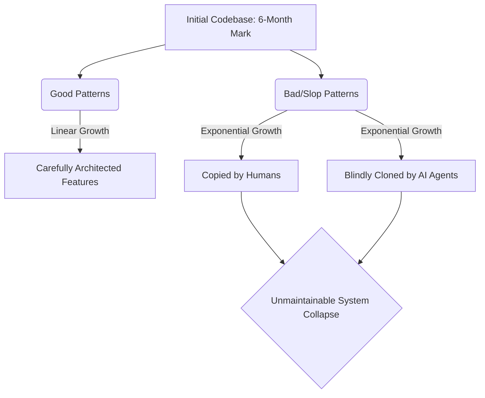

# The Hidden Crisis in AI Developer Tools and How to Fix It

Theo begins with a blunt assessment of the current landscape of AI developer tools, including Cursor, Claude Code, and Codeex. Despite the massive hype, he finds them highly inconsistent, buggy, and ultimately frustrating to use. He argues that a fundamental architectural problem is holding these tools back: the companies building them fell victim to their own technology too early. 

Historically, "dogfooding"—building a tool using the tool itself—has been a best practice in software engineering. However, Theo takes the controversial stance that for AI coding companies, this approach has created a massive disadvantage. By heavily relying on early models like Claude 3.5 or 3.7 Sonnet to build their actual applications, these companies baked early AI limitations and messy architectural patterns permanently into their codebases.

Theo briefly notes that fixing context retrieval is essential for modern agents, mentioning his reliance on Augment to instantly index large codebases so that tools like Codeex don't spend endless time searching for poorly linked logic. However, context tools cannot fix a fundamentally broken user interface. 

### The Realities of Using AI-Generated Dev Tools
Through his daily workflow, Theo highlights severe usability issues in the most popular AI coding platforms. He explains that these tools do not just fail occasionally, but they fail in highly non-deterministic ways, making it impossible to rely on them for serious engineering.

* Cursor recently removed a highly praised user interface feature—a simple toggle between "agent mode" and "editor mode"—in favor of confusing layout templates that shift the UI unpredictably and break established workflows.
* The cursor interface is so unstable that it frequently and accidentally leaks his private email address on screen with a single misclick, showcasing a severe lack of UI polish.
* Claude Code, despite being a Command Line Interface (which historically implies stability and simplicity), is remarkably buggy. Theo experienced severe typing lag, where the terminal physically could not register keystrokes in real-time.
* File handling in Claude Code is broken to the point of causing unrecoverable errors. He recounts an instance where pasting an image caused a hidden race condition and failed background compression, which permanently corrupted the context window and killed his entire coding thread.
* The performance of these AI CLIs is so poor and memory-intensive that the creators occasionally resort to desperate measures, such as acquiring the talent behind the highly optimized Bun runtime simply to salvage their failing architecture.

### Codebase Inertia and the Multiplication of Slop
Theo introduces the concept of codebase inertia, arguing that the structural quality of any software project peaks between three and six months of focused effort. If a team uses early AI models to "vibe code"—accepting AI-generated output with minimal steering—during those crucial first months, the codebase permanently plateaus as a disorganized mess. 

Once a codebase reaches this state, bad patterns multiply exponentially while good patterns only grow linearly. When developers or AI tools need to implement a new feature, they look to the existing codebase for examples. Because bad, rushed code is often easier to find and copy, both humans and AI agents will silently propagate those poor architectural choices throughout the entire system. 

### Theo's Playbook for the AI Coding Era
To survive and thrive when managing codebases touched by AI, Theo insists that engineering skills and architectural discipline matter more now than ever before. He outlines specific strategies to prevent AI tools from destroying a project's maintainability.

* **Adopt a zero-tolerance policy for bad code.** If you or an AI agent introduce a messy, poorly optimized pattern just to hit a deadline, it will rapidly infect the rest of the project. If code smells bad, it must be removed immediately, regardless of missed deadlines or management pressure.
* **Embrace sledgehammer development.** It is historically too expensive to delete 5,000 lines of bad code and rewrite it from scratch, but AI has drastically lowered the cost of generating new code. If a system is broken, instruct the AI to completely replace it rather than trying to untangle and fix the existing mess.
* **Spend the majority of your time in planning mode.** Do not let the AI immediately start writing code. Engage in a deep back-and-forth dialogue to draft a thorough markdown plan, read the plan carefully to ensure the architecture is sound, and only generate code once the blueprint is perfect.
* **Isolate features into separate repositories.** Instead of cramming internal endpoints, deprecated features, and one-off tools into a massive monolithic codebase, spin up entirely new modules. Theo recalls his time at Twitch, where he fought to keep an admin-only "permaban" tool entirely out of the main public Twitch codebase to prevent security vulnerabilities and massive technical debt.
* **Interrogate your AI agents.** When an AI suggests a weird solution, ask it exactly where it got the idea. If it pulled a bad pattern from an old file in your project, go delete that file so the AI stops learning from it.

### The Return of the Prototype Model
Because building reliable code on top of AI "slop" is proving impossible, Theo predicts a radical shift in how teams will build software. He points to the development of the game *Vampire Survivors*. The creator built a messy, laggy version of the game in browser-based JavaScript to rapidly test mechanics and prove the concept. Once the ideas were finalized, a separate team used strict engineering practices to rebuild the engine from scratch in C++ for the actual consumer release. 

Theo believes developers will need to adopt this exact methodology for traditional software. Teams will likely use AI and "vibe coding" to create disposable, messy prototypes to test user experiences. Once the ideas are proven, they will throw that code away and start from scratch with rigorous, planned engineering. In this new era, the mantra shifts from "measure twice, cut once" to "file ten messy pull requests, but only merge the carefully rebuilt final version."
