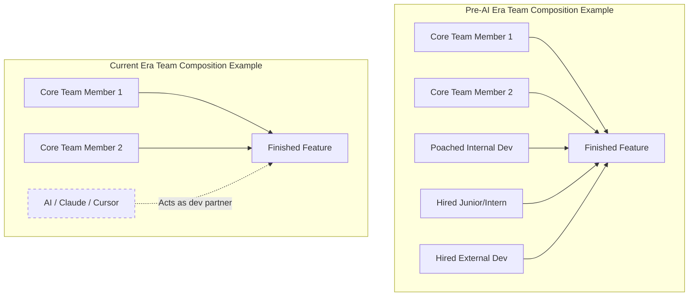

# Navigating the Harsh New Reality of Junior Software Development

Theo begins with a candid admission: he was entirely unqualified for his first software development job. He secured a three-month contract heavily based on cultural fit and the patience of a manager who liked him. Through grueling work and constant hand-holding from senior developers, he eventually proved himself and leveled up. However, Theo acknowledges that the industry has fundamentally shifted, and the path he took is essentially closed to juniors today. 

The software market is currently in a chaotic state. Historically, the number of developers needed to build a feature was high, while the number of available developers was low. This gap created tremendous leverage for engineers, forcing companies to compete fiercely, lower their hiring bars, and invest heavily in training junior staff. Today, the lines have crossed. Modern frameworks, changing product expectations, and AI assistants like Claude have drastically reduced the number of engineers required per feature. Meanwhile, the pool of applicants has surged, and available capital has decreased. Companies no longer need to take risks on unproven talent because they can simply reassign existing staff or lean on AI tools. 

To illustrate this, Theo reflects on his experience managing a team at Twitch to build the Mod View product.

In the current era, the junior and intern roles have effectively vanished from the team structure. However, Theo argues that while getting a first job is significantly harder, it is not impossible if you completely rethink how you learn, build trust, and communicate.

### The Learning Process and the AI Trap
The way juniors learn to program has changed, and Theo warns that it is currently set up to make developers fail. 

*   In previous years, engineers facing an obscure error had to manually isolate the problem, search forums, and eventually ask a senior colleague who would force them to rethink the entire architecture of their solution.
*   Today, it is a basic human instinct to avoid hard things, and chatbots offer an immediate escape hatch for any error message you encounter.
*   If you constantly ask AI to fix your uncaught exceptions, you rob yourself of the opportunity to struggle, learn root causes, and understand the deeper layers of your applications.
*   Theo credits his engineering resilience to his background in skateboarding, where progress requires entering a session fully expecting to fall and get hurt.
*   To succeed as an engineer, you must go into a programming session expecting your code to break, embracing the feeling of being dumb, and fighting the urge to let the AI do the painful parts for you.

### Reaching the Trust Bar
Theo rejects the idea that a developer's salary grows on a smooth, linear curve. Instead, your compensation in the tech industry operates as a step function. 

You will realistically make zero dollars as a software developer until your skills cross a specific quality threshold, at which point your value immediately jumps to a six-figure salary. However, being technically skilled is no longer enough to cross that line. In an internet flooded with thousands of AI-generated applications, the rarest and most strictly required commodity is trust. 

Because companies have less money and fewer open headcount slots, they rank applications based on the likelihood that a candidate will actually perform well, not on the buzzwords listed on a resume. If you rely on AI to generate boilerplate sites or commit slop to GitHub, senior engineers will immediately see through it. Instead, you build trust by showing genuine care for the craft. Publishing a blog post detailing why you chose a specific technology, or publicly admitting which parts of a problem you struggled to understand, signals honesty and a willingness to learn that employers desperately want. Outstanding people still stand out, even in crowded markets, because their genuine curiosity and effort are undeniable. 

### How to Communicate and Stand Out
The final piece of Theo's framework is learning how to effectively communicate with senior developers and potential mentors. Approaching people the right way can accelerate your career, while treating them like data processors will guarantee you get ignored.

*   Never send an unsolicited direct message containing your entire life story, coding journey, or vague, open-ended questions.
*   High-value communication starts with context, pinpoints the specific misunderstanding in the smallest possible terms, and makes a very low-friction ask, such as requesting a link to a resource.
*   Community members who consistently provide clear context, ask thoughtful questions, and share relevant resources in public forums often end up being directly hired or heavily referred by senior engineers who notice their competence.
*   If a senior developer gives you a resource that makes a concept click, writing a detailed blog post about your breakthrough and sharing it back to them is incredibly impressive and places you firmly on their radar for future job opportunities.

### Clarifications on Theo's Advice
Theo is highly specific about what he is entirely against, clarifying his stance to prevent misinterpretation:

*   He is not telling you to abandon AI tools entirely. Using AI to explain a complex topic or write boilerplate code to save time is highly beneficial; the danger only lies in using AI to avoid learning hard concepts.
*   He is not saying you have to learn React to get a job. You should use whatever framework you genuinely care about and understand deeply. 
*   He is not saying GitHub is useless. While spamming popular repositories with low-effort pull requests will not get you a job, writing detailed bug reports with exact reproduction steps on tools you actually use is a massive green flag to hiring managers.
*   He is definitely not saying you should give up. Once you cross the initial threshold and secure your first job, the potential to create massive impact and climb the ranks is actually higher today than it has ever been.
