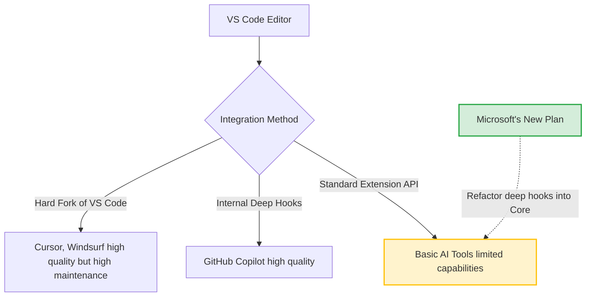

# Microsoft Open-Sources Copilot: The End of VS Code Forks?

Theo breaks down a massive philosophical shift from Microsoft: the decision to open-source the GitHub Copilot Chat components in VS Code, alongside the Windows Subsystem for Linux (WSL). He explains the underlying technical history of VS Code, why this move threatens the current wave of popular AI editor forks, and why Microsoft ultimately decided that now is the right time to make this transition. 

### The History of AI in VS Code
Historically, VS Code has been an open-source, MIT-licensed editor that developers customized using the extensions API. This API allowed for sidebars and iframes, but it was highly limited in how deeply it could interact with the editor. 

When Microsoft introduced Copilot, they realized the standard extension capabilities were not powerful enough to support advanced AI features like inline diffs or real-time tab completions. Consequently, Copilot had to diverge from standard extension paths, utilizing special internal hooks built directly into VS Code. Because standard extensions could not access these deep integration points, third-party developers who wanted to build AI tools at the same quality level as Copilot had only one option: completely fork VS Code. 

This necessity gave rise to an entire market of highly capable, heavily funded VS Code forks like Cursor, Windsurf, Void, and Pear. However, Theo points out that maintaining a hard fork of VS Code is incredibly resource-intensive, requiring teams to manually manage security patches, backfill updates, and operate without the official VS Code extension marketplace.

### What is Changing and What Remains Closed
Theo clarifies the specifics of what Microsoft's announcement actually entails, noting that the transition is a planned process rather than an overnight drop of code.

*   Microsoft is keeping the Copilot server backend, inference engines, tokenization management, and proprietary APIs strictly closed-source.
*   The GitHub Copilot Chat extension itself is being open-sourced under the highly permissive MIT license, meaning developers can freely use, modify, and even build competing products with the code.
*   Microsoft is aggressively refactoring the custom integrations that powered Copilot—such as inline autocomplete and complex chat features—directly into VS Code Core so that any standard extension can access them.
*   The company is also open-sourcing its prompt-testing infrastructure to ensure community contributors can easily build and pass tests for new AI features.

### Why Microsoft is Making This Move Now
According to Microsoft's statements and Theo's analysis, several major industry shifts have made retaining a closed ecosystem less necessary and more detrimental to the community.

*   Large Language Models have improved so significantly that complex prompt engineering and secretive system prompts are no longer the deep competitive moat they once were.
*   Modern models, such as GPT-4.1, can now natively read and write git diff syntax, eliminating the need for complex, custom-built models just to handle file editing.
*   The user experience for AI editors has largely converged, meaning features like hitting Command+I for a sidebar or Command+K for inline edits are universally expected standards rather than unique innovations.
*   Microsoft wants to foster transparency and security, as open-sourcing the extension allows the community to track telemetry data and rapidly patch malicious exploits targeting AI tools.

### The Impact on the AI Editor Market
Theo, who is directly invested in several VS Code forks like Cursor and Void, believes this announcement fundamentally alters the competitive environment. 

Microsoft’s overarching goal is to stop the fragmentation of the VS Code ecosystem. When companies fork VS Code, they stop building on a shared foundation, which inevitably leads to compatibility issues, such as standard C++ extensions breaking in Cursor because upstream patches were ignored. By elevating the maximum capability of standard extensions, Microsoft is actively trying to help extension-based AI tools—like Cline and Augment Code—succeed. 

Ultimately, Theo concludes that Microsoft does not necessarily want to destroy companies like Cursor, but rather eliminate the technical disadvantages faced by developers who choose to build within the ecosystem rather than fracturing it. 

### Bonus Announcements
At the end of the video, Theo briefly shares two other exciting pieces of news from Microsoft. Alongside open-sourcing WSL, Microsoft unexpectedly released a brand new CLI text editor designed as a Vim competitor. Written entirely in Rust, the new editor pays homage to the classic MS-DOS editor, further highlighting Microsoft's currently aggressive push into open-source developer tooling.
