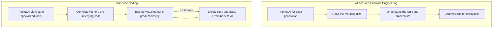

# The True Meaning of Vibe Coding and Why It Matters

Theo dives into the heavily debated concept of "vibe coding," a term originally coined by Andrej Karpathy in February 2025. While the phrase has rapidly become Silicon Valley's favorite buzzword, Theo argues that it is already being widely misunderstood and diluted. Drawing heavily on the writings of Simon Willison, Theo sets out to rescue the definition of vibe coding, explain why it is deeply valuable for the industry, and outline exactly when it should—and shouldn't—be used.

### Redefining Vibe Coding

Theo stresses that vibe coding and traditional coding are diametrically opposed. To him, vibe coding is not about what percentage of your AI tool wrote the code, but rather the ratio of your attention. If your attention to the actual code is zero, you are vibe coding.

*   Using tab-complete or inline prompt editing (like hitting Command K in Cursor) is simply AI-assisted software development, because it requires you to read the diffs and understand the changes.
*   Tools that check your repository for bugs, like CodeRabbit or Graphite's Diamond, represent responsible software engineering, not vibe coding.
*   True vibe coding means fully ignoring the underlying codebase by closing the files, looking only at the final product, and blindly pasting any errors back into the AI without providing additional context.
*   Platforms like Lovable and Bolt often facilitate this by hiding the code tab entirely, forcing the user to focus strictly on the visual output rather than the architecture.

### The Dilution of a Useful Term

Theo is immensely frustrated by how quickly the industry has co-opted the term to sell products and books. He points out that publishers are already releasing books with titles like "Vibe Coding: Building Production Grade Software," which is an inherent contradiction. 

To illustrate how absurd this is, Theo compares it to someone writing a book about Test-Driven Development (TDD) that teaches you how to add tests to a project after it is already built. Just as TDD requires the tests to drive the process, vibe coding requires a total detachment from reading the code. When developers use the term to describe any AI involvement in their work, or use it as a pejorative to explain away bad code or server outages, it completely destroys the term's usefulness for categorizing a distinct new way to build.

Simon Willison's golden rule highlights this contrast perfectly: you should never commit code to a repository if you cannot explain exactly what it does to another human. Doing so is actual software development. Vibe coding completely ignores this rule by design, which is why it is meant for an entirely different class of projects.

### The Value of Time to Smile

Despite the gatekeeping around what production code should look like, Theo is incredibly optimistic about vibe coding because it drastically lowers the barrier to entry for beginners and non-developers. 

He likens learning to code to learning how to skateboard. It takes months or years of falling down just to land your first basic trick, the ollie. Because the journey from starting out to doing something rewarding takes so long, most people simply give up. In coding, staring at esoteric languages and struggling with syntax creates a massive barrier. Vibe coding radically shortens the "time to smile"—the time it takes for a beginner to input a command, see a working result, and feel a sense of accomplishment. By flattening the learning curve, vibe coding will inevitably serve as a gateway, turning many total beginners into capable, passionate software developers over time.

Furthermore, Theo doesn't feel threatened that his unique ability to build an app in a week is no longer a rare superpower. He is thrilled that anyone, even non-programmers running small consignment shops or playing video games, can now build bespoke tools tailored exactly to their needs without needing a computer science degree.

### When to Vibe Code Responsibly

Because vibe coding inherently bypasses quality control, architecture planning, and rigorous testing, Theo and Simon outline clear boundaries for when it is appropriate to use this approach.

*   Vibe coding should be reserved strictly for low-stakes, disposable projects where failure will not cause financial harm, reputational damage, or physical risk to users.
*   Projects built this way are best kept as personal tools; if a vibe-coded tool eventually needs to be released to the public, it should usually be completely rewritten from scratch.
*   Users must remain highly vigilant about basic security, ensuring they do not accidentally leak API keys, passwords, or sensitive user data into poorly generated code.
*   Developers must be careful to act as good network citizens, as AI-generated loops can easily spam external APIs, potentially crashing other people's services or racking up massive usage bills for the creator.

Theo concludes by encouraging all developers, regardless of their experience level, to actually try vibe coding as it was originally intended. He notes that it has personally unlocked his ability to quickly build side components—like a clone submission portal for his community—that he otherwise would have left languishing on a backlog. By letting go of the need for architectural perfection, builders can quickly bring useful ideas to life that otherwise might not exist at all.
