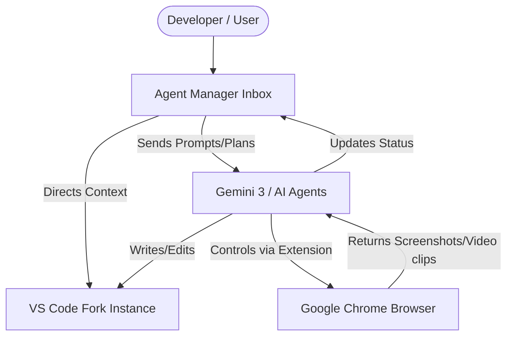

# Google's Anti-Gravity: A Promising but Buggy Leap in AI IDEs

Theo recently gained early access to Anti-gravity, a newly released, fully free AI IDE from Google. Built as a VS Code fork, it relies heavily on acquired technology and personnel from the Windsurf IDE. While Theo acknowledges that the editor is currently riddled with bugs typical of a rushed release, he is genuinely excited about its fresh approach to user experience, particularly its deep browser integration and unique agent management system. 

Before diving into his full review, Theo briefly highlights his sponsor, Modal. He notes that Modal provides secure sandbox environments, which are essential for safely executing AI-generated code without exposing sensitive server infrastructure like databases. 

### Core Innovations in Anti-gravity

Theo is highly optimistic about how Google has structured the workspace. Rather than functioning like a traditional coding assistant, the IDE acts more like a project management suite. 

*   **The Agent Manager operates as an external command center:** Instead of squeezing the AI into the editor's sidebar, Anti-gravity uses a separate, inbox-style window to manage multiple tasks and projects simultaneously. Theo loves this for context switching, noting that you can hit a keyboard shortcut to instantly jump into the specific editor instance for any given task.
*   **Deep browser control streamlines visual debugging:** The IDE connects directly to Google Chrome via an extension, allowing the AI to interact with the browser, take screenshots, and record mini gameplay reels to verify its own code. Theo considers this the best browser-to-IDE integration he has ever experienced.
*   **The workflow prioritizes planning over blind generation:** The editor defaults to pushing users toward planning out tasks before engaging the building phase. This heavily reinforces the concept that the developer is an external manager overseeing independent agent workflows rather than just a pair-programmer.
*   **The AI can generate its own visual assets:** During a game development test, the agent realized it needed sprites and seamlessly generated its own image assets with transparent backgrounds to integrate straight into the project.

### Theo's Successes vs. The Glaring Bugs

Theo stress-tested the IDE using Gemini 3 and was highly impressed by its "one-shot" capabilities. He asked it to build a 3D simulation aquarium game using 3JS. It successfully built a working game on the first try, complete with fish that seek food and drop collectible coins. It also successfully built a 2D version using Phaser on the first attempt. Theo highlights that he gave the exact same prompt to a high-end competing model, which burned over three million tokens, struggled for an hour, and completely failed to produce functional code.

However, the rapid development of Anti-gravity shows in its lack of polish. Theo notes several frustrating issues:
*   **Random thread failures:** Conversation threads will occasionally die completely and become impossible to recover, forcing the user to start over.
*   **Missing standard features:** The IDE fundamentally lacks git worktree support, which limits how a developer can parallelize work within a single project.
*   **Stubborn runtime blindness:** The agent routinely ignores local package managers, outright refusing to use the Bun runtime even when the project files explicitly demand it.
*   **User interface lag:** Aesthetic choices, like a glow effect on the UI, cause noticeable typing lag inside the text editor. 

To illustrate the architecture Theo praises, here is how the Anti-gravity workflow is structured:

### Ben's Counter-Experience

To balance his own positive experience, Theo shares footage from his channel manager, Ben, who had a disastrous time attempting to daily-drive Anti-gravity. 

Ben called it the "most uncanny valley" editor he had ever used. He encountered a completely broken Svelte extension, missing syntax highlighting, and severely glitched interface elements where sidebar icons vanished and menus instantly collapsed upon opening. Furthermore, Ben discovered leftover UI text referencing "Cascade"—Windsurf's proprietary AI agent—proving that Google haphazardly built their tool directly on top of Windsurf's old codebase. Ultimately, Ben found the tool to be entirely unusable in its current state.

### Conclusion

Despite the frequent crashes, missing features, and his colleague's outright hatred of the tool, Theo remains highly optimistic about Anti-gravity. He believes that the integration of the external Agent Manager and the seamless Chrome execution represent a massive step forward for the industry. Even if the current build is deeply flawed, Theo hopes competing editors copy this new project-management-style workflow.
