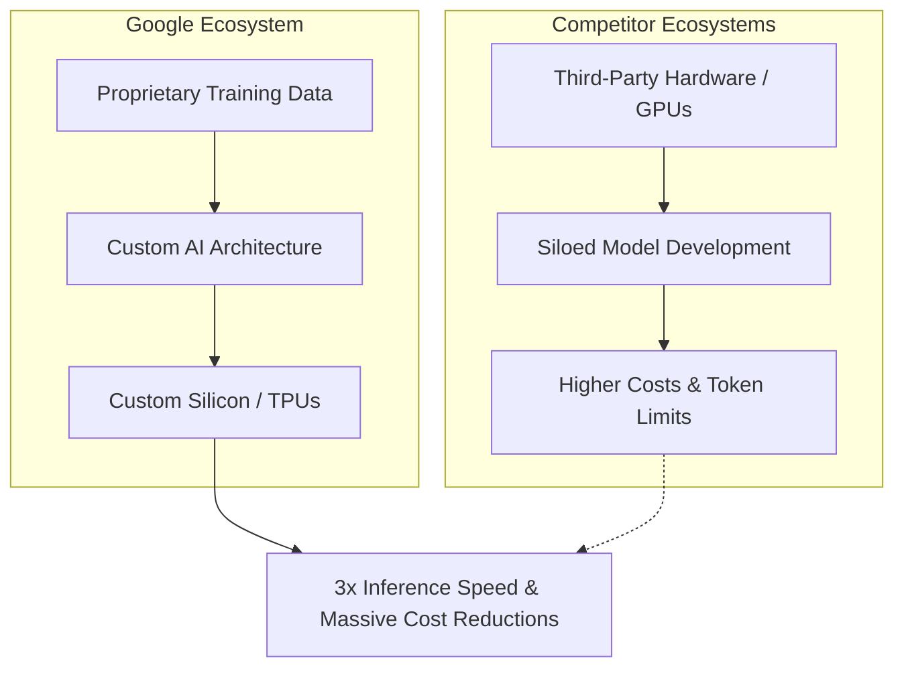

# Google's Shocking AI Comeback: How Gemini 2.0 Breaks the Market

Theo admits he was initially surprised to see Google fall behind in the AI race, given their massive data reserves and history of algorithmic dominance. However, he believes the release of Gemini 2.0 proves Google has not only caught up but is fundamentally disrupting the market. The model is so exceptionally fast, cheap, and capable that Theo has integrated Gemini 2.0 Flash as the default free offering on his own application, T3 Chat. 

### Shattering the Pricing and Performance Paradigm

Theo details how recent model releases have drastically shifted the AI pricing landscape, with Google now undercutting the entire industry.

*   **The Baseline Competitors:** OpenAI's GPT-4o is standard but relatively pricey, while GPT-4o-mini is highly affordable but lacks top-tier quality. Open AI's reasoning model, o1, is extraordinarily capable but costs nearly one hundred times more than their mini model. Anthropic's Claude 3.5 Sonnet is highly capable but remains a very expensive option for developers.
*   **The DeepSeek Disruption:** DeepSeek temporarily shook up the market by offering reasoning and standard models at wildly low prices. Their R1 model even beat OpenAI's o1 on some coding benchmarks while costing a fraction of the price.
*   **Google's Unbeatable Pricing:** Gemini 2.0 Flash and Flash-Lite have obliterated the current pricing floor. Flash costs just $0.10 per million input tokens and $0.40 per million output tokens. Flash-Lite is even cheaper at $0.07 in and $0.30 out. 
*   **Unmatched Value:** Because Gemini 2.0 meets or beats Anthropic's Claude 3.5 in quality while costing nearly forty times less for output tokens, Theo considers the threat from low-cost competitors like DeepSeek to be largely neutralized by Google's new offerings.

### The Power of Massive Context Windows

While most competitive AI models max out at 128,000 to 200,000 context tokens, Google offers a staggering one million token context window for Gemini 2.0, with their Pro model expected to handle up to two million. Theo explains that this massive scale fundamentally changes how developers build AI applications. 

Instead of building complex Retrieval-Augmented Generation (RAG) systems to parse and search through large datasets, developers can simply hand entire repositories or codebases directly to Gemini. Because the input cost is merely ten cents per million tokens, running an analysis on an entire software project now costs practically nothing, bypassing the need for extensive data-curation engineering.

### Vertical Integration and Built-in Capability

Theo attributes Google's success to their unique position of owning every layer of the AI development stack, comparing their closed ecosystem advantages to Apple's hardware and software harmony.

*   **The "Apple of AI":** Because Google owns the training data, the model architecture, and the custom silicon chips powering the inference, they have achieved a 3x faster inference throughput and significant energy efficiency. This vertical integration allows them to offer lower prices and higher context limits than companies reliant on third-party hardware.
*   **The Groq Contrast:** Theo notes that highly specialized hardware companies like Groq (spelled with a 'Q') achieve blistering speeds of up to 3,000 tokens per second for open-source models like Llama. However, because Groq does not own the models, they are physically constrained to much smaller context windows, proving Google's proprietary advantage.
*   **Built-in Web Search:** Unlike OpenAI or Anthropic where developers must build custom tools and utilize headless browser platforms to give the AI internet access, Google natively integrated web search into Gemini. This saves developers entirely from building complex search infrastructure.
*   **Native Multimodality:** Even the ultra-cheap Flash-Lite model natively handles text, images, video, and audio inputs out of the box.

### Overcoming the Developer Experience Hurdle

A major barrier to building with Google has historically been atrocious developer experience, but Theo explains exactly how to bypass it. 

He strongly warns developers to avoid Google Cloud Vertex AI, describing its authentication process—which relies on clunky private keys and client credential JSON files—as an absolute nightmare. Instead, developers should strictly use the standard Google AI Studio. 

By getting a traditional API key from Google AI Studio and pairing it with Vercel's AI SDK, Theo found the integration process functionally effortless. Generating a response requires merely dropping the key into environment variables and importing the Google provider into the codebase. 

Theo concludes that Google currently stands alone in fighting aggressively on price, quality, context size, and features. His hope is that Google's aggressive market positioning will successfully force Anthropic and OpenAI to drastically lower their prices, ultimately making top-tier AI accessible to everyone.
