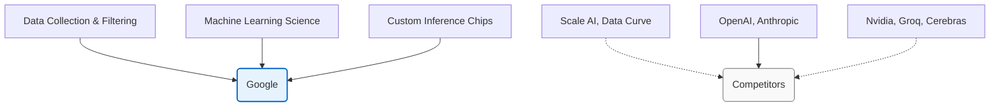

# Google's Huge Lead in the AI Race with Gemini 2.5 Pro

Theo strongly believes that Google is positioning itself as the undisputed winner of the AI race, a claim cemented by the release of their newest model, Gemini 2.5 Pro. After making Gemini 2.0 Flash the default model for his own application, T3 Chat, due to its incredible speed and low cost, Theo has found himself completely blown away by the capabilities of the newly dropped 2.5 Pro. He argues that it is slaughtering almost everything else currently on the market. 

Theo notes that while handling massive codebases—like the 200,000-line Repicache/Zero sync monorepo—requires specialized enterprise tools like his sponsor Augment Code to index and query instantaneously, Gemini's massive native context window is making unprecedented workflows possible for everyday developers.

### Why Gemini 2.5 Pro is Breaking Standard Benchmarks

Gemini 2.5 Pro represents a significant leap forward because it is a native "thinking" model, built to handle increasingly complex problems. Instead of just patching on a prompt asking the AI to think before answering, Google has baked reasoning capabilities directly into the model's architecture alongside a significantly enhanced base model. 

Theo highlights several specific areas where the model excels or introduces major advantages:
*   The model immediately took the number one spot on the LLM Arena, beating out heavyweights like OpenAI's GPT-4.5 and the most recent DeepSeek models.
*   It crushed OpenAI's 03 Mini High on the Humanity Last exam, which is distinctly impressive because OpenAI largely built that specific benchmark to test their own advanced models.
*   It fixes historic weaknesses with math logic, showing vast improvements over older versions like Gemini Flash and outperforming competitors like GPT-4.5 in computational reasoning.
*   The model features an unprecedented one million token input context window, which allows users to paste absurd amounts of raw data—such as Theo's real-world example of feeding the model 71,000 tokens of raw, unformatted Blogspot HTML to successfully write a JavaScript extraction script and isolate 61 iframe links perfectly on the first try.
*   Google has officially confirmed that 2.5 Pro will soon be available on priced API tiers, which allows developers like Theo to reliably integrate it into heavy-traffic applications without fearing the aggressive rate limits placed on experimental free models.

Despite these overwhelming strengths, Theo maintains that thinking models are currently not the best tools for active coding inside editors like Cursor. He argues that because these models generate so much of their own internal reasoning context, they leave less room for the user's initial constraints, often leading the AI to hallucinate or "gaslight" itself. He demonstrates this using the "ball in a hexagon" continuous coding test, where Gemini does well initially but eventually fails to calculate the physics correctly, a test that DeepSeek's V3 handles much better.

### The Three Pillars of Google's Dominance

Theo argues that Google is uniquely positioned to win the AI race because building, training, and running high-performing models fundamentally requires three things: massive data, advanced science, and specialized hardware. 

While competing companies usually specialize in just one of these pillars and have to purchase or partner for the other two, Google owns the entire pipeline. 
*   Google possesses an effectively infinite dataset gathered from decades of indexing and running the internet.
*   Google has deeply rooted internal machine learning science and talent, tracking back to early predictive pathing projects like Google Translate.
*   Google is the only major AI company building its own custom hardware optimized specifically for inference, eliminating their reliance on third-party chipmakers like Nvidia or specialized hosts like Groq.

Theo points out that because Google knows their models will exclusively run on their own custom chips, their scientists and hardware engineers can work together in perfect synergy. This tightly controlled ecosystem results in operational costs that competitors simply cannot match. To illustrate this, Theo references his own application's backend: running Claude for less than half a million messages cost him $31,000, whereas running over a million messages through Gemini cost only $1,200. 

Theo contrasts Google's position with Apple, arguing that Apple's lack of planning has left them in a terrible spot for the AI era. Because Apple prioritizes total privacy, they lack the vast data required to train models. Because they lacked the data, they historically underinvested in the necessary ML science. Finally, while Apple makes incredible hardware, it is entirely optimized for performance-per-watt on consumer devices, not the heavy, high-scale inference requirements needed to host large language models.

### Improved Ecosystem, but One Major Frustration

Historically, Theo has heavily criticized Google Cloud Platform (GCP) for being a dysfunctional mess disconnected from the realities of modern web development. However, he emphasizes that Google's new AI division operates completely differently. The Developer Relations team is actively engaged on platforms like Twitter, paying close attention to what the community is actually building, and using community-created benchmarks in their official announcements. Google's AI Studio provides an incredibly smooth experience compared to the rest of GCP.

However, Theo highlights one major frustration regarding how Google is handling the new reasoning capabilities. When you interact with Gemini 2.5 Pro inside the web-based AI Studio, the model's internal "thinking" data is fully visible, allowing you to see exactly how it arrived at an answer. But if you connect to the model via the API to build your own application, Google entirely strips away that thinking data, leaving you to simply wait for the final text output. Theo views this omission as a significant downside for developers building complex applications and strongly urges Google to make the thinking context accessible out of the API.
