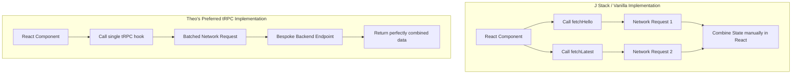

# J Stack vs. T3 Stack: A Deep Dive into End-to-End Type Safety

Theo created the T3 Stack—combining Next.js, TypeScript, React, Tailwind, and tRPC—to establish a modern marker for web development, similar to what the LAMP stack was for an earlier era. The glue of this stack has always been tRPC, which Theo praises for the magical experience of writing backend functions and consuming them on the frontend with flawless type safety. However, a new alternative has arrived: J Stack, created by fellow tech YouTuber Josh Tried Coding.

J Stack is heavily inspired by the T3 ecosystem but relies on a different core philosophy. It embeds a Hono backend router via a catch-all route inside a Next.js application. It supports deploying anywhere, includes standard web responses, and cleverly offers an `llm.txt` file so AI code editors like Cursor can instantly understand its documentation. Like tRPC, it relies heavily on Zod for input validation and SuperJSON to properly serialize complex JavaScript types like dates across the network. 

### The State Management Debate

The most significant architectural divergence between the two stacks centers on client-side state management. Josh intentionally decoupled J Stack's API client from React Query. He felt that tRPC's deep integration with React Query hooks made it overly restrictive for developers who want to use React Query independently for complex client-side state. 

Theo respectfully disagrees with this approach and champions a different philosophy. He argues that decoupling the client forces developers to make multiple overlapping hook calls inside their components. When this happens, the developer has to write custom logic in React to await multiple promises or manually mangle the distinct data sources back together. 

Instead, Theo prefers keeping state management out of React entirely. He advocates for writing bespoke backend endpoints for specific components. If a user needs a "hello" message and a "latest post" feed simultaneously, Theo prefers writing a single backend endpoint that returns both, leaving the React component completely clean and dumb.

### Trade-offs and Developer Experience

As Theo experimented with J Stack, he found it to be a fantastic minimalist alternative to tRPC, but he noted several major trade-offs where he feels tRPC's complexity pays off.

*   Because J Stack decouples the API client from React Query integration, it natively generates multiple disparate network requests, dropping the automatic request batching that tRPC utilizes to optimize performance.
*   J Stack relies on passing raw string keys for cache invalidation, opening the door for human error and silent caching bugs, whereas tRPC provides strict, type-safe route paths to invalidate data directly on the target endpoint.
*   The simplified vanilla approach in J Stack currently lacks the seamless developer experience of holding command and clicking a frontend API call to be teleported directly to the underlying backend procedure.
*   Conversely, J Stack acts as a much more approachable toolkit for developers who find tRPC's interconnected layers and steep setup requirements overwhelming.

In the end, Theo views J Stack as a brilliant love letter to the core patterns of tRPC—like input validation, builder chains, and type safety—wrapped in a cleaner, more minimal API. While he plans to stick with tRPC for its deep React Query integration and built-in guardrails against fetching bugs, he celebrates J Stack as an outstanding tool pushing the ecosystem toward universal full-stack type safety.
