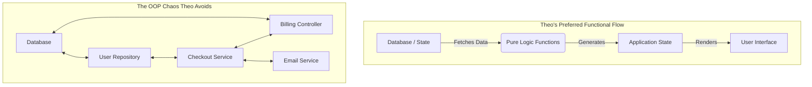

# The Great SQL Debate: Form vs. Function in Application Architecture

Theo recently responded to a series of takes by Robert "Uncle Bob" Martin, a highly influential figure in software engineering and co-author of the Agile Manifesto. Bob recently stated that embedding SQL strings into application code is one of the gravest errors in the software industry. 

While Theo strongly disagrees with Bob's famous "Clean Code" philosophies—arguing that they often hide bugs rather than prevent them—he admits that Bob makes a few valid points regarding databases. However, they arrive at very different conclusions about what the ideal database abstraction should look like.

### Uncle Bob's Position on SQL
Uncle Bob views databases through the lens of strict object-oriented programming (OOP) and pure abstraction. Theo outlines Bob's core arguments regarding data access:

*   **SQL is for terminals, not applications:** Bob believes SQL is a fine language for users at a terminal querying data, but an awful interface for programmers who want to call functions rather than pass complex strings into an API.
*   **ORMs are a poor patch:** Bob dislikes Object-Relational Mappers (ORMs), viewing them as an unnecessary band-aid. He believes databases should simply expose pure APIs with simple inputs and outputs, bypassing a query language entirely.
*   **SQL is an inherent security flaw:** Bob has argued for years that transmitting a universal textual language through user interfaces creates unacceptable risks, specifically pointing to the massive historic damages caused by SQL injection attacks.
*   **Databases should not dictate architecture:** Bob advocates that the database is an implementation detail that should be hidden behind application-specific services. The database should not be the center of the universe.

### Theo's Counterarguments and the Defense of SQL
Theo pushes back against Bob's idealized view of stripping out SQL, pointing out that dealing directly with database internals is impossibly complex. When you pass a simple SQL string into a database like SQLite or Postgres, it parses trees, plans query optimizations, and generates bytecode for virtual database engines. Expecting developers to manually recreate this via function calls would be disastrous.

Theo makes several key points regarding why SQL has survived and thrived for over fifty years:

*   **SQL is a powerful universal standard:** Because SQL is standard across most relational databases, it separates application code from database engine implementation. This separation has allowed the industry to build incredible innovations—like PlanetScale's sharding capabilities or modern ORMs—without breaking the underlying systems.
*   **SQL injections are mostly a solved problem:** Theo notes that we no longer construct raw SQL strings with user input glued inside them. Modern tools use template literals and parameterized queries, which sanitize inputs automatically. Today, developers are far more likely to face Cross-Site Scripting (XSS) errors in HTML than SQL injections in the backend. 
*   **Data teams and developers need a shared layer:** Erasing SQL would force data analytics teams to use the same software languages as application developers, or force developers to write custom APIs just for basic reporting. SQL serves as a perfect common ground.

### Architecture and State: The Core Disagreement
The deepest divide between Theo and Bob stems from how they view application architecture. Bob prefers Object-Oriented Programming principles, where state and logic live highly abstracted inside specialized controllers and services. Theo prefers Functional Programming (FP), where the application is simply a pipe turning database state into a user interface. 

Theo references a real-world debugging nightmare caused by "Clean Code" principles. In an expense reporting app, a discrepancy of thirteen cents was impossible to trace because the OOP architecture explicitly hid the decision-making logic inside private classes. 

Theo argues that when services hold their own internal states and talk to each other chaotically, finding out where data fell out of sync is like solving a murder mystery. If the database is treated as the sole source of truth, tracing a bug is straightforward: you just walk backward from the interface up to the database.

### The Right Way to Abstract the Database
Despite their massive philosophical differences, Theo ultimately agrees with Bob on one major point: **You should not be writing raw SQL inside your application code.** 

Where they differ is the direction they want to take the abstraction. Bob wants to go deeper, stripping away SQL to construct database service layers from scratch. Theo wants to go higher, utilizing tools that bridge the gap between application safety and database state. 

Theo advocates for a few specific modern solutions that solve the issues Bob complains about, without sacrificing the power of the database:

*   **Type-safe query builders (like Drizzle):** These tools allow developers to write TypeScript that feels like SQL but provides strict type safety. If a column name changes in the database, the developer gets an immediate error in the UI component rendering it, perfectly connecting the state to the application.
*   **Application-focused syntaxes (like Gel/EdgeDB):** These databases use deeply nested, graph-like syntaxes that feel much closer to how developers actually use data in modern applications, bypassing traditional SQL syntax headaches entirely.
*   **Code-as-state platforms (like Convex):** Platforms like Convex allow developers to define database schemas and logic natively in TypeScript. Because the platform understands both the data and the logic, it handles client-server synchronization automatically via WebSockets, eliminating the need to write complex data-fetching and parsing logic.

Ultimately, Theo concludes that our main job as developers is to build simple pipes that turn data into user experiences. The database should be the reliable source of truth at the start of that pipe, and the application should remain as stateless and linear as possible to make bugs easy to find and fix.
