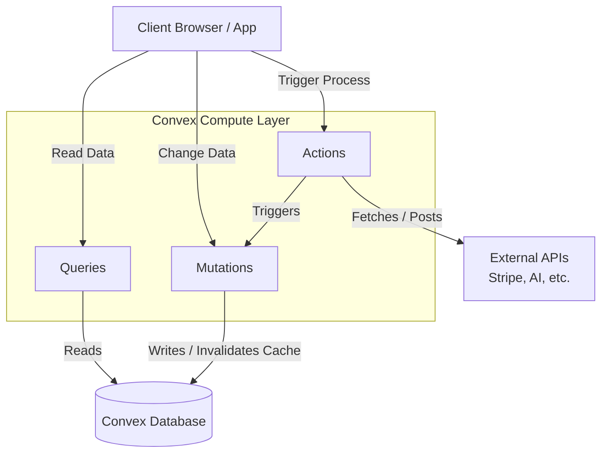

# The State of App Databases: Why Theo Chose Convex Over Supabase

Theo has recently become a massive advocate for Convex, an application database platform. Sparked by seeing peers rapidly build complete applications with AI and Convex, and prompted by a recent video from another creator about leaving Supabase, Theo breaks down exactly why he believes Convex is the superior choice for modern, TypeScript-based application development. He clarifies that while he has invested in Convex because he believes in the product, his video is organically driven and not sponsored by them. 

He does pause to highlight the actual sponsor of the video, Tuple. Theo demonstrates using Tuple for seamless, low-latency pair programming and remote control, noting that it completely heavily outshines general tools like Zoom for actual developer collaboration.

### Rethinking Pricing and Architecture

Theo's departure from traditional platforms like Supabase begins with how they handle pricing and underlying architecture, which fundamentally impact the developer experience.

*   Supabase penalizes developers for experimenting with multiple ideas, limiting free plans to two active projects and forcing you to pause older ones to test new concepts.
*   Once you upgrade a Supabase organization to a paid tier, you lose access to free projects entirely within that organization, meaning every small hobby project automatically incurs a minimum $10 monthly fee.
*   The high cost of Supabase stems from its architecture, where they provide a traditional Postgres database instance that costs them money to run continuously, meaning you pay for the box regardless of traffic.
*   Convex utilizes a custom compute layer built on isolates (similar to Cloudflare Workers) that sits directly on the same box as the database, allowing compute to effortlessly scale down when inactive and saving costs for everyone.
*   Because of this highly efficient architecture, Convex offers absurdly generous free tiers, allowing up to 40 free deployments for hobbyists before requiring a paid plan, which scales fairly based on exact usage.

### The Developer Experience: Code as Infrastructure

The most important distinction Theo makes is how developers actually interact with the database. Supabase models data first and requires you to directly query Postgres, relying on Row-Level Security (RLS) configured in the database to manage permissions. Theo argues this abstracts vital security rules away from the source code, making it difficult to maintain.

Convex flips this by managing all database state, schema, and security within a single `convex` folder existing inside your codebase. 

*   Developers define the exact schema in a single TypeScript file, which entirely removes the need for complex ORMs or tedious migration management.
*   Because Convex deeply understands your schema, you get instant autocompletion and TypeScript errors directly in your editor if you target a table or field that does not exist.
*   Data synchronization across the server and client happens completely automatically without requiring complex setup tasks, cache invalidation, or websocket management.
*   Convex eliminates the need for complex SQL join syntax; developers simply use standard JavaScript array methods like `map` combined with `await` to link relational data, trusting the Convex query planner to optimize the performance behind the scenes.
*   If you delete a column from your schema or remove conflicting data directly in the database, the Convex local development server instantly recognizes the resolution and redeploys your environment automatically.

### Queries, Mutations, and Actions

Theo details Convex's strict but highly effective mental model for interacting with data. He notes that to keep caching and real-time syncing magical, Convex separates pure database interactions from side effects.

*   **Queries and Mutations** must be absolutely deterministic, meaning they can only read or write to the Convex database and cannot fetch external data.
*   Because all data changes must route through defined mutation functions, permission logic is explicitly codified and easily reviewable in standard TypeScript.
*   **Actions** are designated server functions that act as the bridge to the outside world, allowing developers to call external APIs, process heavy compute tasks (even in Node.js environments), and then trigger mutations to save the results.

### The AI Advantage and Components

Theo emphasizes that AI coding agents like Claude Code and Cursor excel with Convex. Because agents struggle to manage disjointed state across databases, dashboards, and code, Convex's model—where everything is defined in standard TypeScript files inside one folder—allows AI to flawlessly generate, fix, and deploy complete database solutions without requiring specialized API configurations or Model Context Protocols. 

Additionally, Convex provides "Components," which are fully featured backend modules developers can install directly into their Convex folder. Instead of hoping a database platform builds a specific feature, developers can import pre-built logic for Stripe billing, AI agent orchestration, email via Resend, or sophisticated "Work Pools" that handle rate-limiting and task queueing for external APIs. 

### Acknowledging the Limitations

Theo is completely transparent that Convex is not the right tool for every scenario, pointing out a few rigid rules developers must accept.

*   Convex is strictly an application database optimized for user-facing applications, making it unsuitable for internal data analysts wanting to run massive, ad-hoc, table-scanning queries.
*   The platform actively discourages unoptimized patterns like selecting hundreds of millions of rows in a single query, purposefully throwing errors to enforce best practices for application performance.
*   Convex is heavily reliant on the TypeScript ecosystem; if a team is not writing their client applications in TypeScript, the primary benefits of the platform are largely lost.
*   If deep analytics are required, Convex accommodates this organically by offering dedicated streaming pipelines to export data into proper analytics warehouses like Snowflake or Databricks.

To finalize his argument, Theo runs a live, unedited demonstration using Claude Code via voice commands. Within just 20 minutes, the AI generates a completely functional, full-stack AI image generation app using Convex and the Fal API. The AI natively understands the Convex folder structure, automatically applies type fixes when they occur, and successfully deploys a seamlessly synced, real-time application without Theo manually typing a single line of code.
