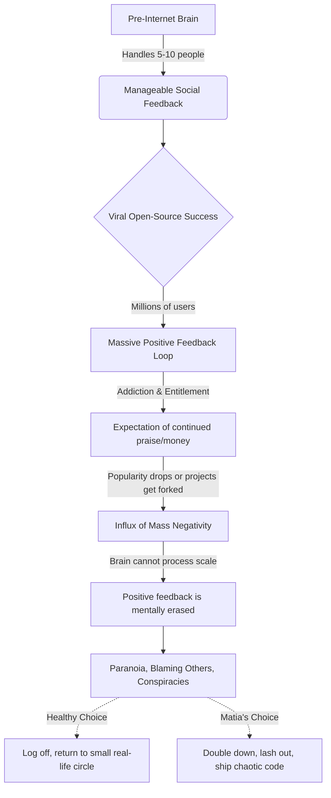

# Summary of Theo's Breakdown: The VS Code Material Theme Takedown

In an unprecedented move, the VS Code team completely permanently deleted and uninstalled a highly popular extension—the Material Theme—from millions of users' devices. Theo spent over forty hours investigating the delicate and chaotic situation surrounding the theme and its creator, Matia. He presents a detailed breakdown of bad-faith development practices, the markers of malicious software, and the psychological unraveling of an open-source maintainer.

### The Problem With the Extension
Microsoft removed the extension because it exhibited behavior that closely mirrors malware. Theo argues that while themes should essentially just be simple JSON files tracking hex colors, Matia's theme was heavily over-engineered and acting suspiciously. Theo outlines three glaring red flags that indicate a package might be malicious:

*   It requests system permissions it has no logical reason to need, such as an appearance theme asking to access the root file system.
*   It utilizes highly suspicious dependencies, such as the ability to spawn child processes directly on the user's local machine.
*   It features extreme code obfuscation, intentionally scrambling the JavaScript to hide what it is doing, a process that can kill performance by up to 80 percent and is highly atypical for standard open-source extensions. 

Because Matia implemented all three of these practices, Microsoft's security team intervened. Theo points out that this exact combination of tactics was used in the massive "X utils" hack the previous year to quietly siphon user data. 

### Matia's Downward Spiral
Theo traces the origins of this drama back several years, noting that Matia has a long history of making hostile decisions whenever he feels he isn't receiving enough money or recognition for his open-source work. Theo details a specific sequence of bad actions Matia took regarding the Material Theme:

*   He entirely deleted the commit history of the repository, erasing the visible contributions of hundreds of other developers who helped build the theme.
*   He improperly attempted to change the project's open-source license so he could start selling it, ignoring the fact that prior open-source versions forkable by the community still existed legally.
*   He obsessively stalked and publicly harassed the developers of other text editors, like Zed and Sublime Text, simply because they supported open-source versions of Material themes.
*   After his extension was banned by Microsoft, he refused to apologize or fix the code, and instead created over 500 proxy GitHub accounts to try and sneak the extension back onto the marketplace under different names. 

### Theo's Involvement and Forks
Because Matia had attempted to close off the open-source code, Theo created and maintained a fork of the last legitimate open-source version of the theme to keep it available. As a maintainer of this fork, Theo realized how terribly written the original codebase was. He spent a night auditing the code until 5:00 AM, stripping out over 10,000 lines of highly unnecessary elements, including an elaborate HTML-rendering system that pulled text from a remote CMS just to display two-sentence release notes. 

When the drama escalated, Theo contacted his connections on the VS Code team. He explicitly instructed them to take down his own fork instantly and without warning if they found even a trace of malware in it, valuing user safety far above his own extension's install count. 

### Malice vs. Incompetence
Theo takes a nuanced position on whether the extension actually contained a malicious payload designed to steal data, stating he is currently split 50/50 on the reality of the situation. 

On one hand, he argues that anyone checking every single box on the malware-creation list—hiding code, demanding deep system access, and relentlessly evading bans—must be assumed to be acting with malicious intent. On the other hand, Theo invokes Hanlon's Razor: do not attribute to malice what can be attributed to stupidity. He suggests there is a real possibility that Matia is simply an incredibly paranoid, narcissistic, and poor developer who obfuscated his code merely because he was terrified people would steal his theme-generation techniques. However, Theo concludes that even if it was just profound stupidity, Matia has proven he is entirely unsafe and untrustworthy to have in the software ecosystem. 

### The Psychology of Internet Fame
To explain how Matia reached this point of erratic behavior, Theo details his theory on how the human brain processes internet exposure. He explains that humans biologically evolved to handle feedback from extremely small, tightly-knit social circles. 

Theo argues that when Matia experienced the massive, unnatural high of millions of users praising his theme, he became addicted to it and felt entitled to financial success. When the popularity faded and people forked the project, he couldn't cope. Because the human brain naturally magnifies negative feedback for survival, Matia's perceived world became entirely negative. Lacking a small, grounding circle of real-life friends to pull him away from the screen, Matia resorted to blaming external forces—like Theo and Microsoft—inventing deep conspiracies rather than accepting his own failures. 

### Final Warnings and Praise
Theo ends by heavily praising the VS Code team for their strict, responsive, and effective handling of the security threat, noting they are vastly superior to Google Chrome's extension security team. He urges all users to actively use the report button if they notice an extension behaving suspiciously. Finally, he warns the broader developer community that toxic maintainers must be caught and stopped the moment they begin harassing other creators, rather than waiting until they spiral out of control and potentially compromise millions of machines.
