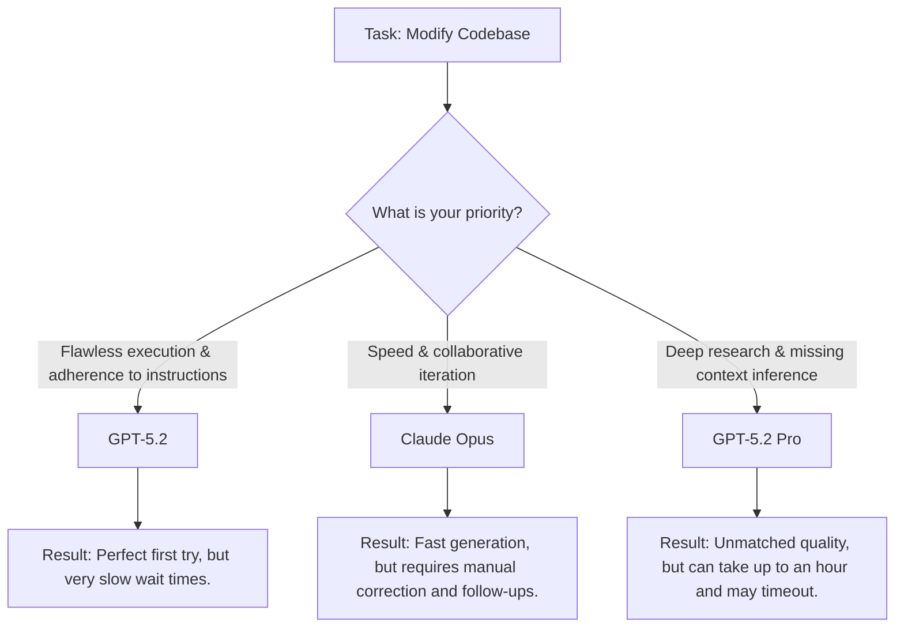

# Reviewing GPT-5.2: Triumphs, Regressions, and the True Cost of Reasoning

Theo recently gained early access to OpenAI's GPT-5.2 and provides a nuanced breakdown of its capabilities. While mainstream coverage highlights its record-breaking benchmark scores, Theo's real-world testing reveals a more complex reality. He finds that the new generation brings massive leaps in instruction following and tool calling, but suffers from notable regressions in spatial reasoning and severe reductions in generation speed.

### The Spatial Reasoning Regression
Despite the hype around GPT-5.2, Theo immediately noticed a sharp regression in his personal evaluation tool, "Skatebench," which tests a model's three-dimensional and spatial reasoning by asking it to name skateboard tricks based on physical descriptions. 

Previously, GPT-5 easily scored a 97% on this test using default settings. When Theo first ran GPT-5.2, it scored a dismal 4% because it defaults to using zero reasoning tokens. After forcing the model into its "extra high" reasoning mode, it achieved a 79%. Theo points out that this is an 18-point regression that costs roughly five times as much per request and uses far more tokens. He theorizes that OpenAI may have heavily optimized the model for 2D logic and coding, inadvertently breaking its grasp on 3D physics and spatial visualization.

### Where GPT-5.2 Dominates
Outside of specific 3D tasks, Theo acknowledges that GPT-5.2's broader benchmark scores are entirely deserved and represent incredible leaps in AI utility.

*   On the notoriously difficult ARC AGI reasoning benchmark, the Extra High version of 5.2 Pro scores a 90.5%, achieving a massive 390x cost-efficiency improvement over unreleased test models from just a year ago.
*   The model achieves a 70.9% on GDP Val (expert human-graded evaluations on professional knowledge work), demonstrating a massive leap in deliverable quality compared to GPT-5's 38.8%.
*   GPT-5.2 Thinking set a new state-of-the-art score of 55.6% on SWEBench Pro, proving it is highly capable of debugging production code, implementing features, and refactoring large codebases autonomously.
*   The model handles massive context windows brilliantly, maintaining a 98% recall accuracy on needle-in-a-haystack evaluations at 256,000 tokens while drastically reducing the hallucination issues frequently seen in competitors like Gemini 3 Pro.

### Coding, Instruction Following, and the Speed Trade-off
To gauge real-world coding feel, Theo tested GPT-5.2 against Claude Opus to rewrite caching logic in one of his projects. Claude Opus iterated quickly but required multiple follow-up prompts because it ignored instructions and failed to implement the cache it created. GPT-5.2, by contrast, executed Theo's exact instructions flawlessly on the very first try. 

However, there is a severe catch: GPT-5.2 computes so slowly that waiting for its single perfect generation actually took longer than Theo's entire multi-prompt debugging session with Opus. 

### Pricing and New Model Tiers
For the first time in a while, OpenAI has raised model prices. The base GPT-5.2 costs $1.75 per million input tokens, while the elite GPT-5.2 Pro jumps to a groundbreaking $21.00 per million input tokens. OpenAI justifies this by claiming the new models use tokens so efficiently that reaching a baseline level of quality is actually cheaper, even if maximizing the model's performance costs a premium.

To manage the varying needs for speed and cost, OpenAI has staggered the model into a few distinct tiers:
*   **GPT-5.2 Instant:** This is the base model with reasoning explicitly turned off. Theo notes that early testers are thoroughly impressed by its speed and ability to surface key information clearly for everyday tasks.
*   **GPT-5.2 Thinking:** Equipped with sliding scales of reasoning (from low to extra high). It is highly obedient and great for coding, but significantly slower than previous generations.
*   **GPT-5.2 Pro:** Available via API and Chat, this is an incredibly heavy model designed for deep logic. 

Theo concludes by echoing the findings of fellow AI tester Matt Schumer. They both agree that GPT-5.2 Pro is arguably the most capable model available today, possessing an uncanny ability to identify and apply constraints the user didn't even realize were missing from their prompt. Because Pro models take so long to generate—sometimes thinking for 30 to 60 minutes before timing out or failing—Theo warns that the user's workflow must fundamentally change. Prompting matters more than ever, and users must meticulously refine their constraints before hitting send to avoid wasting hours of compute time.
