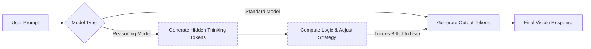

# OpenAI's Baffling Pricing Strategy and the Dominance of o3-Mini

Theo begins by reflecting on an assumption he recently had to walk back. As a developer intimately involved in the AI space, he previously built his business strategy—including his application, T3 Chat—around the belief that AI inference costs were locked in a rapid race to the bottom. However, OpenAI recently shattered this assumption by launching the o1 Pro API. Priced at an astonishing $150 per million input tokens and $600 per million output tokens, it is hundreds of times more expensive than current market alternatives. 

### How Tokens and Reasoning Drive Up Costs

Theo breaks down the economics of AI models by explaining how tokens function and why newer reasoning models can suddenly spike costs for developers.

*   Tokens are small chunks of data, roughly four to eight characters long, that LLMs use to predict the most likely next word in a sequence, effectively acting as highly advanced autocomplete.
*   Because processing more tokens requires more GPU compute and complex routing through the model's weights, token volume serves as the primary metric for billing.
*   With the rise of reasoning models like Claude 3.7 or OpenAI's o-series, models now generate a massive amount of hidden "thinking" tokens before they ever start typing the final response to the user.
*   Developers and end-users are billed for these unseen reasoning tokens, meaning that even if the visible output is short, the total token generation—and the resulting bill—can be incredibly high.

### The Industry Race to the Bottom vs. OpenAI's Strategy

While much of the tech industry has been aggressively lowering prices, OpenAI seems to be moving in the exact opposite direction. Theo points out the stark contrast between broader market trends and OpenAI's confusing new lineup.

*   Google's Gemini 2.0 Flash severely disrupted the market by offering quality comparable to GPT-4o at a fraction of the cost, largely because Google owns its entire pipeline from chip architecture to data centers.
*   DeepSeek's V3 and R1 models further drove prices down by offering elite, open-weight reasoning capabilities at incredibly cheap rates, forcing competitors to reevaluate their pricing.
*   OpenAI responded to this landscape by releasing GPT-4.5, a massive model that lacks reasoning features and scores poorly on coding benchmarks, prioritizing a marginally better human conversational tone over cost-efficiency.
*   Following that, OpenAI released the o1 Pro API at a massive premium, a model that is so computationally demanding that OpenAI historically lost money on the average user accessing it via the $200-a-month ChatGPT Pro tier.

### UI Frustrations and o1 Pro's Failures

To evaluate the actual value of o1 Pro, Theo tested it against a complex Advent of Code programming problem. The experience was universally negative. He notes that the ChatGPT UI is incredibly buggy for high-tier models; it fails to generate chat titles in parallel, lacks basic text selection and copy buttons, and suffers from catastrophic connection drops. 

Theo explains that if a user refreshes the page or switches tabs on a mobile device while o1 Pro is generating, the request frequently fails entirely. Even when the model managed to complete its two-minute thinking process without dropping the connection, it returned a hilariously incorrect 20-line answer for a complex problem that realistically requires hundreds of lines of code.

### The True Value of o3-Mini

Despite OpenAI's confusing release schedule, Theo strongly advocates for o3-mini, calling it his current favorite model and an absolute triumph in value and performance.

*   OpenAI intentionally priced o3-mini at exactly double the cost of DeepSeek R1 to remain highly competitive, making it roughly 136 times cheaper than the o1 Pro API.
*   Unlike o1 Pro, o3-mini is blazingly fast, highly accurate, and succeeds at getting much closer to the correct answer on complex coding queries on the very first attempt.
*   Theo clarifies a major point of confusion: "o3-mini high" is not a separate, distinct model from o3-mini.
*   The "high" designation simply grants the base o3-mini model permission to use more time and generate more hidden reasoning tokens before answering; OpenAI only presented it as a separate model in their dropdown list because they failed to build a proper UI slider for reasoning effort.

Theo concludes the video deeply confused by OpenAI's overall strategy. They have managed to release two distinct products—GPT-4.5 and o1 Pro—that are both functionally worse and vastly more expensive than their own o3-mini model. He suspects these expensive releases might be an attempt to justify the sunk costs from years of training, or perhaps they serve as foundational stepping stones for future models like GPT-5. Regardless of OpenAI's reasoning, Theo is grateful that the broader AI industry remains highly focused on making elite inference models more affordable.
