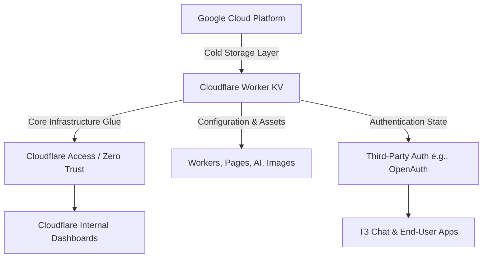

# The Day Half the Internet Went Down: Uncovering Cloudflare's Hidden Dependency

The internet recently experienced a massive wave of outages affecting major platforms like Discord, Spotify, Twitch, Google, and Cloudflare. While it felt like the entire web was crumbling, Theo narrowed the root cause down to the core web service providers. After ruling out Azure, AWS, and a self-inflicted outage at Twitch, the investigation focused entirely on Google Cloud and Cloudflare. 

Theo explains that the web primarily relies on a small oligopoly of hosting providers. What terrified the developer community during this incident was a previously unknown, hidden dependency that caused a domino effect across the internet. 

### The Root Cause: A Hidden Dependency on Google Cloud

To understand why Cloudflare went down, Theo breaks down Cloudflare's architecture into three main eras: DDoS Protection, the Developer Platform, and Zero Trust corporate services. At the heart of their Developer Platform is a service called Worker KV. 

Worker KV is a highly reliable Key-Value storage system that acts as the foundational glue for almost the entire Cloudflare ecosystem. Services ranging from image delivery and AI workers to their Zero Trust access protocols rely heavily on Worker KV for configuration, asset delivery, and authentication. 

The critical point of failure was that Cloudflare relies on a third-party vendor—specifically Google Cloud Platform (GCP)—for the long-term cold storage of Worker KV data. When GCP suffered an outage, Worker KV was unable to retrieve any data that was not actively cached. This triggered a cascading failure across the vast majority of Cloudflare's services.

When GCP fell over, Cloudflare services experienced peak failure rates of nearly 100% for over two hours. 

### Theo's Experiences and Industry Critiques

Theo’s own application, T3 Chat, went down during this incident. Even though T3 Chat is primarily hosted on AWS, its authentication layer uses OpenAuth, which is built on top of Cloudflare. Because Worker KV was failing, signed-in users experienced a completely broken app. 

While analyzing the incident, Theo brings up several strong opinions regarding the cloud industry and the narrative surrounding the outage:

*   **Disagreement on "No Data Lost":** Cloudflare explicitly stated no data was lost during the outage. Theo pushes back on this phrasing, noting that any analytics or real-time logs attempting to persist during those two and a half hours were indeed lost by developers who expected the infrastructure to save them. 
*   **Google's Lack of Dogfooding:** Theo strongly criticizes Google Cloud's reliability, arguing that GCP is unstable largely because Google does not "dogfood" its own cloud products. He points out that the internal infrastructure Google runs its search engine on is entirely different from the commercial products, like Spanner, that they sell to the public. 
*   **Praise for Cloudflare's Transparency:** Despite the massive failure, Theo gives immense credit to Cloudflare and its CTO, Dane. He respects their absolute ownership of the problem and the fact that they published an incredibly detailed postmortem within four hours, notably choosing to accept the blame for their architectural decisions rather than pointing fingers directly at Google Cloud.

### Incident Mitigation and Future Prevention

During the outage, Cloudflare demonstrated a highly proactive approach to incident management. Because Cloudflare's internal dashboards and access tools also rely on Worker KV, their engineers were effectively locked out of their own systems. Instead of just waiting for Google Cloud to recover, Cloudflare engineering teams worked in parallel to gracefully degrade internal rules and spin up alternative data stores to regain control of their dashboards. Once Google Cloud's storage finally stabilized, Cloudflare's serverless infrastructure seamlessly recovered without requiring manual reboots.

To ensure a failure like this never takes down so much of the internet again, Cloudflare is implementing several architectural changes. 

*   They are accelerating planned work to completely remove Worker KV's singular dependency on storage infrastructure that Cloudflare does not wholly own.
*   They are implementing short-term blast-radius remediations step-by-step so that an isolated failure in Worker KV cannot instantly knock down independent products like Turnstile or Cloudflare Access. 
*   They are building new manual override tools allowing engineers to progressively re-enable data namespaces during an incident, which prevents the servers from accidentally DDoSing themselves when thousands of services try to pull from cold storage all at once.
