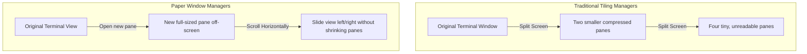

# The Future of Terminal Workflows and the Switch to CMUX

Theo recently made a surprising change to his development environment. After having spent 15 years mastering traditional terminal multiplexers like tmux, and recently falling in love with the Ghostty terminal, he has entirely moved off Ghostty directly. His shift was completely driven by the changing nature of modern software engineering, specifically what he refers to as the agentic coding problem. 

As Theo increasingly pairs alongside AI agents like Claude Code, his daily workflow has become heavily parallelized. He constantly branches out, spinning up sandboxes, and juggling multiple tasks at once. Standard development environments break down under this weight. Splitting work across isolated IDEs, web browsers, and standard terminal tabs creates a mentally exhausting context-switching experience. 

Theo notes that operating system-level solutions completely fail to manage this modern workflow. MacOS workspaces isolate windows poorly, require users to hunt for active applications, and force agonizingly slow animation delays when switching contexts context. Traditional tiling window managers, like i3, also fall short for his specific needs.

### The CMUX Solution

Theo adopted a new open-source terminal called CMUX, engineered by the Maniflow team and built on top of `libghostty`. Mitchell, the creator of Ghostty, always envisioned his terminal as a foundational library that would empower developers to build targeted, specialized tools, and CMUX is exactly that realization. 

CMUX operates as a holistic workspace manager that collapses the terminal side of software development into one cohesive view. Theo views it out as a massive productivity boost, despite being in its early stages. 

Here is why CMUX currently anchors his workflow:
* It structurally separates context by grouping localized tools, development servers, and AI chats into dedicated project sidebars.
* It fully supports standard Ghostty functionalities and hotkeys, completely eliminating the learning curve for anyone already accustomed to the ecosystem.
* It inherently integrates with AI logic, instantly recognizing when Claude Code is running in a shared workspace and notifying him of state changes.
* It allows him to pin active projects and dedicated sandbox directories, allowing him to bounce between wildly different environments effortlessly.

Despite his praise, Theo identifies a few glaring flaws currently present in CMUX:
* He repeatedly encounters a custom Zsh bug where status lines stack on top of each other every time he presses enter or clears the screen.
* The integrated CMUX browser operates as a stripped-down Safari webview that lacks his cookies, extensions, and password managers.
* This internal browser hijacked his default settings, forcing terminal links—like his dozens of daily GitHub PR links via lazygit—to open within CMUX instead of his main browser, breaking his momentum. 

### The Infinite Canvas Vision

Because of these limitations, Theo views CMUX not as the permanent answer, but as a rough, duct-taped prototype of the next generation of dev tools. To explain his absolute ideal development environment, he points to a concept utilized by Niri, a "paper window manager" that fundamentally reconstructs how screen real estate behaves. 

Rather than splitting a single screen into increasingly tiny, unreadable boxes, a paper window manager opens every new pane at full size just slightly off-screen. Users navigate by sliding left, right, up, or down across an endless canvas. Theo experienced this environment and found it completely rewired his brain. 

Theo concludes that the ultimate developer application should adopt this Niri-style endless canvas internally. In his perfect tool, a sidebar would hold your project hierarchy. Acting within a single designated project, you could infinitely scroll horizontally or vertically between fully realized environments—sliding seamlessly from an active terminal, directly into a VS Code interface, and finally into a fully authenticated instance of Google Chrome containing your actual extensions. 

AI integration has necessitated an entirely new generation of tools built specifically for heavy parallel work. Theo expects rapid innovation over the coming months and is incredibly excited about being on the frontier of exploring what intuitive, chaos-free software development workflows will eventually look like.
