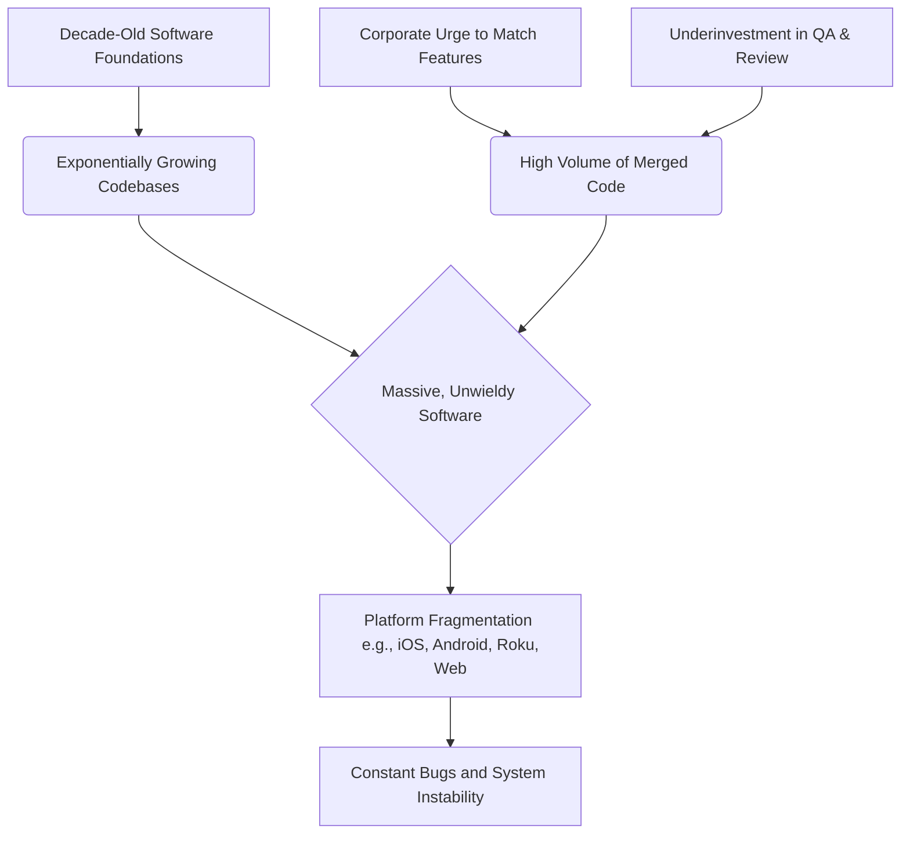

# Why Modern Software is Falling Apart

Theo begins by sharing his deep frustration with the current state of technology, describing what he calls a slow spiral of software degradation. He highlights daily experiences with widespread instability: his Windows PC suffering random SSD disconnects, iOS messaging glitches, PlayStations requiring constant firmware updates just to boot, and basic features broken on well-funded platforms like Twitter, Uber, and YouTube. To Theo, the software world feels like it is crumbling because the tools we rely on heavily are becoming fundamentally unreliable.

When looking for software that actually works, Theo points to a few specific tools he uses daily without issue. He notes his positive experience porting his own projects to Convex, underscoring the value of modern, flexible databases. Beyond that, he highlights Ghostty (a terminal emulator written in Zig), Lossless Cut (an open-source video editor built on Electron), and Helium (a Mac app utilizing Chromium patches). 

Theo observes that these stable applications share very specific traits. They are open-source passion projects, typically maintained by one or two dedicated developers who are financially secure enough to focus on quality rather than corporate metrics.

### What Is Not Causing the Problem

Theo argues strongly against the narrative that modern technology choices or tools are to blame for software decay. He points out several false culprits that developers and users often blame:

*   The underlying tech stack does not dictate an app's stability, as proven by his favorite stable apps being built on a wild mix of Zig, Electron, and patched Chromium.
*   Writing an application in Rust will not magically eliminate bugs. He cites a massive Cloudflare outage caused by a memory limit panic in human-written, human-reviewed Rust code to prove that memory-safe languages do not prevent catastrophic logic failures.
*   Frameworks like SwiftUI or Flutter are not the root of system-wide failure, even though tools like SwiftUI can cause performance bottlenecks if used poorly to render large lists. 
*   Artificial intelligence is not responsible for the current wave of bugs. While AI allows developers to write code faster and scale projects up, massive bugs and system crashes are fundamentally human errors occurring in established codebases, not the byproduct of AI generation.

### The Real Reasons Software Sucks

According to Theo, the true cause of software instability comes down to a combination of age, corporate incentives, and overwhelming complexity. 

*   **Software is simply too old and bloated.** We have been building on top of the exact same foundations—like iOS, Windows, and Gmail—for over a decade without a hard reset, causing codebases to grow exponentially, such as iOS ballooning from 2.5 gigabytes to nearly 14 gigabytes.
*   **Corporate economic incentives prioritize speed over quality.** Companies are so eager to match competitors' features that they force developers to rush out broken software, drastically increasing the number of pull requests merged without proper oversight.
*   **The industry heavily underinvests in quality assurance.** While the sheer number of developers writing code has skyrocketed over the years, the number of QA testers, security researchers, and managers dedicated to polishing and reviewing that code has completely failed to keep pace.
*   **Platform fragmentation multiplies the margin for error.** Updating an app no longer means writing code for one device; it means making sure an incredibly dense codebase functions across standard PCs, ARM-based machines, mobile operating systems, smart TVs, and legacy hardware.

### Theo's Conclusion

Theo anticipates that the state of software will continue to worsen before it sees any meaningful improvement, simply because every new update adds more bloat to already rotting codebases. His ultimate advice for users and developers is to stop relying exclusively on legacy platforms run by giant companies. Instead, he encourages people to actively search out and financially support independent, highly focused software built by small, passionate teams who are solving specific problems. Additionally, he suggests that consumers should continually pressure major companies, like Apple, to release updates completely dedicated to patching and stability rather than pushing out new features.
