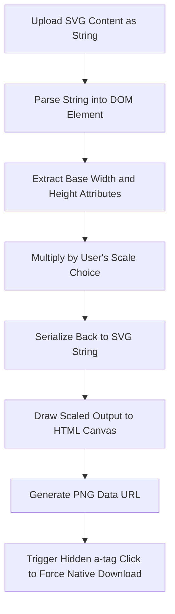

# Building Custom Tools for Everyday Developer Problems

Theo explains his frustration with seemingly simple developer tasks that have terrible, overcomplicated, or expensive solutions online. A major pain point for his workflow is converting an SVG logo into a PNG for his video and thumbnail editors. Before diving into his custom solutions, he highlights a positive tool experience with his sponsor, Bolt.new by StackBlitz. He demonstrates how Bolt distinguishes itself from other AI generators by allowing developers to directly edit and fix AI-generated code in a browser-based IDE—rather than endlessly tweaking text prompts—and then deploy the final project with a single click.

### The Frustration with Existing Tools

Theo breaks down exactly why existing visual asset tools drive him crazy:

*   Many SVG to PNG converters fail to filter the native file upload prompt specifically for SVGs, making the simple act of locating the right file in a messy folder unnecessarily annoying.
*   Standard free converters lock the output to the SVG's claimed base resolution, which often results in a blurry, tiny PNG file because the tools do not offer a way to scale up the vector before exporting.
*   Some tools offer nonsensical features like converting a PNG to an SVG, which forces the program to trace pixels into individual color patches and results in awful, watercolor-style generated art.
*   Tools that do gracefully offer scaling, like CloudConvert, perform the compute on their remote servers, which eventually forces them to lock you behind a subscription paywall after just a few conversions to cover their costs.
*   Existing image-squaring tools require multiple clicks, default to terrible blur-hash backgrounds, occasionally default to bizarre red padding, and force page refreshes if you want to switch the image you are working on.

### Theo's Browser-Based Solutions

To resolve these workflow roadblocks, Theo built Quick Pick, a free, open-source, entirely browser-based suite of tools. 

The first tool is an SVG to PNG converter tailored to exactly what developers need. It strictly filters for SVG uploads, prominently displays both the original and scaled resolutions, and allows users to apply custom scale multipliers to ensure the resulting PNG is high quality.

The second tool is a Square Image Generator. Theo frequently shares programming memes on YouTube Community posts, but YouTube's interface awkwardly crops non-square images, preventing users from seeing the whole image without clicking. To engineer around this, his tool instantly pads an image into a perfect square. It defaults to a white background—which looks correct for his use case—features a single-click option for a black background, and relies on one simple save button without requiring the user to scroll.

### Under the Hood Code and Architecture

Because the tools are client-side, Theo explains that they work perfectly even if you turn off your Wi-Fi. He built the app using Next.js, noting that he intentionally moved his client-side logic out of the main Next.js page component so he could retain server-side metadata on the page. He is also running the React compiler on the project and tracks anonymous usage statistics via Plausible. 

Theo details his custom `scaleSVG` hook, which entirely bypasses the need for backend infrastructure by manipulating the file directly in the browser. 

### The Core Takeaway: Build What You Need

Theo concludes with a personal and encouraging message for his audience. He stresses that he isn't some rare visionary who magically knows what the market wants; he simply builds exactly what he needs to escape his own workflow frustrations. 

He believes every developer has unique needs heavily influenced by their daily routines and quirks, both inside and outside of coding. When you build software to fix something suboptimal in your own life, you create genuinely useful products. These hyper-personal projects often blow up entirely on their own—just as his uploading tools, routing tools, and his own YouTube channel did once he committed to making them for himself. In the absolute worst-case scenario, building tools simply to scratch your own itch gives you an excellent and passionate topic to talk about in your next job interview.
