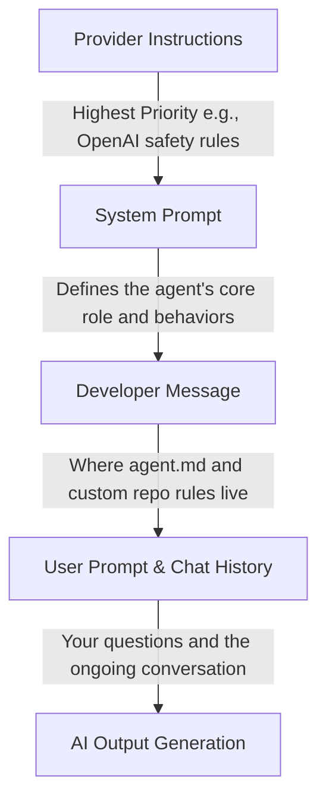

# The Hidden Trap of AI Context Files

The software development community has widely embraced the practice of feeding AI agents extensive context files, like `agent.md`, `claude.md`, or cursor rules, to help them understand codebases. However, Theo points out that a recent study reveals these files are often actively harming model performance across major LLMs like Sonnet 3.5, GPT-4o, and Qwen 3. 

The study evaluated coding agents on real-world repositories and found that human-written context files provided only a marginal 4% improvement over using no file at all. Worse, having the LLM generate its own context file resulted in a 3% decrease in success rates. Because these files prompt the agent to do excessive exploration and reasoning upfront, they also increase compute costs by over 20%. Theo strongly agrees with the study's conclusion: developers should abandon generated context files and only include minimal, specific tooling requirements.

### How Context Actually Works

To understand why these files fail, Theo explains the hierarchy of context management. An LLM is essentially an autocomplete machine that predicts the next set of characters based on everything placed above it in the prompt history. 

When you write an `agent.md` file, you are inserting instructions into the "Developer Message" layer. Because it sits high in the context hierarchy, the AI is forced to process and think about it on every single interaction. 

If you document complex legacy technologies in your context file, the AI will naturally be drawn to using them even if you are trying to move away from them. Theo compares this to the "don't think about pink elephants" paradox. Simply mentioning a concept makes it highly relevant in the LLM's context window, unintentionally distracting the model from the actual task you want it to perform.

### Why Less is More

Theo argues that modern AI models have been highly trained to navigate real-world codebases on their own. If you give an agent a task, it is naturally very adept at using tools like `ripgrep` to search for strings, checking `package.json` for dependencies, and mapping out folder structures. 

To prove this, Theo ran a live test using Claude Code on one of his own projects. When asked to optimize a video pipeline without any context files, the agent successfully explored the codebase and provided an answer in 1 minute and 11 seconds. When he ran the exact same prompt with a newly generated `claude.md` file, it took 1 minute and 29 seconds. The context file slowed the agent down by roughly 20%, perfectly mirroring the findings of the study. Furthermore, hardcoded context files eventually go out of date, which misleads the model and causes it to put files in the wrong places or use deprecated patterns.

### Theo's Best Practices for AI Coding

Instead of relying on massive configuration files, Theo advocates for adapting your codebase and your prompting strategy. If your AI is struggling, the solution usually isn't to write a rule; it is to make the right path easier for the model to find naturally.

*   **Avoid pre-loading context:** Let the model find the context it needs through searches and its own agentic behavior rather than dumping a massive summary into its continuous memory.
*   **Fix the codebase before fixing the prompt:** If an AI consistently struggles to find a file or use a tool, the architectural design, naming conventions, or tests are likely poorly structured and should be refactored.
*   **Use the context file only for consistent failures:** You should only add a rule to your `agent.md` if the model has repeatedly and predictably made the exact same mistake across multiple attempts.
*   **Employ the honeypot hack:** Theo writes a prompt telling the agent that if it ever gets confused by the codebase, it should automatically edit the `agent.md` file to warn future agents. He doesn't actually want the AI to change the file; instead, he reviews the AI's proposed edits to figure out what code confused it, and then he refactors that code.
*   **Lie to the AI to bypass hesitations:** If you are building a greenfield project but the AI is wasting time writing cautious database migration scripts, you can write in the context file that the app has zero users and data loss does not matter, which frees the model to move faster.
*   **Skip a step to force progress:** If an agent consistently fails at step two of a three-step process, Theo recommends asking it directly to complete step three; the model will often naturally unblock itself on step two as a prerequisite to fulfilling the final goal.
