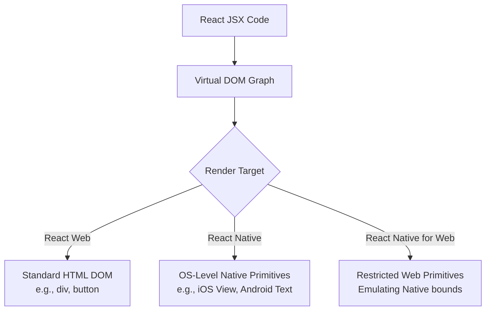

# The Reality of React Native's Popularity: A Response to Tastemaker Design

In a response to a video by a relatively new YouTuber named Tastemaker Design, Theo addresses claims that React Native is secretly unpopular and heavily propped up by deceptive marketing. While Theo praises Tastemaker's phenomenal editing and presentation skills, he strongly challenges the video's research, assumptions, and conclusions. Theo aims to correct the record on how massive companies actually integrate React Native, how popular it truly is, and why businesses continue to invest heavily in the framework.

Theo's central critique is that Tastemaker views mobile development through a restrictive "all or nothing" lens. Tastemaker assumes that if an app's root architecture isn't built entirely in React Native, the company is lying about using it. Theo explains that React Native was actually created specifically to integrate into existing native applications. It allows large companies to vertically slice their engineering teams, enabling a single product team to own the backend, front end, and cross-platform UI without needing dedicated iOS and Android engineers for every small feature.

### How Companies Actually Use React Native

Theo breaks down several examples from Tastemaker's video where companies were accused of faking their use of React Native:

*   Facebook does not use React Native for its entire root app, but completely owns massive, highly performant sections of it like Facebook Marketplace, blending it seamlessly into the native shell.
*   Walmart might not use React Native for its primary consumer iOS app, but they employ a massive suite of internal React Native apps for employee devices to handle inventory, routing, and fulfillment. 
*   Amazon uses React Native across various internal and external properties, going as far as maintaining a 600-engineer internal interest group and building a custom C++ rendering engine to run React Native on Kindle e-ink displays.
*   Meta extensively uses React Native to build the operating system, store, and core applications for the Meta Quest VR headsets.
*   Microsoft maintains React Native for Windows and macOS, utilizing it to bring a higher quality developer experience to crucial surfaces like the Xbox store, the Windows Start Menu, and parts of Excel.
*   Sony relies heavily on React Native for the user interface of the PlayStation 5 operating system.

### Understanding the React Native Architecture

Tastemaker suggested that Facebook might just be wrapping "React Native for Web" inside a web view on mobile. Theo strongly corrects this, explaining that React Native renders to true native components, not web elements. 

To clarify how React handles rendering differently depending on the environment, Theo outlines the component translation process:

React Native uses a different translation layer at the end of the Virtual DOM lifecycle. Instead of mapping to HTML, it maps directly to iOS and Android default primitives, meaning the end user is interacting with a native application, not a website.

### Debunking the Native "Hype" and Marketing Conspiracies

Tastemaker argued that the popularity of React Native is manufactured by consultancies like Infinite Red and toolmakers like Expo to sell services. Theo thoroughly rejects this, noting that these companies bet their livelihoods on React Native because it actively solves business problems, not the other way around. 

Theo provides concrete data to prove React Native's dominance over highly publicized alternatives like SwiftUI and Jetpack Compose:

*   Evan Bacon from the Expo team regularly scrapes the Apple App Store, revealing that roughly 25% of the Top 100 apps in major categories like Sports, Food, and Business are built using React Native.
*   A search on Indeed for job availability shows that React Native has over ten times the number of open job listings compared to SwiftUI or Jetpack Compose.
*   The recent massive spike in React Native's NPM downloads is not artificial inflation caused by Expo's automated tooling—as Expo's download numbers are exponentially smaller—but is actually driven by the recent explosion of AI startups choosing React Native to ship cross-platform apps quickly.
*   Theo points out that closed-source UI layers from Apple make building AI-assisted dev tools incredibly difficult, pushing even hardcore Apple fans toward React Native's open-source ecosystem.

### Theo's Conclusion and Advice for New Creators

Theo fully agrees with one of Tastemaker's underlying points: the internet is flooded with low-quality, AI-generated SEO articles making false claims about mobile frameworks. It is genuinely difficult for new developers to find good information. However, Theo is disappointed that Tastemaker's video, despite its high production value, ultimately added to this pile of misinformation by making assumptions without digging past the surface level.

Theo ends the video on a warm, encouraging note. He advises Tastemaker—and any new creator blessed with a sudden platform—to use their reach to contact industry experts. The React Native ecosystem is incredibly deep, and engineers at places like Infinite Red, Expo, or Meta are highly accessible and eager to share the fascinating architectural realities of modern mobile development. He invites Tastemaker to reach out directly, offering his own help and mentorship to foster better technical discourse on YouTube.
