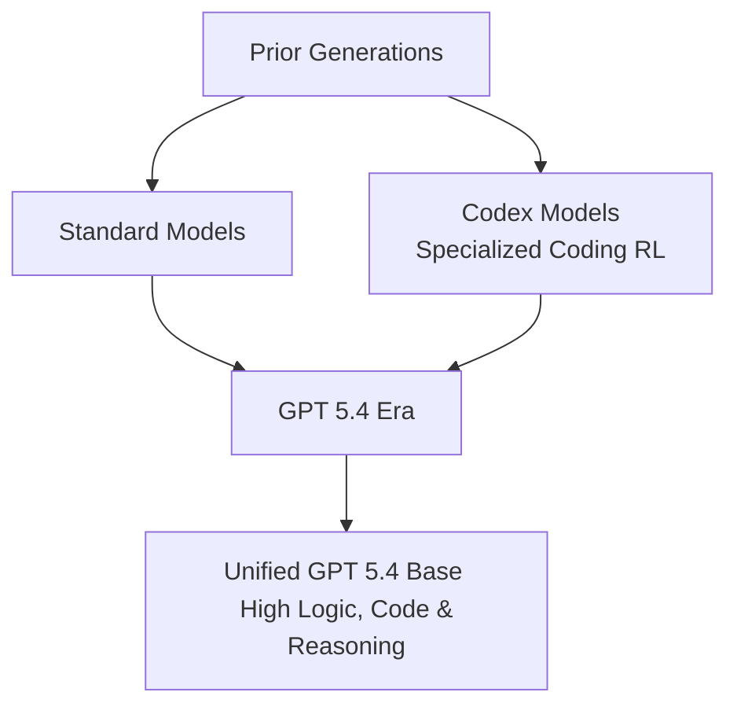

# GPT 5.4 Review: Capabilities, Pricing, and Real-World Developer Experience

Theo views GPT 5.4 as the best AI model ever made, describing it as a massive leap forward for productivity, particularly for developers. Before diving into the model's capabilities, he clarified his relationship with OpenAI. While he receives early access to models, he is not paid by them, declined a free $2,400 Pro subscription to remain objective, and donated $200 to charity to offset the minor API subsidies he received for testing. 

He also highlighted Devin Review by Cognition Labs, a sponsor product that significantly improves GitHub code reviews. Instead of listing pull request changes alphabetically without context, Devin Review uses AI to group related code changes together, making large PRs drastically easier for humans to digest.

### The Shift to a Unified Model
Previously, OpenAI released specialized "Codex" models that applied different reinforcement learning techniques to make base models better at long-running coding tasks. With the release of GPT 5.4, Theo believes the standalone Codex models are dead. The reasoning, coding, and agentic workflows have all been merged directly into the base 5.4 model. Going forward, "Codex" appears to refer specifically to OpenAI's product surface area (CLIs, desktop apps, web wrappers) rather than a distinct underlying AI model.

### Context Limits, Token Efficiency, and Pricing
Theo dug heavily into the economics and functional limits of the new model, noting that while the base price went up, real-world usage might actually be cheaper.

*   The model now supports a massive one million token context window, though exceeding roughly 272,000 input tokens introduces a price multiplier of 2x for input and 1.5x for output.
*   GPT 5.4 is incredibly token-efficient during its reasoning phase, using only about 500 to 1,100 tokens on the "Medium" and "High" reasoning settings, respectively.
*   Theo strongly recommends the "High" reasoning setting, noting that the "Extra High" setting burns over 5,000 tokens per prompt, frequently overthinks the problem, and often fails as a result.
*   The raw API cost for GPT 5.4 increased to $2.50 per million input tokens and $15 per million output, suggesting actual underlying architecture changes rather than just an arbitrary price hike.
*   Because the model reaches better conclusions using far fewer reasoning tokens than models like Claude, the net cost of running tasks is highly competitive and often balances out the higher base price.
*   GPT 5.4 Pro is exceptionally expensive at $30 per million input and $180 per million output tokens, and Theo found it actually performs worse than standard 5.4 on typical coding tasks.

### Real-World Coding and Front-End Deficiencies
Theo extensively tested GPT 5.4 against his own private benchmark (Skatebench V2) and real-world coding challenges. He discovered a sharp divide between its backend prowess and its visual design capabilities.

For long-running engineering tasks, the model is nearly flawless. Theo tasked it with updating a complex, legacy 2020 React codebase. Without any handholding, it generated a comprehensive plan, tracked a massive conversational history without lagging or forgetting previous instructions, and executed the modern refactor effectively. It has exceptionally strong memory compaction, entirely eliminating the "amnesia" older models suffered from during long prompts.

However, GPT 5.4 is remarkably bad at front-end UI design. Theo explicitly stated it feels a generation behind Claude Opus and Gemini in this regard. When tasked with designing web visuals, GPT 5.4 defaults to terrible spacing, bad alignment, and a bloated, card-heavy aesthetic. When he tried to get 5.4 to fix a bad chart UI, it repeatedly failed to adjust spacing and ignored his specific instructions. He ultimately had to port the code over to Claude Opus, which instantly recognized the underlying framework was the problem, rewrote the UI using Tailwind, and fixed the design perfectly.

### Computer Use and Security
Instead of just navigating traditional text, GPT 5.4 features massive improvements in vision and browser use. Rather than clumsily guessing pixel coordinates to click on a screen, the model has been explicitly trained to write and execute JavaScript to programmatically interact with user interfaces. 

Theo notes the model's system-prompt compliance is the best he has ever seen. It strictly follows complex output contracts, handles mid-task interruptions cleanly, and obeys tool-routing instructions without getting stuck in looping logic. However, this increased reliance on tool usage comes with a localized security regression. While the model is highly resistant to standard prompt injections, it currently falls for prompt injections hidden inside data returned by function calls roughly two percent of the time, making it slightly vulnerable when ingesting user-generated or hostile external data.

### The Case for GPT 5.4 Pro
While Theo found GPT 5.4 Pro to be wildly overpriced and generally worse for standard coding or conversational tasks, he discovered it possesses unparalleled lateral thinking for extreme logic problems. 

To test it, he provided the model with a link to a grueling Defcon cryptography puzzle called "C Shanty" from the Goldbug challenge. This puzzle requires reading text off an image, figuring out an obscure cipher based on an awful poem, and decrypting a hidden phrase. It previously took his team of expert human hackers days to solve, and older models would spin for hours before failing entirely. GPT 5.4 Pro solved the entire puzzle in under 17 minutes. Theo concluded that while almost nobody needs the Pro model for daily work, it is profoundly capable at solving the world's absolute hardest logic problems.
