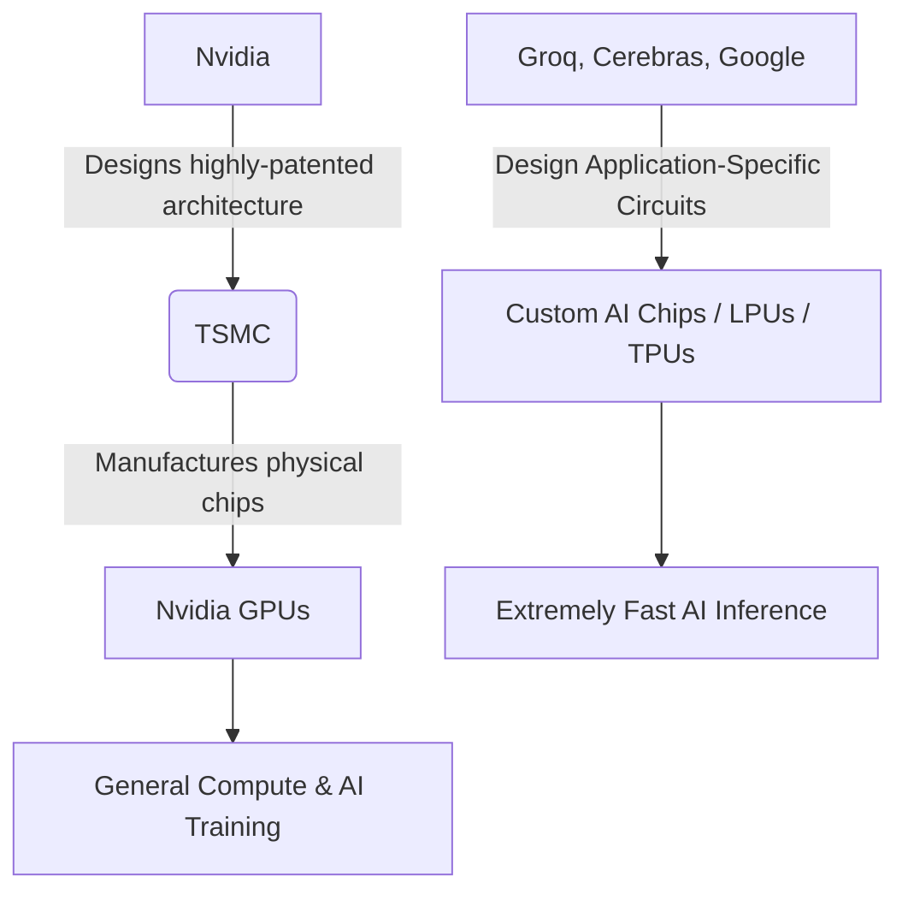

# The Looming Threat to Nvidia's AI Dominance

Theo opens by highlighting Nvidia's status as the most valuable company in the world, pointing out that its total value is currently comparable to all the silver on Earth. He explains that while Nvidia's gaming graphics cards have fortuitously become the backbone of the global AI boom, the company's long-term reliance on general-purpose chips might ultimately be its undoing as major players pivot toward highly specialized hardware. 

Theo admits to being an Nvidia critic for over fifteen years. He notes that their history of alienating partners pushed immense clients like Sony, Microsoft, and Apple to look elsewhere for hardware. Despite a reputation for being difficult to work with, Nvidia maintains market dominance simply because designing GPUs is incredibly complex—so difficult that competitors like Intel and AMD have historically struggled to build equivalent architectures.

### The True Power Behind the Silicon

A critical distinction Theo makes is that Nvidia does not actually manufacture its own chips. That highly specialized task falls entirely to TSMC (Taiwan Semiconductor Manufacturing Company). 

Theo argues that TSMC is arguably the most critical company in the world. They are the only manufacturer capable of producing silicon at the microscopic scale and precision required by modern computing. Nvidia acts as an architect, coming up with brilliant ways to compute generic math, which TSMC then securely prints onto physical silicon. Strict NDAs and patents prevent TSMC from reusing or sharing Nvidia's lucrative blueprints.

### The Shift from General GPUs to Custom ASICs

Theo compares the current AI hardware landscape to the early days of cryptocurrency mining. Initially, GPUs were preferred for Bitcoin mining because their thousands of small cores computed generic vector math brilliantly. However, as the operations became standardized, miners completely abandoned GPUs in favor of ASICs (Application-Specific Integrated Circuits). These custom chips ran the exact required math significantly faster and with far less power. Theo predicts the exact same transition is happening in AI for two specific reasons:

*   **Training demands broad capability:** Creating and teaching a massive AI model from scratch requires highly generalized computing, making traditional Nvidia GPUs the optimal choice for the training phase.
*   **Inference demands tailored speed:** Running a finished model to calculate tokens based on a user's prompt is a highly repetitive task that is drastically more efficient on tailor-made accelerator chips.
*   **Resource availability:** Moving inference workloads off of generic GPUs frees up valuable Nvidia chips to be repurposed exclusively for training new, smarter models.

### The Competitors and the Speed Advantage

Theo points out that specialized companies like Cerebras, Groq (with a Q), and Google are building purpose-built chips specifically designed to conquer AI inference. Because these competitors design custom logic—sometimes weaving massive amounts of memory directly into giant wafers—they achieve unbelievable output speeds.

He highlights that OpenAI is eagerly partnering with Cerebras because models are currently bottlenecked by hardware speeds. Using standard Nvidia GPUs, a model might generate roughly 60 to 80 tokens per second. Offloading that exact same model to chips made by Groq or Cerebras can easily push performance to between 360 and 700 tokens per second, and sometimes as high as 3,000 tokens per second if the software optimizations align perfectly with the hardware.

### Moats, Timelines, and Industry Secrecy

Despite the sheer performance advantage of custom AI chips, Theo outlines several massive barriers preventing competitors from unseating Nvidia smoothly.

*   **The CUDA software lock-in:** Because the entire AI industry was built around Nvidia's "CUDA" standard, competitors have to build custom SDKs from scratch and painstakingly tweak them to mesh with newly released models.
*   **Intense corporate secrecy:** The techniques used to optimize chip architecture are immensely guarded utilizing clean rooms and endless NDAs, meaning Nvidia's multi-trillion-dollar valuation relies entirely on its proprietary blueprints remaining secretive.
*   **Massive manufacturing lead times:** Building a new TSMC fabrication process or spinning up hardware equivalents takes roughly five to ten years, meaning the competitors challenging Nvidia today are only succeeding due to bets placed heavily in the past. 
*   **Nvidia's defense mechanisms:** Nvidia is deeply aware of its eventual hardware limits, which is why they are heavily investing in custom solutions themselves, even reportedly spending roughly $20 billion to license technology and acquire talent from competitors like Groq.

Theo concludes that basic economics of scale will eventually dictate the market. As AI transitions from a foundational training phase into widespread everyday use, it will stop making financial sense to run repetitive inference on expensive, power-hungry Nvidia GPUs. While he expects Nvidia to hold the top spot for a while due to sheer momentum, he is ultimately thrilled by the competition because it means the models we rely on daily are about to get exponentially faster.
