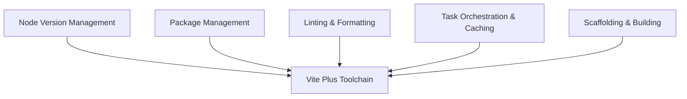

# Theo's First Look at Vite Plus: The Open-Source Unified Toolchain

Theo begins by sharing his excitement about the release of Vite Plus. Originally announced as a closed-source, paid tool by Evan You's new company Void Zero, Vite Plus has now been released as an open-source project under the MIT license. Theo is highly optimistic about its goal: creating a unified toolchain that handles package management, Node environments, testing, scaffolding, building, and linting all in one cohesive system. This consolidation aims to solve the historic web development problem of constantly shifting, fragmented tooling.

Before diving into the code, Theo briefly highlights the sponsor, General Translation. He notes that developers leave the vast majority of the global market behind by only supporting English. General Translation offers a React-friendly toolset with dynamic variable handling and automated translation merges, a product Theo believes in so much that he became an investor.

### The Promise and Core Features

Exploring Vite Plus live, Theo tests several of its built-in modules and finds a lot to praise regarding how much developer friction the toolchain removes. 

*   Vite Plus introduces a built-in Node version manager that pins the exact Node version to the project, which Theo loves because it eliminates the cross-team environment friction usually handled by tools like NVM or FNM.
*   The Rust-based linting and formatting commands are absurdly fast, with Theo observing Vite Plus check and fix issues across a 15,000-line codebase in just over 300 milliseconds.
*   The tool includes a feature called V Tasks, which orchestrates commands and caches outputs similarly to Turbopack, ensuring that multi-command scripts run efficiently based on the correct dependency graph.
*   The scaffolding command allows developers to pick exactly which AI agents they use within their editor, generating specific configuration files to assist the models during development.

### Friction Points and Critiques

Because Vite Plus is still in an Alpha state, Theo encounters several frustrating edge cases and design choices that he believes must be addressed before the tool is ready for widespread adoption.

*   The default AI agent markdown files generated by Vite Plus are bloated with irrelevant framework tutorials rather than useful project context, which Theo warns will actively harm AI model performance by clogging their context windows.
*   Vite Plus forces a move off of Bun and onto PNPM, which Theo feels is a massive oversight since the bleeding-edge developers most likely to try Vite Plus are the exact same demographic already utilizing Bun.
*   The built-in commands hijack custom scripts in the package file, meaning running the default dev command ignored Theo's custom concurrent dev setup, forcing him to learn a new syntax to trigger his own scripts.
*   Theo points out a minor but noticeable ergonomic annoyance: typing the package installation command requires two hands on a standard QWERTY keyboard, breaking the single-handed muscle memory developers have built with other package managers.

### Migration Experience and Verdict

To truly test the toolchain, Theo attempts an automated migration on an existing TanStack Start application to move it from Vite 7 and Bun over to Vite Plus and PNPM. The initial migration command succeeds but leaves behind stale dependencies and module mismatches that completely break the application's runtime and local dev server. 

After struggling to get Claude Code to resolve the mismatched TanStack packages, Theo relies on T3 Chat to identify the root cause—a conflict caused by the transition from Bun to PNPM—and successfully repair the application. Once the project is running on Vite Plus, Theo tests the build times. The project's build duration drops from 28 seconds down to 22 seconds. He finds this to be a highly meaningful performance gain for an application that is already quite small and optimized. 

Ultimately, Theo concludes that Vite Plus is a brilliant vision for the future of web development. By stripping away the decision fatigue of cobbling together separate linters, runtime managers, and package systems, Void Zero is building a highly promising foundation. However, due to the current edge cases, lack of Bun support, and script configuration quirks, he will hold off on adopting it for his own production projects until it matures out of Alpha.
