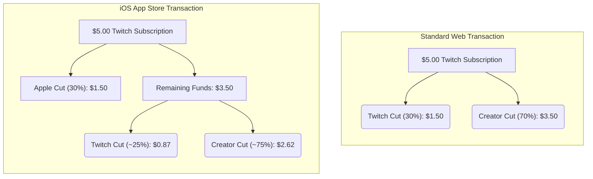

# Epic's Massive Court Victory Over Apple's App Store Fees

Theo breaks down the recent, highly consequential court ruling where Apple was found in willful contempt regarding its App Store policies. The ruling marks a major victory for Epic Games, game developers, and the broader creator economy after a four-year legal battle over Apple's mandatory fees.

### The Core Dispute: The "Apple Tax" and Developer Inequality

The conflict stems from Apple's strict policy of charging a 30% fee on all digital goods sold through iOS applications. Theo explains that while physical goods (like ordering from Amazon), tangible services (like taking an Uber), and banking (like depositing money into Chase Bank) incur zero fees from Apple, anyone selling digital goods or subscriptions is forced to use Apple Pay and surrender 30% of their revenue. Developers are explicitly blocked from using third-party payment processors like Stripe, which typically charge around 2.9% plus a small flat fee. 

Theo argues this creates a massive, disproportionate burden on independent developers. A small indie game developer making digital sales is forced to subsidize the platform, paying thousands of dollars in Apple fees. Meanwhile, massive corporations like Chase Bank, which require constant app reviews and consume immense Apple server bandwidth, pay nothing beyond the basic $100 yearly developer license. 

This fee structure also severely damages the creator economy. Theo uses the example of Twitch subscriptions to show how Apple's mandatory cut destroys a creator's earning potential on mobile devices. 

Because Apple takes its cut first, platforms like Twitch are forced to pass the losses down to the creator, decentivizing platforms from building robust mobile monetization features. 

### The Legal Rulings: From Malicious Compliance to Contempt

To fight this ecosystem, Epic Games intentionally bypassed Apple's payment system in Fortnite four years ago, knowing the game would be banned, simply to force this issue into the courts. Theo outlines how the resulting legal battles have unfolded across different arenas:

*   **The initial Apple ruling resulted in malicious compliance.** A judge originally ordered Apple to allow developers to include buttons, links, or callouts to external payment options. Apple focused heavily on the word "or," allowing developers only a single, heavily restricted link hidden away from the checkout flow, accompanied by a massive warning screen designed to scare users away from clicking it.
*   **Epic simultaneously crushed Google in court.** In a parallel lawsuit, a judge ruled that Google ran an illegal monopoly. Google was forced to allow rival third-party app stores on Android, permit developers to use alternative payment processing, and allow developers to offer cheaper prices outside the Play Store.
*   **The new Apple ruling strikes down Apple's bad faith behavior.** The court recently found Apple in "willful contempt" of the original injunction, completely rejecting Apple's restrictive interpretation of the previous rules.
*   **Developers can now freely link to external payments.** Apple is no longer allowed to dictate the font size, placement, or style of external links, nor can they prevent tracking URLs that allow users to seamlessly check out on a web browser without having to sign back in.
*   **Apple is barred from charging off-app fees.** Apple had previously planned to enforce a new 27% fee even if users paid outside the app, but the new ruling strictly forbids them from levying any commission on off-app purchases.
*   **Apple faces severe financial and legal penalties.** Apple was ordered to pay Epic's legal fees related to this specific injunction, and Apple's VP of Finance was referred to the US Attorney for potential criminal contempt charges for allegedly lying under oath about how Apple formulated its fees.

### Impacts and the Future of the App Store

Theo expresses immense gratitude toward Epic Games CEO Tim Sweeney. Because Sweeney holds a 51% controlling stake in Epic, he was uniquely positioned to sacrifice millions of dollars in immediate Fortnite revenue without facing shareholder lawsuits. Theo notes that Epic's ultimate motivation is to ensure game developers have more money in their pockets; if developers aren't losing 30% to Apple, they have more capital to spend on Epic's tools, like Unreal Engine. Epic has even publicly offered to drop all ongoing and future litigation if Apple agrees to adopt these new, friction-free rules worldwide. 

Looking forward, Theo predicts that Apple will likely hold a deep grudge over this massive loss in high-margin service revenue and may consequently divest resources from developer tools like Xcode. However, he strongly urges Apple to take a different path. Rather than punishing developers and searching for new legal loopholes to make their lives miserable, Theo believes Apple should view this as an opportunity. If Apple voluntarily lowers its mandatory fee to a competitive rate of 5% to 10% and focuses on making Apple Pay the most attractive option rather than a mandated requirement, they could instantly win back the love and loyalty of the global developer community.
