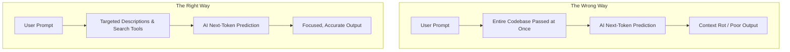

# How to Stop Failing with AI Coding Tools

Theo addresses developers who are skeptical about using AI for real, complex codebases. While it is easy to assume AI is only good for small side projects, Theo argues that lackluster experiences usually stem from developers making a specific set of operational mistakes. By changing your approach to context, environment, and problem selection, you can unlock incredible productivity.

### Selecting the Right Problem

The most fundamental mistake developers make is treating AI as a last-resort safety net for problems they do not understand. Because they only turn to AI when they are out of ideas, they set the agent up to fail. 

*   Try AI on problems you already know how to solve, as this allows you to compare the model's solution to your own and accurately gauge its capabilities. 
*   If you encounter a problem the AI cannot solve but you can, save the exact codebase state and context to create a highly valuable, real-world benchmark for testing future models.
*   Treat the AI like a junior engineer on your team by handing it well-understood, clearly defined tasks so you can easily verify its output and spread the workload.

### Context Management and the Danger of "Context Rot"

Theo strongly advises against giving an AI model access to your entire codebase at once. Tools that flatten whole repositories into a single context file fundamentally misunderstand how Large Language Models work. Because AI relies on next-token prediction, flooding it with thousands of lines of irrelevant code distracts the model. This creates "context rot," where the model's success rate plummets because the answer is buried in noise. 

Even if a model like Claude Opus or Gemini has a massive context window, using all of it makes the model dumber. Instead of giving the AI everything, you should give it tools—like code search functionality—so it can find the specific lines it needs, exactly as a human developer would.

### Building an AI Memory

Because AI agents effectively have their memories wiped every time you run them, you have to build a memory for them. This is done using files like `claude.md` or `agent.md`, which serve as a lightweight guide for the model seamlessly included in its context. 

Theo stresses that you should not copy-paste complex templates from the internet to serve as exhaustive documentation. Instead, treat this file as a simple "gotchas" list. When you notice the AI making a repeated mistake—like running a dev server when it should only run a type-check, or creating generic "AI slop" UI designs—add a single sentence to the markdown file telling it exactly what to do or avoid. This takes seconds and saves hours of future frustration.

### Fixing Broken Environments

If a developer opens your project at the root level and the type-checking breaks because the configuration requires them to be in a specific subfolder, your environment is broken. 

*   When an AI agent encounters these deep-seated configuration errors, it will mistakenly think its own code caused them and desperately try to fix them, trapping itself in an agonizing loop of reverting and rewriting.
*   You must fix these environmental "ghosts" so the AI has a clean slate to test its code against.
*   Ironically, you can often run the agent directly on the broken configuration files and simply ask it to fix the environment errors for you.

### Avoiding "MCP Hell" and Over-configuration

A massive trend among developers right now is attempting to force AI to be useful by bloating it with Model Context Protocol (MCP) servers, complex plugins, and sprawling rulesets. Theo rejects this entirely. He uses stock editors with zero MCP servers configured. 

Adding layers of orchestration and massive feature sets only muddies the context further. If an AI tool is not useful in its simplest, out-of-the-box form, adding complex routing and plugins will only make it perform worse. The most productive developers simply let the model look at a few files and instruct it clearly, rather than building elaborate tech stacks around the prompt.

### Plan Mode and Iteration

When an AI model produces poor output, the standard reflex is to tell it, "You did this wrong, fix it," appending the correction to the chat. Theo argues this is highly destructive. Because the AI relies on the history of the chat to predict the next tokens, leaving bad instructions and incorrect implementations in the history pollutes its future logic.

Instead, if the output goes entirely off the rails, you should revert the change, step back, and adjust your initial prompt or your markdown instructions. Using "Plan Mode" is incredibly effective here. Plan mode forces the AI to outline its intentions and ask clarifying questions before executing any code. If the AI hallucinates a bad plan, you can simply correct the plan or update your context before letting it touch the codebase, ensuring that its history remains filled primarily with good data.
