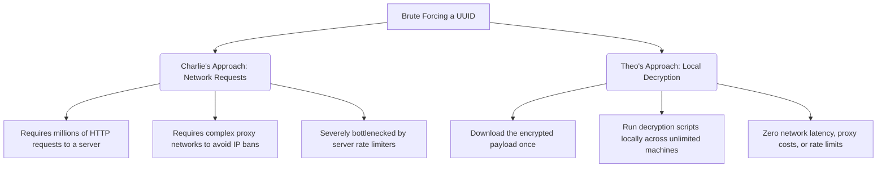

# The Great UUID Brute-Force Debate

The entire situation started with a simple thought experiment Theo posted online. He wanted to know if placing data behind a wildly unique public URL—specifically one utilizing a UUID—still constituted keeping that data private, since the URL would be virtually impossible to guess. While he got some insightful feedback about why this approach isn't always viable, the conversation was sidelined by a user named Charlie, who confidently claimed that UUIDs are not secure because all variations can be easily brute-forced. 

Determined to correct a massive misunderstanding of basic cryptography, Theo spent days engaging with this user, ultimately resulting in a technical challenge, community involvement, and a deep dive into how randomness on the internet actually works. 

### The Core Debate: UUID Math and Misconceptions

Theo firmly believes that anyone asserting UUIDs can be easily brute-forced simply does not understand the math behind them. He breaks down the realities of UUID generation against Charlie's flawed arguments:

*   **The sheer scale of UUID v4:** A standard UUID v4 has 5.3 × 10^36 (or 2^128) possible variations. Theo explains that the likelihood of generating two identical UUIDs in a truly random environment is equivalent to phasing through a solid wall because your atoms perfectly aligned with it. 
*   **Charlie's hallucinated math:** Charlie claimed there are only 2^32 variations and that a server making 100,000 requests per second could brute-force a UUID in 12 hours. Theo points out this is a made-up number, likely pulled from a misunderstanding of AI chatbot answers or totally unrelated technical specs.
*   **Outdated vulnerabilities:** To back up his claims, Charlie linked a decade-old article detailing a flaw in a specific, outdated Java/C implementation in Chrome using `math.random`. Theo counters that modern web tools use secure cryptographic implementations that entirely prevent this theoretical vulnerability.
*   **The proxy and serverless argument:** Charlie claimed he could use thousands of serverless cloud functions and proxy evasion to brute-force a network endpoint. Theo argues this simply highlights a fundamental misunderstanding of bypassing security, as network requests are wildly inefficient for brute-forcing compared to local computational power.

To illustrate why Charlie's insistence on using network requests for brute-forcing makes no sense, Theo sets up a comparison of the two concepts:

### The $1,000 Decryption Challenge

To force the issue, Theo created a public challenge with a $1,000 prize. He generated a UUID, used it as a key to encrypt a simple text file via AES-256, and provided the file to the public. He told Charlie that if brute-forcing a UUID is so easy, he should securely download the file and decrypt it locally. 

Instead of attempting the challenge, Charlie made a series of baffling excuses. He claimed the prize money wasn't high enough because his server costs would be $2,000. He completely failed to grasp that by downloading the file and decrypting it locally, he bypassed the need for network proxies or API requests entirely. Charlie even argued that forcing him to decrypt the file locally unfairly limited him to using a single server, which Theo notes is precisely the opposite of how scalable local computing works.

### The Community Investigation

Theo's community quickly leaned into the absurdity of the challenge. A developer named Nolan, who previously built a website hosting every possible UUID, added a specific feature to his site just for this event. Users could scroll through the massive database of UUIDs, and the site would automatically attempt to decrypt Theo's file using the UUIDs on the screen. 

Because Theo used AES-256 encryption, an incorrect UUID would sometimes successfully process but output complete gibberish instead of failing outright. Charlie actually passed an incorrect UUID through Nolan's site, got a nonsensical text output, and confidently declared to Theo that he had successfully cracked the file. Other friends of Theo even tried to use tools like ChatGPT to guess the file's contents, leading the AI to hallucinate answers like "The cake is a lie."

Ultimately, the 48-hour challenge window expired with zero successful attempts. Theo finally revealed the correct UUID and unlocked the file, revealing the hidden message: "There's a literal 0% chance you are able to get into this file." 

Theo concludes that while he lost a lot of time and sanity to the thread, the sheer chaos of the journey made it incredibly entertaining. He views it as a distinct lesson in how some people will publicly and repeatedly defend an outright lie rather than admit they misunderstood a core technical concept.
