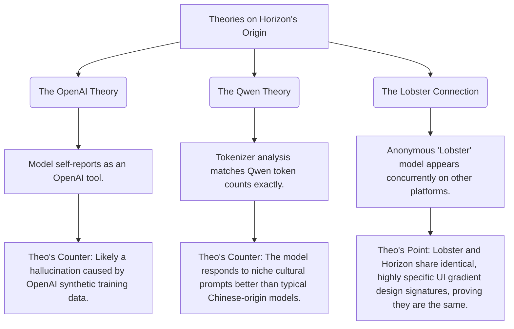

# The Anonymous "Horizon" Models: Exceptional UI Generators

Theo recently spent time testing two new anonymous AI models—Horizon Alpha and Horizon Beta—that surfaced quietly on OpenRouter. He was blown away by their capabilities, specifically when generating user interfaces and designs. Comparing them against industry standard models like Anthropic's Claude 3.5 Sonnet and Claude 4 Opus, Theo found that the Horizon models significantly outperform the current state-of-the-art options in aesthetic taste and layout execution. 

### Model Behaviors and Characteristics

While experimenting extensively with standard coding tasks and prompt handling, Theo noticed several distinct behaviors that set these Horizon models apart from existing options:

*   These are fundamentally swift models, consistently generating between 90 and 125 tokens per second, though heavy user traffic has occasionally slowed them down to about 80 tokens per second.
*   They function as non-reasoning models that begin text output immediately upon receiving a prompt, avoiding the hidden "thinking" phase used by newer reasoning models. 
*   An early implementation bug on OpenRouter temporarily enabled reasoning on the Alpha model, confirming to Theo that the underlying architecture is fully capable of reasoning even if the public implementation currently disables it.
*   The models exhibit an aggressive preference for upfront planning, consistently opting to draft a detailed to-do list before initiating code generation when loaded into an IDE environment.
*   They demonstrate a highly advanced understanding of SVGs and spatial awareness, performing exceptionally well on the difficult "Pelican Test" (drawing a pelican riding a bicycle inside an SVG) and accurately rendering classic Star Wars droids.

### The Mystery of Their Origin

Because Horizon Alpha and Beta are completely anonymous, there is widespread debate regarding who built them and what underlying architecture they utilize. Theo outlines the prevailing theories and provides his own counterarguments based on his testing. 

When asked directly, the Alpha model claims to be trained by OpenAI, while the Beta model claims an unknown provider. Theo dismisses this as solid evidence, noting that models like DeepSeek often claim OpenAI origins simply because they were trained on synthetic data generated by OpenAI. Furthermore, AI researchers have tested identical, complex text strings through various tokenizers, discovering that the Horizon token count perfectly matches Qwen models instead of OpenAI models. Although this strongly implies a Qwen architecture, Theo finds the models' behaviors differ from typical Qwen outputs. 

Additionally, Theo strongly believes the Horizon models are the exact same architecture as another anonymous model currently on the LMSYS Chatbot Arena called "Lobster." While some users speculate Lobster is GPT-5, Theo rejects this claim. Instead, he points to a highly specific, baked-in design quirk: both models default to an identical blurred background gradient combining bottom-right blue and top-left purple. 

### Real-World Performance vs. Benchmarks

To push the models' historical and cultural knowledge, Theo uses his standard "Skate Bench" test, asking for the history of the 360-flip skateboarding trick. He specifically looks for the model to rightly credit skater Jason Lee. The Horizon models performed adequately—scoring around 20% and outperforming typical Chinese models—but they still missed crucial nuances and hallucinated historical details. 

In standardized math and coding benchmarks, the Horizon models score quite poorly compared to top-tier models like o3-Mini or Llama 4 Maverick. However, Theo argues that these artificial benchmarks no longer reflect lived reality. In day-to-day usage for coding and web application building, his experience proves that models often scoring lower on leaderboards (like Claude 3.5 Sonnet) are vastly superior for actual production. 

To test Horizon purely on UI execution, Theo deployed an API hack to force Cursor IDE to use the models for generating a mocked web application. The design results were stunning. Unlike Claude models, which default to heavy rounded corners and specific pink/purple gradient palettes, the Horizon models naturally generated incredibly tasteful color palettes, dark modes, and modern blurred interface components. 

Theo concludes that whoever is behind these models is likely a major tech lab running a free, temporary data-collection phase to measure user reception before an official release. Because no company provides models this advanced for free indefinitely, he highly recommends developers try them immediately.
