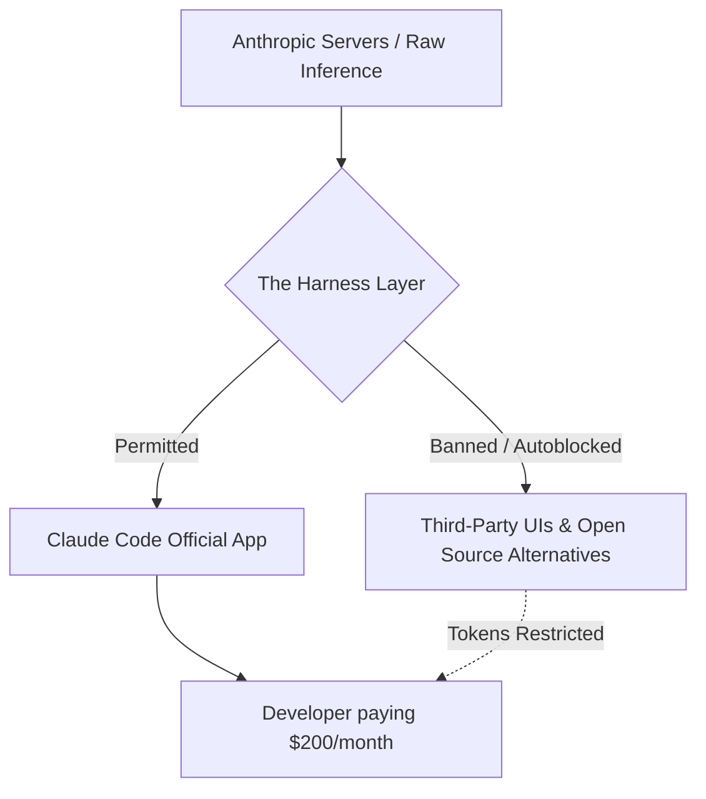

# Anthropic's Hostile Developer Practices and Internal Culture

While Anthropic recently released the highly capable Claude Sonnet 4.6 model, Theo's focus is entirely on the company's deteriorating relationship with developers. Despite building incredible tools, Anthropic is increasingly engaging in hostile business practices, shutting out competitors, and fostering a restrictive internal culture. Theo leverages his unique position as a developer, business owner, and media figure to sound the alarm on what he views as destructive behavior from an otherwise brilliant AI lab.

### The Problem with Subsidized Subscriptions and Harness Lock-ins

The core of the current conflict revolves around how Anthropic handles its $200-a-month developer plans. Theo explains that these plans heavily subsidize inference costs. To illustrate, his business, T3 Chat, paid $23,000 for standard API usage in a single month; if they had access to the subsidized rates of the $200 plan, that same usage would have cost closer to $1,500. 

Because Anthropic is footing the bill for this massive discount, they are fiercely restricting how developers can use their subscriptions. They recently updated their policy to ban users from taking their Claude Code OAuth tokens and bringing them to third-party interfaces or products. Theo believes that if a user is paying for their own subscription, they should be able to use whatever user interface or "harness" they prefer, rather than being locked exclusively into Anthropic's proprietary Claude Code app.

### A Startling Contrast with OpenAI

Theo highlights a massive cultural and operational gap between Anthropic and OpenAI regarding developer relations. 

*   OpenAI actively encourages developers to hack around and build upon their internal servers, openly providing the architecture for developers to build custom user interfaces for OpenAI's tools.
*   When developers face issues hooking into OpenAI systems, OpenAI employees reach out, offer support, and even advise them on how to spoof headers to bypass restrictions.
*   OpenAI welcomes constructive criticism, sharing Theo's highly critical videos internally to learn from them, whereas Anthropic ignores direct requests for technical clarification from partners they are actively under NDA with.

### A Catalog of Hostile Industry Behaviors

Beyond the subscription technicalities, Theo details a broader pattern of Anthropic playing dirty across the AI industry. 

*   Anthropic routinely bans competitors from utilizing their models, having recently cut off access to Windsurf, OpenAI, and XAI, preventing them from using Claude for comparative benchmarks or internal workflows.
*   They intentionally distort safety benchmarks to favor themselves, recently claiming that OpenAI's o3 models failed a safety benchmark because they did not understand the test, while claiming their own model exhibited "awareness" when it demonstrated the exact same behavior.
*   The company actively fights the open-source community by keeping Claude Code closed source, refusing to release open-weight models, and issuing aggressive DMCA takedowns against developers discussing inadvertently leaked code.
*   Anthropic severely underpays developer influencers for promotional videos, handing them a flat rate of roughly three thousand dollars while funneling millions of dollars a day into distributing the creator's face across Instagram ads without offering fair distribution rights or residuals.

### The Savior Complex and "Cult" Culture

Theo attributes this erratic behavior to Anthropic's internal culture, which he likens to a religious cult. Since the company was founded by former OpenAI employees who felt OpenAI lacked safety protocols, Anthropic has internalized a deep savior complex. Many within the company genuinely believe that if Anthropic does not win the AI race, humanity will be destroyed by careless competitors. 

This extreme mindset dictates how the company runs. Employees are terrified to speak out, engage with critics, or be seen as outsiders for fear of losing their deeply vested equity or being ostracized. Because Theo occasionally praises OpenAI and criticizes Anthropic, the company now views him as a hostile enemy rather than a collaborative partner. This paranoia trickles down to developer relations, resulting in strict communication lockdowns where even helpful employees are silenced by legal and PR teams.

### Theo's Proposed Solutions for Anthropic

To repair their public image and stabilize the developer ecosystem, Theo offers several direct pieces of advice.

*   The executive team needs to drop their massive ego, stop treating every simple tool as a proprietary secret, and realize they cannot recreate Apple's walled-garden ecosystem in today's fast-moving AI landscape.
*   They must commit to radical transparency by explicitly communicating why specific users are banned and what exact policies third-party apps are violating.
*   The company should lean into open-source software by opening the code for their developer tools and granting free inference tiers to maintainers of critical open-source projects.
*   Leadership needs to fire the restrictive PR and legal teams and empower their actual developer advocates to speak freely and represent the community inside the company, much like how YouTube empowered critical creators to steer their platform strategy.
