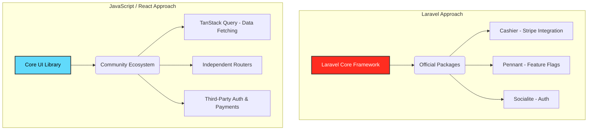

# Theo's Take on PHP's Resurgence and the Power of Laravel

Theo reviews an article about the modern resurgence of PHP, prompting him to reflect on his own bumpy history with the language and evaluate the current hype surrounding Laravel. While he has been firmly embedded in the JavaScript ecosystem for years, the impressive evolution of PHP leads him to acknowledge why so many developers are flocking back to it.

### The WordPress Era and PHP's Bad Reputation

Theo relates deeply to the article's premise, having started his own career as a WordPress developer. He admits that wrestling with WordPress early on made him heavily dislike front-end work, pushing him to focus almost entirely on the back-end. 

PHP's original design was a double-edged sword. It provided a magical, frictionless learning curve where a developer could simply drop a `.php` file onto a server and have it run without complex setup. However, this lack of guardrails naturally led to unstructured "spaghetti code" and a reputation for poor scalability. 

Theo shares a painful personal story from this era of FTP deployments and cheap shared hosting. Years ago, one of his WordPress sites hosted on a generic cPanel service got compromised by a bot and started distributing malware. The hosting provider entirely locked him out of his account, breaking his FTP access and refusing to give him a backup of his files. Because the host also controlled his email server, he stopped receiving crucial emails. Out of desperation to regain control of his email, he was forced to permanently wipe the server, losing over ten years of his early web development history in the process.

### PHP's Performance Evolution

Beyond messy codebases, legacy PHP was widely criticized for being hilariously slow. Theo highlights how Facebook originally built their platform on PHP but struggled so much with its poor performance that they had to invent a completely new language called Hack just to make it scale. 

However, Theo points out that the language has undergone massive performance improvements over the last decade. Starting with PHP 7.0 and continuing through 8.0, 8.1, and 8.2, response times have plummeted. He notes that tests showing 475ms response times on older versions dropped to 164ms on modern builds, ultimately resulting in a nearly 10x performance gain over the language's lifespan. 

### Modern Developer Experience

Theo also takes a detour to praise modern backend deployments, specifically highlighting his sponsor, Savala, to show what developers now expect from their tooling. He demonstrates how easy it has become to attach workers, automated cron jobs, and Cloudflare CDNs to an existing codebase with just a few clicks—features that make him envious compared to his current Vercel setup.

### The Great Framework Wars: PHP vs. JavaScript

The article claims the JavaScript ecosystem became overwhelming with its explosion of tools, but Theo argues that PHP went through the exact same chaotic phase. 

*   Early PHP developers were bombarded with a massive array of disjointed solutions like CodeIgniter, Symfony, WordPress, Magento, and Drupal, which created immense fatigue.
*   The JavaScript ecosystem experienced a parallel boom with libraries like Ember, Backbone, Meteor, and Knockout, which was overwhelming but ultimately necessary for the ecosystem to mature.
*   Theo argues that people tend to view the past with rose-tinted glasses—we only remember the JavaScript chaos because it happened more recently and had better package management, but both ecosystems naturally filtered out the bad options and kept the survivors.

### Laravel vs. The JavaScript Ecosystem

The core of Theo's analysis focuses on why Laravel is suddenly so popular and how its philosophy differs completely from the modern JavaScript ecosystem. Taylor Otwell built Laravel to rescue developers from PHP's unstructured chaos by giving them a highly guided "happy path." 

Theo outlines the clear trade-offs between Laravel's integrated approach and the JavaScript community's modular approach:

*   Laravel provides officially supported, first-party packages for complex infrastructure that developers hate building from scratch. For example, Laravel includes Cashier for Stripe integration, Pennant for feature flags, and Socialite for authentication.
*   Theo admits he is jealous of Laravel's built-in Stripe integration, noting that his own team frequently struggles with synchronizing Stripe webhooks and database caching, which Laravel handles natively. 
*   However, Theo defends the JavaScript community's fragmented "Linux-style" approach, arguing that independent innovation is essential for breakthroughs. If the core React team controlled the entire stack the way Laravel does, incredible third-party tools like TanStack Query (React Query) never would have been invented.
*   Ultimately, Theo believes Laravel is the perfect choice for developers who experience analysis paralysis and want reliable decisions made for them, whereas his own T3 Stack is designed for developers who want a balance of stability and the freedom to swap out modular pieces.

Despite his deep loyalty to the composable JavaScript ecosystem, Theo concludes that Laravel has successfully made PHP fun and robust again. The article successfully convinces him that he needs to put his biases aside, leading him to announce that he plans to build a Laravel app completely from scratch to experience it firsthand.
