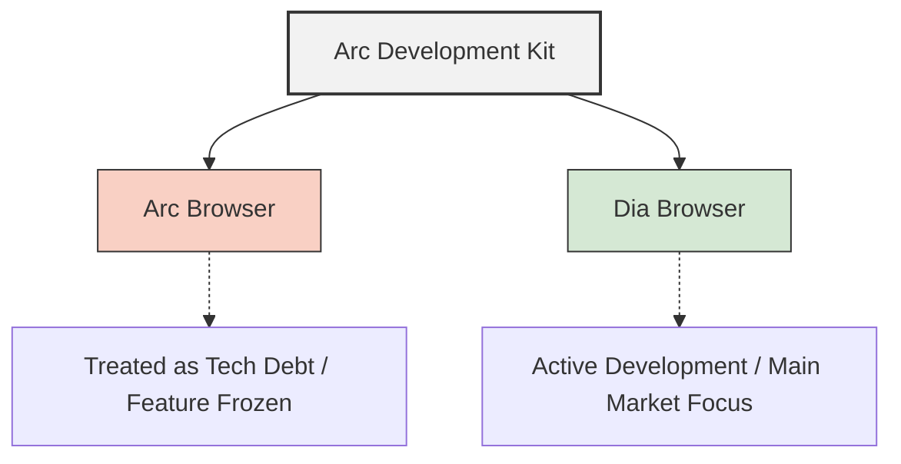

# The Demise of the Arc Browser and Why Theo is Moving On

Theo addresses a bittersweet and frustrating moment for his channel regarding the Arc browser. After heavily championing Arc to his audience and driving an enormous number of users to the platform, he recently voiced deep concerns about the company's direction. Now, The Browser Company has released an open letter that confirms his fears: they are effectively halting feature development on Arc to completely pivot to a new AI-focused browser named Dia. 

Theo feels personally burned by this move. He explains that his frustration is less about his own inconvenience and more about the fundamental betrayal of the enthusiastic power users who built the company's initial momentum. 

### Why Arc Failed to Scale

According to the open letter, The Browser Company realized that while Arc commanded intense loyalty from its core users, it presented too steep of a learning curve for the general public. Theo breaks down the core reasons behind this decision:

*   The company admitted to a massive "novelty tax," meaning new users were overwhelmed by the unique interface, leading to a grim retention rate where only about ten percent of users stuck around after trying it. 
*   Theo relates this to what he calls "the mom problem" based on his own startup experience: if you build a product that is too complex for your own mother to use and benefit from, you are inherently capping your market size.
*   The CEO of The Browser Company previously admitted he could not see his mom using Arc, explicitly signaling that the browser was fundamentally incompatible with mainstream adoption.
*   Instead of maintaining Arc as a dedicated application for power users while developing a mainstream alternative, the company chose to gut Arc, treating its codebase as technical debt to build Dia on top of.

### The Technical Reality and Open Source

Many users hoped that if Arc was being abandoned, the company would open-source the project. Theo explains that this will absolutely never happen, entirely due to how the browser was engineered. 

Arc runs on a custom, proprietary infrastructure called the Arc Development Kit (ADK), which allows developers to build complex browser interfaces without touching the underlying Chromium C++ codebase. The company relies so heavily on the ADK that it is now the foundation for their new browser, Dia.

Furthermore, Theo highlights that the company confessed to regretting their use of SwiftUI because it created a performance mess. He points out the irony here, as the company previously dismissed his private and public bug reports—specifically regarding the downloads tab completely freezing the browser—by calling him a "niche user" rather than fixing the underlying architectural flaw.

### VC Pressure and Cosplaying as CEO

A core theme of Theo's critique is how venture capital influenced this pivot. While he argues that investors likely did not explicitly order the death of Arc, the overarching pressure to justify a massive valuation inevitably forced the company's hand. 

*   Theo accuses the leadership of "cosplaying as a CEO" by prioritizing the aesthetics of running a massive tech company over establishing sustainable product-market fit.
*   The company spent exorbitant amounts of money on elaborate marketing videos and hired approximately 136 employees while generating zero revenue natively.
*   Theo estimates their fundamental operating and staffing expenses burn roughly $30 million a year, forcing the company to pivot toward the AI hype cycle to secure future funding and simulate explosive growth.
*   Rather than acknowledging they scaled too quickly on an unproven business model, the company’s letter grandiosely compares standard browsers to candles and AI browsers to electricity to justify the pivot.

Theo views Dia as an uninspired attempt to chase the AI trend. Having tested early builds, he notes that it essentially functions as a clunky, slow AI chat sidebar that offers no real innovation over standard tools already available in Chrome. 

### Where to Go Next

Because of the broken trust and fundamentally flawed business trajectory, Theo flatly refuses to recommend any products built by The Browser Company. He strongly doubts the company can survive the next few years given their massive cash burn and lack of product-market fit with Dia.

For users looking to transition away from Arc, Theo offers a few clear paths forward. He notes that for the vast majority of people, standard Chrome or Ungoogled Chrome remains the safest, most reliable choice. For users who genuinely loved Arc's ergonomics, such as the sidebar and workspace management, he highly recommends Zen. Zen is a fully open-source, community-driven browser built by a tiny team; while it is Firefox-based and inherits some of Firefox's inherent quirks, it provides the most pleasant browsing experience Theo has tested recently. He also mentions Helium as an incredibly early but promising Chromium-based alternative to watch in the future.
