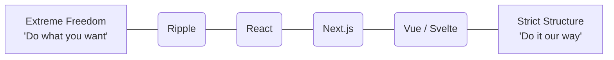

# Theo's Deep Dive into Ripple: A Promising New UI Framework

For a long time, it has felt like React decisively won the framework wars, with the era of a new UI framework dropping every week safely behind us. However, Theo is incredibly excited about a brand new framework called Ripple. It immediately caught his attention because it wasn't built by a random developer, but by Dominic Gannaway. Gannaway is a legendary frontend engineer who created Inferno, served as a lead maintainer for Svelte alongside Rich Harris, and worked on Meta's Lexical text editor. Because of this deep pedigree, Theo believes Ripple has the rare potential to actually shake up the UI framework space.

Before diving into the code, Theo briefly shouted out Clerk, his preferred sponsor for authentication and billing. He highly values Clerk for its seamless integration with modern web tools, and specifically praised their new billing features that tie users directly to Stripe subscriptions via simple, drop-in React components. 

### The Philosophy Behind Ripple

Ripple is designed as a TypeScript and JavaScript-first framework, rather than an HTML-first framework like Vue or Svelte. Theo strongly agrees with this approach, arguing that data and state should command the UI, rather than the UI demanding data. When a framework starts with TypeScript, developers have the freedom to group logic and components naturally without being forced to artificially split code into separate files just to appease the framework's strict structural rules. 

To achieve this, Ripple introduces its own file extension (`.ripple`). This creates a superset language that plays nicely with TypeScript and JSX but allows Ripple to implement deeper, framework-level compiler optimizations across file boundaries. Theo views Ripple as a "love letter to frontend" that carefully pulls the best concepts from React, SolidJS, and Svelte.

### The Framework "Freedom Scale"
Theo conceptualizes frontend frameworks on a linear spectrum based on how much structural freedom they give the developer versus how strictly they enforce their own file and component structures. He places Ripple on the absolute far left of this scale.

### Key Features and Developer Experience

As Theo explored the early alpha documentation and tested the code in his editor, he highlighted several standout features that make Ripple unique. 

*   **New component declarations:** Instead of exporting a function or a class, developers use a new magic keyword by typing `export component App`, which maintains traditional TypeScript ergonomics while signaling the compiler.
*   **Explicit reactivity via a prefix:** Ripple requires developers to use a `$` prefix to make variables, object properties, props, and even children reactive. Theo notes this is an intentional choice to reduce compute overhead on the happy path, forcing the developer to explicitly opt-in to UI updates. 
*   **Native control loops in markup:** Theo was thrilled to find that Ripple allows developers to write standard JavaScript `if/else` statements and `for` loops directly inside the markup, completely eliminating the need for map functions, complex object wrapping, or messy ternary operators.
*   **Fluid pairing of state and markup:** Developers can mix TypeScript and markup with ultimate flexibility, allowing state calculations to be written right next to the JSX elements that use them, rather than hoarding all state derivation at the very top of a file. 
*   **Shorthand properties:** The framework supports a much cleaner syntax for props, allowing developers to pass an empty destructured object to implicitly bind it, saving repetitive typing.
*   **Seamless styling:** Developers can open a `<style>` tag directly inside the component without breaking bracket formatting or wrestling with awkward nesting. 
*   **Simple DOM references:** Grabbing underlying DOM elements is done through intuitive hooks like `@use` or `$node`, avoiding the clunky abstraction of `useRef` found in React.

### Real-Time Updates and Clarifications

While Theo was recording the video, Dominic Gannaway was actually in the YouTube chat providing real-time clarifications. 

Dominic explained that global state is intentionally not allowed in Ripple. State must be explicitly retained and tied to a specific component lifecycle to ensure the framework remains highly performant and flexible. 

Dominic also shared that the framework already supports inline asynchronous operations. Theo was highly impressed by this, noting that developers can just wrap markup in a standard `try` block and use `await` directly inside the UI without needing server-rendering tricks, complex build steps, or magical async wrappers. Furthermore, a Context API was pushed live during the recording, which functions synchronously from top to bottom, completely avoiding the weird lifecycle rendering bugs common in React's context usage. 

### Conclusion

Theo equates his first impression of Ripple to the feeling he got when he originally discovered SolidJS. It feels like a framework built by someone who possesses a profound understanding of exactly what makes React great, alongside a harsh, clear-eyed view of where React currently fails. By combining the flexibility of React, the performance of Solid, and compiler enhancements similar to Svelte, Ripple manages to feel both incredibly familiar and highly innovative. Theo plans to keep a very close eye on the project as it evolves.
